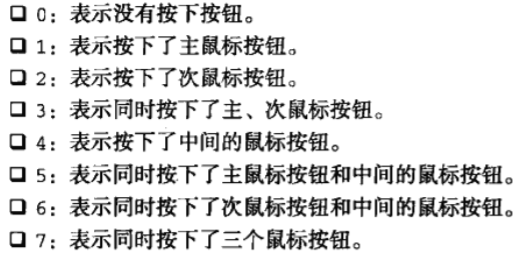

# 红宝书（javascirpt高级程序设计）学习笔记（九）

## 第13章 事件

**本章开始开始介绍浏览器的事件，在开发中十分常用，建议认真阅读，查缺补漏，做好笔记。**

`JavaScript`与`HTML`之间的交互是通过**事件**来实现的。**所谓事件，就是文档或浏览器窗口中发生的一些特定的交互瞬间**。可以使用侦听器来预订事件，以便事件发生时执行相应的代码。

### 13.1 事件流

事件流描述的是从页面中接收事件的顺序，有两种主流的事件流，一种是IE的**事件冒泡流**，而另一种是Netscape的**事件捕获流**。

#### 13.1.1 事件冒泡

IE的事件流叫作事件冒泡（event bubbling），即事件开始时由最具体的元素接收，然后逐级向上传播到较为不具体的节点。简单来说，就是从某个具体的按钮一直冒泡到`document`元素（有的会一直冒泡到`window`对象）。

多数浏览器都是这种事件流。

#### 13.1.2 事件捕获

事件捕获则与上面的思路直接相反，会从`document`一直传播到实际的目标。由于老版本的浏览器不支持，因此很少有人会使用事件捕获。

#### 13.1.3 DOM事件流

"DOM2级事件"规定的事件流包括3个阶段：

- 事件捕获阶段
- 处于目标阶段
- 事件冒泡阶段

在DOM事件流中，实际的目标在捕获阶段不会接收到事件，这意味着在捕获阶段，事件从`document`到`<html>`再到`<body>`后就停止了。下一个阶段是“处于目标”阶段，于是事件在`<div>`上发生，**并在事件处理中被看成冒泡阶段的一部分**。然后，冒泡阶段发生，事件又传播回文档。

### 13.2 事件处理程序

响应某个事件的函数叫作**事件处理程序**（或**事件监听器**）。事件处理程序的名字以"on"开头。为事件指定处理程序的方式有好几种。

#### 12.2.1 HTML事件处理程序

你可以直接在标签里声明事件处理程序，如下

```html
<input type="button" value="click me" onclick="alert('click')"/>
```

这个操作是通过`onclick`特性并将一些JavaScript代码作为它的值来定义的。由于这个值时JavaScript，因此不能在其中使用未经转义的HTML语法字符，如&、""、<、>这些。如上面的代码，如果想要使用双引号，就要改成

```html
<input type="button" value="click me" onclick="alert(&quot;click&quot;)"/>
```

除了以上的方法外，你还可以调用在页面其它地方定义的脚本

```html
<script>
    function showMessage () {
        alert("Hello World !!")
    }
</script>
<input type="button" value="click me" onclick="showMessage()"/>
```

 上面这样指定时间处理程序，会创建一个封装这元素值的函数。这个函数中有一个局部变量`event`，也就是事件对象，通过`event`变量，可以直接访问事件对象。而且在这个函数内部，`this`值等于事件的目标元素。

#### 13.2.2 DOM 0级事件处理程序

每个元素（包括`document`和`window`）都有自己的事件处理程序属性，这些属性通常全部小写，例如`onclick`。将这种属性的直射为一个函数，就可以指定事件的处理程序。

```javascript
var btn = document.getElementById("myBtn")
btn.onclick = function () {
    alert("clicked !")
}
btn.onclick = null // 通过设置为null来删除事件处理程序
```

使用DOM 0级指定方法指定的事件处理程序被认为是元素的方法。因此，这时候的事件处理程序实在元素的作用域中运行的。**换句话说，函数的this引用的就是当前元素**。

#### 13.2.3 DOM2级事件处理程序

与DOM 0级方法一样，这种方式的添加的事件处理程序也是依附在其元素的作用域中运行的。其好处就是可以添加多个事件处理程序。

```javascript
var btn = document.getElementById('myBtn')
btn.addEventListener('click', function () {
    alert(this.id)
}, false)
btn.addEventListener('click', function () {
    alert('hello')
}, false)
// 两个事件会按照添加它们的顺序触发
```

`addEventListener`接收一个函数和一个布尔值，最后这个布尔值参数如果为`true`，表示在捕获阶段调用该处理程序；如果为`false`，表示在冒泡阶段调用事件处理程序。默认为`false`。

**通过`addEventListener()`添加的事件处理程序只能使用`removeEventListner()`来移除**，而这也意味着通过`addEventListener()`添加的**匿名函数**将无法移除。

**大多数情况下，都是将事件处理程序添加到事件流的冒泡阶段，以便最大限度地兼容各种浏览器**。

#### 13.2.4 IE事件处理程序

本小节略。。。（IErbq）

#### 13.2.5 跨浏览器的事件处理程序

使用能力检测即可以视情况分别使用DOM 0级方法、DOM 2级方法或IE方法来添加事件。现如今几乎所有的浏览器都已经支持了DOM 2级方法，所以此节可略。

### 13.3 事件对象

在触发`DOM`上的某个事件时，会产生一个事件对象`event`，这个对象中包含着所有与事件有关的信息。

#### 13.3.1 `DOM`中的事件对象

兼容`DOM`的浏览器会将一个`event`对象传入到事件处理程序中。无论指定事件处理程序时使用什么方法（DOM 0级或是DOM 2级），都会传入`event`对象。如下

```javascript
var btn = document.getElementById('myBtn')
btn.onclick = function (event) {
    alert(event.type) // 'click'
}
btn.addEventListener('click', function (event) {
    alert(event.type)
}, false)
```

在通过HTML特性指定事件的处理程序时，变量`event`中保存着`event`对象

```html
<input type="button" value="Click Me" onclick="alert(event.type)"/>
```

`event`对象包含了以下属性成员。


在事件处理的内部，对象`this`始终等于`currentTarget`的值，而`target`则只包含事件的实际目标。如果直接将事件处理程序指定给了目标元素，则`this`、`currentTarget`和`target`包含相同的值。

而如果事件处理程序存在于按钮的父节点中（也就是说父节点事件响应的是冒泡事件的话），这些值时不相同的。`this`和`currentTarget`都等于的是注册的响应元素，而`target`元素却是指向真正的按钮。

```javascript
document.body.onclick = function (event) {
    event.currentTarget === document.body // true
    this === document.body // true
    event.target === document.getElementById("myBtn") // true
}
```

**在需要通过一个方法同时处理多个事件时，可以使用`type`属性来判断是哪种事件**。

**要阻止特定事件的默认行为，可以使用`preventDefault()`方法**，但只有`cancelable`属性设置为`true`的事件，才可以使用该函数来取消其默认行为。

**使用`stopPropagation()`方法可以用于立即停止在DOM层次中的传播，即取消进一步的捕获和冒泡**。

**使用事件对象的`eventPhase`属性，可以用于确定事件当前位于事件流的哪个阶段**：

- 如果在捕获阶段调用，eventPhase 为1
- 如果事件处理程序处于目标对象上，eventPhase 为2，此时`this`、`target`、`currentTarget`始终相等。
- 如果在冒泡阶段调用，则eventPhase 为3

### 13.4 事件类型

DOM 3级事件规定了以下几类事件

- UI(User Interface，用户界面)事件
- 焦点事件，当元素获得或失去焦点时触发
- 鼠标事件
- 滚轮事件
- 文本事件
- 键盘事件
- 合成事件，当为IME(Input Method Editor，输入法编辑器)输入字符时触发
- 变动（mutation）事件，当底层DOM结构发生变化时触发
- 变动名称事件，当元素或属性名变动时触发（好像没用，不介绍这个）

#### 13.4.1 UI事件

UI事件有以下几种：

- DOMActivate
- load：当页面完全加载后在`window`上面触发
- unload：当页面完全卸载后在`window`上面触发
- abort：当用户停止下载过程时，如果嵌入的内容没有加载完，则在`<object>`元素上面触发。
- error：当发生JavaScript错误时在`window`上面触发、当无法加载图像时在``元素上触发等等...
- select：当用户选择文本框（`<input>`或`<texterea>`）中的一个或多个字符时触发
- resize：当窗口或框架的大小变化在`window`或框架上面触发
- scroll：当用户滚动带滚动条的元素中的内容时，在该元素上面触发

1. load事件

   JavaScript中最常用的一个事件就是`load`。当页面完全加载后，就会触发`window`上面的`load`事件，通过以下两种方式定义`onload`事件处理程序的方式

   ```javascript
   window.addEventListner('load', function (event) {
       // 方法
   })
   ```

   还可以通过在body元素上添加一个`onload`特性

   ```html
   <!DOCTYPE html>
   <html>
       <head>
           <title>test</title>
       </head>
       <body onload="alert('test')">
           
       </body>
   </html>
   ```

2. unload事件

   该事件在文档被完全卸载后触发。使用该事件时一定要小心，因为这个时候页面加载的对象已经不应定存在了，所以任何操作DOM节点或是元素样式的操作都有可能产生错误。

3. resize事件

   当浏览器窗口被调整到一个新的高度或宽度时，就会触发`resize`事件。

   窗口最大化或最小化时也会触发`resize`事件。

4. scroll事件

   `scroll`事件是在`window`对象上发生的，在文档被滚动期间会重复被触发。

#### 13.4.2 焦点事件

焦点事件会在页面元素获得或失去焦点时触发。有6个焦点事件（其中两个废弃）：

- blur：在元素失去焦点时触发
- focus：在元素获得焦点时触发，但不冒泡
- focusin：在元素获得焦点时触发，冒泡
- focusout：在元素失去焦点时触发，冒泡
- DOMFocusIn：在元素获得焦点时触发，冒泡（已废弃）
- DOMFocusOut：在元素失去焦点时触发，冒泡（已废弃）

#### 13.4.3 鼠标与滚轮事件

鼠标事件是Web开发中最常用的一类事件，DOM 3级事件定义了9个鼠标事件

- click：单击或按下回车键触发
- dblclick：用户双击主鼠标按钮触发
- mousedown：按下了任意鼠标按钮时触发，不能通过键盘触发
- mouseenter：在鼠标光标从元素外部首次移动到元素范围内触发。该事件不冒泡。
- mouseleave：在位于元素上方的鼠标光标移动到元素范围外触发。该事件不冒泡。
- mousemove：当元素指针在元素内部移动时重复地触发
- mouseout：在鼠标指针位于一个元素上方，然后用户将其首次移入另一个元素时触发
- mouseover：在鼠标指针位于一个元素外部，然后用户将其首次移入另一个元素边界之内时触发
- mouseup：在用户释放谁啊哦按钮时触发，不能通过键盘触发这个事件

只有在同一个元素上相继触发了`mousedown`和`mouseup`事件，才会触发`click`事件。同样，如果有代码阻止了连续两次触发`click`事件，那么就不会触发`dbclick`事件了。

鼠标事件中还有一类事件`mousewhell`，这个事件跟踪鼠标滚轮，类似于触控板。

1. 客户区坐标位置

   可以通过事件对象的`clientX`和`clientY`属性来表示事件发生时鼠标指针在视口中的位置。

2. 页面坐标位置

   通过事件对象的`pageX`和`pageY`属性，获取鼠标光标在**页面**中的位置。

   在页面没有滚动的情况下，这两个值与`clientX`和`clientY`相等。

3. 屏幕坐标位置

   通过`screenX`和`screenY`属性可以确定鼠标光标相对于整个屏幕的坐标信息。

4. 修改键

   修改键即Shift、Ctrl、Alt和Meta（Win键及Cmd键），在DOM中它们有对应的属性：

   - shiftKey
   - ctrlKey
   - altKey
   - metaKey

   这四个属性都为**布尔值**，如果值为`true`，则说明相应的键被按下。

5. 相关元素

   在发生`mouseover`和`mouseout`事件时，会设计到更多的元素，额而这些元素都被放到了事件的`relatedTarget`属性中。

6. 鼠标按钮

   只有在主鼠标按钮被单击（或是回车键被按下）才会触发`click`事件。但对于`mousedown`和`mouseup`事件来说，还需要的是检测鼠标按键的信息。事件的`button`属性就是用于判断按键的：

   

   

> 本次阅读至P375   7.更多的事件信息