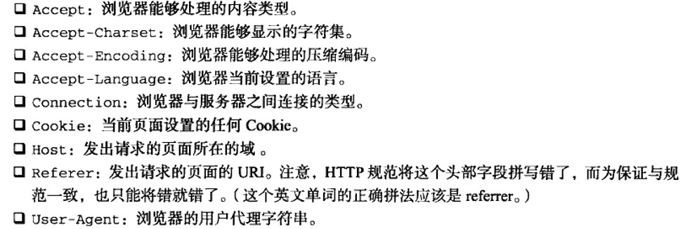
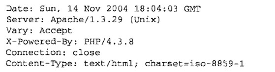

# 红宝书（javascirpt高级程序设计）学习笔记（十四）

## 第21章 Ajax与Comet

**本章开始介绍Ajax，进入原理介绍部分，建议着重认真阅读，做好笔记。**

Ajax技术的核心是`XMLHttpRequest`对象（简称XHR），通过XHR，可以以异步的方式从服务器取得更多信息，然后再通过DOM将新数据插入到页面中。另外虽然名字中包含XML，但Ajax通信与数据格式无关。

### 21.1 XMLHttpRequest 对象

使用`var xhr = new XMLHttpRequest ()`来创建一个原生的XHR对象。

#### 21.1.1 XHR的用法

在使用XHR对象时，要调用的第一个方法时`open()`，它接收3个参数：

- 发送的请求类型(get、post)
- 请求的URL(既可以是相对于当前页面的也可以是绝对路径）
- 是否异步发送请求的布尔值

调用`open()`方法不会真正的发送请求，只是启动一个请求，要发送，就要调用`send()`方法

```javascript
// 如下
xhr.open("get", "example.txt", false)
xhr.send(null)
```

`send()`方法接收一个参数，即请求主体发送的数据，**如果不发送数据，则必须传入`null` **。

当传入`false`时，则说明该次访问是同步的，JavaScript会等到服务器返回响应再继续执行，收到的响应会自动填充XHR对象的属性，共有以下相关属性：

- responseText：作为响应主体被返回的文本
- responseXML：如果响应内容类型是"text/xml"或"application/xml"，这个属性将保存包含着相应数据的XML DOM文档
- status：相应的HTTP状态
- statusText：HTTP状态的说明

一般来说，当`xhr.status`为2XX的时候，访问就算是成功了，此时`resoponseText`属性的内容已经准备就绪。此外，如果返回状态码为304，则说明资源没有被修改，可以直接使用浏览器的缓存。

```javascript
// 同步发送请求
xhr.open("get", "example.txt", false)
xhr.send(null)

if ((xhr.status >= 200 && xhr.status < 300) || xhr.status == 304) {
    alert(xhr.responseText)
} else {
    alert("Request was unsuccessful" + xhr.status)
}
```

上面使用同步发送的代码不会出错，但是在正常使用中，我们一般都是发送异步请求居多。此时，可以通过检测XHR对象的`readyState`属性来识别是否已经接受到所有响应数据。

`readyState`属性有以下的几个值。

- 0：未初始化，尚未调用`open()`
- 1：启动，已经调用`open()`，尚未`send()`
- 2：发送，调用了`send()`，尚未收到响应
- 3：接收。收到了部分响应数据
- 4：完成。接收到了全部的相应数据

每次该属性从一个值变成另一个，都会触发一次`readystatechange`事件，所以我们就可以用该事件来检测。不过要注意的是，为了确保浏览器兼容，必须在调用`open()`前就指定好该事件。

```javascript
var xhr = new XMLHttpRequest ()
xhr.onreadyStateChange = function () {
    if (xhr.readyState = 4) {
        if ((xhr.status >= 200 && xhr.status < 300) || xhr.status == 304) {
            alert(xhr.responseText)
        } else {
            alert("Request was unsuccessful" + xhr.status)
        }
    }
}
xhr.open("get", "example.txt", true)
xhr.send(null)
```

另外，在接收到响应之前可以调用`abort()`方法来取消异步请求，在终止请求后，还应该对XHR对象进行解除引用操作，由于内存原因，不建议重用XHR对象。

#### 21.1.2 HTTP头部信息

默认情况下，在发送XHR请求的同事，会发送下列头部信息：


通过`setRequestHeader()`方法可以设置自定义的请求头部信息，该方法接收两个参数：

- 头部字段的名称
- 头部字段的值

要成功发送请求头部消息，必须在调用`open()`方法之后，调用`send()`方法之前调用`setRequestHeader()`方法。

使用XHR对象的`getResponseHeader()`方法并传入头部字段名称，可以取得相应的头部信息，调用`getAllResponseHeaders()`方法则可以获得一个包含所有头部信息的字符串，如下。



#### 21.1.3 GET 请求

使用GET请求要注意，查询字符串中每个参数的名称和值都必须使用`encodeURIComponent()`进行编码后才能放到URL末尾，以防出错。而且所有名值对都必须由&号分隔。

#### 21.1.4 POST请求

在xhr对象调用`open()`时，传入"post"便可以拉起一个POST请求，发送POST请求需要在`send()`方法中传入某些数据。在此处可以传入XML DOM文档，也可以传入任意字符串。

默认情况下，服务器对POST请求和Web表单请求并不会一视同仁，但是我们可以通过设置`Content-Type`头部信息的值来通过xhr模仿任意类型的请求。例如，将`Content-Type`设置为`application/x-www-form-rulencoded`，就可以将该次发送设置为表单的形式。

### 21.2 XMLHttpRequest 2级

#### 21.2.1 FormData

XMLHttpRequest 2级定义了`FormData`类型，为序列化表单以及创建表单格式相同的数据提供了便利。

```javascript
var data = new FormData()
data.append("name", "test")
```

上面的代码创建了一个`FormData`对象，并添加了一些数据。

`append()`方法接收键和值两个参数，除此以外，也可以通过表单元素预先向其中注入键值对。

```javascript
var data = new FormData(document.forms[0])
```

随后，可以直接将它传给xhr对象，**不用设置头部**，直接发送。

```javascript
var xhr = new XMLHttpRequest ()
xhr.onreadyStateChange = function () {
    if (xhr.readyState = 4) {
        if ((xhr.status >= 200 && xhr.status < 300) || xhr.status == 304) {
            alert(xhr.responseText)
        } else {
            alert("Request was unsuccessful" + xhr.status)
        }
    }
}
xhr.open("post", "example.txt", true)
var data = new FormData(document.forms[0])
xhr.send(data)
```

XHR对象能够识别传入的数据类型是FormData的实例，并配置适当的头部信息。

#### 21.2.2 超时设定

2级规范为XHR对象添加了一个`timeout`属性，在给该属性设定一个数值后，如果超时还没收到响应，就会调用`ontimeout`事件处理程序。

```javascript
xhr.timeout = 1000 // 超时为1秒
xhr.ontimeout = function () {
    alert("timeOut!")
}
```

#### 21.2.3 overrideMimeType() 方法

调用该方法可以保证把响应当做某种文本来处理。

### 21.3 进度事件

进度事件有6种

- loadstart：接收到相应数据的第一个字节时触发
- progress：在接收响应期间持续不断地触发
- error：在请求发生错误时触发
- abort：因为调用abort()方法终止连接时触发
- load：在收到完整响应数据时触发
- loadend：在通信完成或者触发error、abort、load事件后触发

每个请求都从loadstart事件开始，最后以触发loadend事件结束。

#### 21.3.1 load事件

只要浏览器接收到了服务器响应，不管其状态如何，都会触发load事件，这意味着你依然要检查status属性（吐槽：所以这到底有啥用？？闲的吗？？？）

```javascript
var xhr = new XMLHttpRequest ()
xhr.onload = function () {
    if (xhr.readyState = 4) {
        if ((xhr.status >= 200 && xhr.status < 300) || xhr.status == 304) {
            alert(xhr.responseText)
        } else {
            alert("Request was unsuccessful" + xhr.status)
        }
    }
}
```

#### 21.3.2 progress事件

该事件会在浏览器接收新数据期间周期性地触发，同时该事件的`event`对象的`target`属性是`XHR`对象，但包含着3个额外的属性：

- lengthComputable：表示进度信息是否可用的布尔值
- position：表示已经接收的字节数
- totalSize：表示根据Content-Length响应头部确定的预期字节数

使用这些信息，开发者可以为用户创建一个进度指示器。

```javascript
xhr.onprogress = function (event) {
    var testDiv = document.getElementById("status")
    if (event.lengthComputable) {
        testDiv.innerHtml = `${event.position}/${event.totalSize}`bytes
    }
}
```

为保证正确调用，必须在`open()`方法之前添加该事件处理程序。

### 21.4 跨源资源共享（跨域）

>  本次阅读至582  21.4跨源资源共享 601