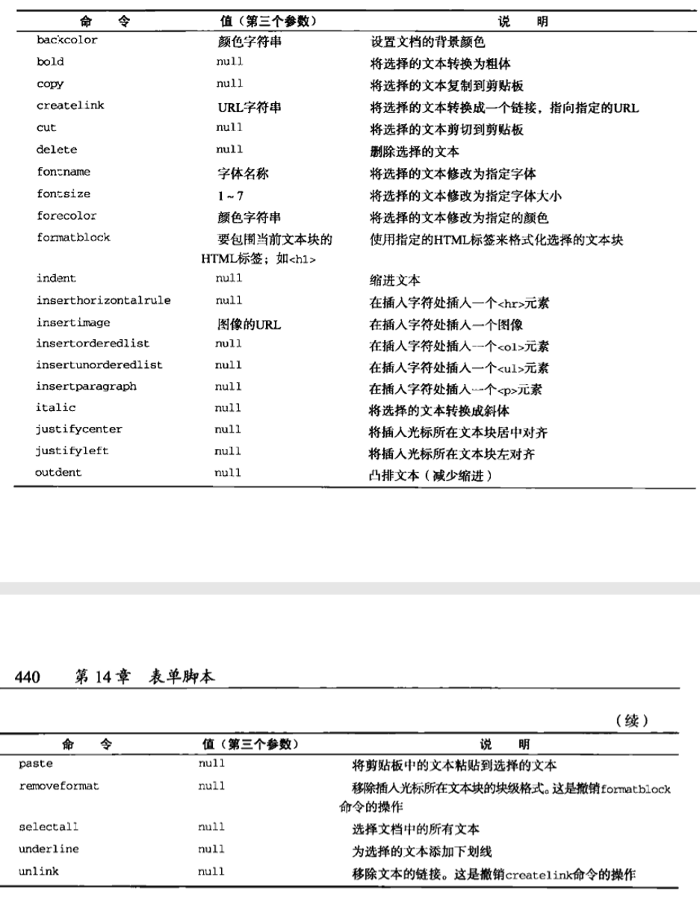

# 红宝书（javascirpt高级程序设计）学习笔记（十）

## 第14章 表单脚本

**本章介绍表单，虽然随着Ajax等异步传输手段的流行，表单脚本在很多开发场景都被弃用，但是理解它对于理解浏览器的工作原理和进一步深入了解JavaScript都是有帮助的，所以本章建议快速阅读，理解要点。**

### 14.1 表单的基础知识

在HTML中，表单由`<form>`元素来表示，在JavaScript中，表单对应`HTMLFormElement`类型。取得`<form>`元素的引用方式有好几种，可以添加id特性用`getElementById()`来引用，也可以通过`document.forms`来取得页面中的所有表单。

表单有下列几个属性

- acceptCharset：服务器能够处理的字符集，等价于HTML中的accept-charset
- action：接受请求的URL，等价于HTML中的action
- elements：表单中所有控件的集合
- enctype：请求的编码类型，等价于HTML中的`enctype`特性
- length：表单中的控件数量
- method：要发送的HTTP请求类型，通常是"get"或"post"，等价于HTML中的method
- name：表单的名称，等价于HTML的name
- reset()：将所有表单域重置为默认值
- submit()：提交表单
- target：用于发送请求和接收响应的窗口名称，等价于HTML的target特性

```javascript
var firstForm = document.forms[0] // 通过位置索引取得页面中的第一个表单
var myForm = document.forms["form2"] // 取得页面中name为form2的表单
```

#### 14.1.1 提交表单

通过将`<input>`或`<button>`的`type`属性设置为"submit"就可以提交表单，而涂销赶牛则是通过将input标签的type特性设置为"image"来定义。

只要表单中存在任何一种按钮，在响应表单控件拥有焦点的情况下，按回车键就可以提交该表单（`textarea`元素是一个例外，在文本区中回车会导致换行）

同时，在JavaScript中通过对form表单元素调用`submit()`方法，也能正常提交表单。

在调用`submit()`方法提交表单时，不会触发`submit`事件，因此要记得在调用该方法前验证表单数据。

利用`onsubmit`事件处理程序可以用于处理表单提交后的操作。

#### 14.1.2 重置表单

使用type特性为"reset"的`<input>`或`<button>`元素都可以创建重置按钮。也可以在JavaScript对form表单元素使用`reset()`方法来重置，与`submit`不一样的是，使用`reset()`方法会触发`reset`事件。

#### 14.1.3 表单字段

每个表单元素都有一个`elements`属性，该属性是表单中所有表单元素（字段）的集合。如`<input>`、`<button>`、`<textarea>`、`<fieldset>`。

1. 共有的表单字段属性

   除了`<fieldset>`元素外，所有的表单字段都拥有相同的一组属性。如下

   - disabled：布尔值，表示当前字段是否被禁用
   - form：指向当前字段所属表单的**指针**，**只读**
   - name：当前字段的名称
   - readOnly：布尔值，表示当前字段是否只读
   - tabIndex：表示当前字段的切换(tab)序号
   - type：当前字段类型，如"checkbox"、"radio"等等
   - value：当前字段将被提交给服务器的值，对文件字段来说，这个属性时只读的

   以上几种属性，除了`form`属性以外，其它皆可被动态修改。（`<input>`和`<button>`元素的type属性可以动态修改，但`<select>`元素的type属性时只读的）

2. 共有的表单字段方法

   每个表单字段都有两个方法：`focus()`和`blur()`。前者的作用是让元素获取输入焦点，而后者是让元素失去焦点。此外，HTML5中表单还新增了一个`autofocus`属性，设置这个属性讲可以自动把焦点移到相应字段，如下

   ```html
   <input type="text" autofocus>
   ```

3. 共有的表单字段事件

   所有表单字段都支持三种事件：

   - blur：当前字段失去焦点时触发
   - change：对于`<input>`和`<textarea>`元素，在它们失去焦点并且`value`值改变时触发，对于`<select>`元素，在其选项改变时触发
   - focus：当前字段获得焦点时触发

   要特别注意的是，对于`blur`和`change`事件的发生顺序，浏览器并没有作严格规定，不同浏览器可能会有不同的顺序。

### 14.2 文本框脚本

在HTML中，有两种方式表现文本框：`<input>`单行文本框和`<textarea>`多行文本框。

下面展示了一个能够显示25个字符，但输入不超过50个字符的单行文本框。

以及一个单行能显示5个字符，显示25行的多行文本框。

```html
<input type="text" size="25" maxlength="50" value="initial value">
<textarea rows="25" cols="5">initial value</textarea>
```

在这里不建议使用DOM方法中的`setAttribute()`方法去设置`<input>`元素中的value特性，也不要去修改`<textarea>`元素的第一个子节点，原因是**对`value`属性所作的修改不一定会反应在DOM中**。

#### 14.2.1 选择文本

两种文本框都支持`select()`方法，用于选择文本框中的所有文本。而在调用`select()`方法或用户选择后，也会触发一个`select`事件。选择文本后，文本框元素的`selectionStart`和`selectionEnd`会随之改变，使用`substring(selectionStart, selectionEnd)`即可以取出被选择的文本。

#### 14.2.2 过滤输入

可以使用JavaScript来过滤输入，将普通的文本框转换成能够理解用户输入数据的功能型控件。

1. 屏蔽字符

   响应向文本框中插入字符操作的是`keypress`事件。因此，可以通过这个事件的默认行为来屏蔽此类字符。如下

   ```javascript
   textbox.addEventListener('keypress', function (event) {
     event.preventDefault()
   })
   ```

   上述代码中，所有的按键操作都将被屏蔽，结果导致文本框变成只读。

   如果只想屏蔽特定的字符，则需要检测`keypress`事件对应的字符编码，然后再决定如何响应。例如，下列代码只允许用户输入数值。

   ```javascript
   textbox.addEventListener('keypress', function (event) {
       if ( !/\d/.test(String.fromCharCode(event.charCode)) ) {
           event.preventDefault()
       }
   })
   ```

2. 操作剪贴板

   剪贴板事件有六个，本别是

   - beforecopy：在发生复制操作前触发
   - copy：在发生复制操作时触发
   - beforecut：在发生剪切操作前触发
   - cut：在发生剪切操作时触发
   - beforepaste：在发生粘贴操作前触发
   - paste：在发生粘贴操作时触发

   要注意的是，通过`beforecopy`、`beforecut`、`beforepaste`事件可以在向剪贴板发送数据，或者从剪贴板取得数据之前修改数据，不过，取消这些事件并不会取消对剪贴板的操作——只有在`copy`、`cut`、`paste`中才能阻止相应操作的发生。

   要访问剪贴板中的数据，可以使用`event`中的`clipboardData`对象。该对象有三个方法：

   - getData()
   - setData()
   - clearData()

#### 14.2.3 自动切换焦点

为增强易用性，同时加快数据输入，可以在前一个文本框中的字符达到最大数量后，自动将焦点切到下一个文本框，具体实现略。（主要用到了`form.elements`这个数组中元素的有序性）

#### 14.2.4 HTML5 约束验证API

在HTML5中，在某些情况下表单可以进行自动验证。具体来说，就是要在HTML标记中为特定的字段制定一些约束，然后浏览器才会自动执行表单验证。

1. 必填字段

   第一种情况是表单中的`required`属性，如下

   ```html
   <input type="text" name="username" required>
   ```

   任何标注有required的字段，在填写表单时都不能空着。对于空着的必填表单，不同浏览器有不同的处理方式。

2. 其他输入类型

   HTML5为`<input>`元素的`type`属性又增加了几个值。这些新的类型不仅能反映数据类型的信息，还能提供一些默认的验证功能。其中，"email"和"url"是两个得到支持最多的类型，各浏览器都为它们增加了定制的验证机制。

   ```html
   <input type="email" name="email">
   <input type="url" name="homepage">
   ```

   要注意的是，如果不给`<input>`元素设置`required`属性，那么空文本框也会验证通过。

3. 数值范围

   自动递增或递减`type`为number的input标签，范围可以用min和max来规范，甚至可以用step来步进，但目前还没有广泛应用。

4. 输入模式

   HTML5位文本字段新增了`pattern`属性，该属性是一个正则表达式，用于匹配文本框中的值。例如如果只想允许在文本字段中输入数值

   ```html
   <input type="text" pattern="\d+" name="count">
   ```

5. 检测有效性

   使用`checkValidity()`方法可以检测表单中某个字段是否有效。而`validity`属性则会告诉你为什么字段有效或无效。

6. 禁用验证

   通过设置`novalidate`属性，可以告诉表单不进行验证。

   ```html
   <form method="post" action="signup.php" novalidate>
      <!-- 表单元素 -->    
   </form>
   ```

   在JavaScript中使用`noValidate`属性可以取得或设置这个值，若该属性存在，值为`true`，若不存在，值为`false`。

### 14.3 选择框脚本

选择框是通过`<select>`和`<option>`元素创建的。为了方便与这个控件交互，除了所有表单字段共有的属性和方法外，`HTMLSelectElement`类型还提供了下列属性和方法：

- add(*newOption*, *relOption*)：向控件中插入新的`<option>`元素，其位置在相关项之前
- multiple：布尔值，是否允许多项选择，等价于HTML中的multiple
- options：空间中所有`<option>`元素的`HTMLCollection`
- remove(index)：移除给定位置的选项
- selectedIndex：基于0的选中项的索引，如果没有选中项，值为-1
- size：选择框中的可见行数，等价于HTML中的size

如果有多个选中项，选择框的`value`属性将取得第一个选中项的值，若没有，则为空字符串。

`<option>`选项有以下属性：

- index：当前选项在`options`集合中的索引
- label：当前选项的标签，等价于HTML中的label特性
- selected：布尔值，表示当前选项是否被选中
- text：选项的文本
- value：选项的值，等价于HTML中的value特性

#### 14.3.1 选择选项

对于只允许选择一项的选择框，访问选中项最简单的方式就是使用选择框的`selectedIndex`属性。

而对于多个选中的选项，则需要使用`getSelectedOptions()`方法返回包含选中项索引值的数组。（此时的`selectedIndex`属性是选中项中第一项的索引值）

#### 14.3.2 添加选项

可以使用`JavaScript`动态创建选项，并将它们添加到选择框中。添加选项的方式有很多，可以创建节点，使用appendChild手动添加，也可以使用选择框的`add()`方法，也可以使用`innerHTML`，在此不一一举例。

#### 14.3.3 移除选项

与上面所说一样，可以使用`removeChild()`方法，也可以使用其它DOM方法。

#### 14.3.4 移动和重排选项

使用`appendChild()`和`insertBefore()`两个DOM方法来添加移动和重排选项。

### 14.4 表单序列化

本小节了解即可（在21章讨论Ajax会提到），略。

### 14.5 富文本编辑

富文本编辑技术的本质，就是在页面中嵌入一个包含空HTML页面的`iframe`。通过设置其`designMode`（两个可能的值：on或off）来定义整个文档是否可以编辑。然后就可以像使用字处理软件一样编辑文本。

#### 14.5.1 使用contenteditable属性

另一种编辑富文本内容的方式是使用名为`contenteditable`特殊属性应用给页面的任何元素，然后用户就可以立即编辑该元素，不需要iframe、空白页和JavaScript。

```html
<div class="editable" id="richedit" contenteditable></div>
```

这个属性有3个可能的值，true,false,inherit(从父元素继承)。

#### 14.5.2 操作富文本

使用`document.execCommand()`可以对文档执行预定义的命令，并且可以应用大多数格式。要注意，该方法接收三个参数，命令名称，一个布尔值，命令所需的布尔值（不需要传null），其中，为保证兼容性第二个参数应始终为`false`。

以下是支持的命令



#### 14.5.3 富文本选区

若通过`iframe`实现富文本编辑器，则可以使用`iframe`的`getSelection()`方法确定实际选择的文本。

具体使用方法略

#### 14.5.4 表单与富文本

由于富文本编辑是使用`iframe`而非表单控件实现，因此其中的HTML不会被自动提交到服务器，需要我们手工提取并提交HTML。

当然，也可以设置一个隐藏的表单字段，让它的值等于从`iframe`中提取出的HTML。

