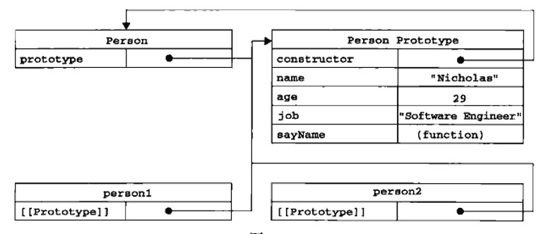

# 红宝书（javascirpt高级程序设计）学习笔记（四）

## 第6章  面向对象的程序设计

**本章开始将会开始介绍在ECMAScript中对象真正的高级用法，本章适合仔细阅读，反复观看，做好笔记。**

### 6.1 理解对象

在ECMAScript中，每个对象都是基于一个引用类型创建的。这个引用类型可以是第5章讨论的原生类型，也可以是开发人员定义的类型。

创建自定义对象最简单的方式就是创建一个 *Object* 的实例，然后再为它添加属性和方法。

```javascript
// 示例
var person = new Object()
person.name = 'hw'
person.age = 29
person.sayName = function () {
    alert(this.name)
}
```

除了上面这种方式外，还有一种被称为通过**对象字面量**的创建方式。

```javascript
var person = {
    name: 'hw',
    age: 29,
    job: 'software',
    sayName: function () {
        alert(this.name)
    }
}
```

#### 6.1.1 属性类型

ECMAScript中有两种属性：数据属性和访问器属性。

1. 数据属性

   数据属性有4中描述其行为的特性：

   - Configurable：表示能否通过delete删除属性从而重新定义属性，默认为true
   - Enumerable：表示能否通过for-in循环返回属性，默认为true
   - Writable：表示能否修改属性的值，默认为true
   - Value：包含这个属性的数据值。读属性值的时候，从这个位置读；写入属性值的时候，把新值保存在这个位置，默认值为undefined。

   要改变某个属性的默认特性，必须使用ES 5中的 *Object.defineProperty()* 方法。

   ```javascript
   // 示例，修改某个属性的数据属性
   var person = {
       name: 'vivo'
   }
   Object.defineProperty(person, 'name', {
       writable: false, // 不可修改
       value: 'bibo'
   })
   person.name // bibo
   person.name = 'vivo' // 非严格模式下被忽略，严格模式下报错
   person.name // bibo
   ```

2. 访问器属性

   访问器属性不包含数据值；它们包含一对 *getter* 和 *setter* 函数。在读取访问器属性时，会调用 *getter* 函数，这个函数负责返回有效的值。在写入访问器属性时，会调用 *setter* 函数并传入新值，该函数决定如何处理数据。

   访问器属性有4个特性：

   - Configurable：能否通过delete删除属性从而重新定义属性，默认为true。
   - Enumerable：表示能否通过for-in循环返回属性，默认为true.。
   - Get：在读取属性时调用的函数。默认undefined。
   - Set：在写入属性时调用的函数。默认为undefined。

   **访问器属性不能直接定义**，只能使用 *Object.defineProperty()* 来定义。

   ```javascript
   var book = {_year: 2004, edition: 1}
   Object.defineProperty(book, 'year', {
       get: function () {
           return this._year
       },
       set: function (newValue) {
           if (newValue > 2004) {
               this._year = newValue
               this.edition += newValue - 2004
           }
       }
   })
   book.year = 2005
   book.edition // 2
   ```

   通过 *getter* 和 *setter* ，就可以达到设置一个属性导致另一个属性变化的效果。（数据监听）

#### 6.1.2 定义多个属性

使用 *Object.defineProperties()* 可以通过描述符一次定义多个属性。

```javascript
// 示例
Object.defineProperties(book, {
    _year: {
        writable: true,
        value: 2004
    },
    edition: {
        writable: true,
        value: 1
    },
    year: {
        get: function () {
            return this._year
        },
        set: function (newValue) {
            if (newValue > 2004) {
                this._year = newValue
                this.edition += newValue - 2004
            }
        }
    }
})
```

#### 6.1.3 读取属性的特性

使用 *ECMAScript5* 的 *object.getOwnPropertyDescriptor()* 方法，可以取得给定属性的描述符。其返回值，如果是访问器属性，这个对象的属性有configurable、enumerable、get和set；如果是数据属性，这个对象的属性有configurable、enumerable、writalbe和value。

在JACAScript中，可以针对任何对象——包括DOM和BOM对象，使用这个函数方法。

### 6.2 创建对象

**使用 *new* 操作符来创建对象，一般来说会经历以下四个步骤（重点理解）：**

1. 创建一个新对象（该对象是被调用的**构建函数**的原型对象，即Function.prototype）
2. 将构造函数的作用域赋给新对象（因此 *this* 就指向了这个新对象）
3. 执行构造函数的代码
4. 返回新对象（若构造函数没有return语句，则返回该原型对象）

以下是几种创建对象模式的详细介绍。

#### 6.2.1 工厂模式

```javascript
// 工厂模式创建对象
function createPerson(name, age, job) {
    var o = new Object()
    o.name = name
    o.age = age
    o.job = job
    o.sayName = function () {
        alert(this.name)
    }
}
var a = createPerson('mike', 18)
a.name // mike
a.age // 18
a instanceof Object //true
a instanceof createPerson // false
```

**PS：如上所示，工厂模式不能通过 *instanceof* 等操作符来告诉别人它的类型**

#### 6.2.2 构造函数模式

**构造函数按照规范应该始终以大写字母开头。**

```javascript
function Person(name, age) {
    this.name = name
    this.age = age
    this.sayName = function () {
        alert(this.name)
    }
}
var mike = new Person('mike', 18)
mike instanceof Object // true
mike instanceof Person // true
// 在另一个作用域中调用
var o = new Object()
Person.call(o, 'Jack', 8)
o.sayName() // Jack
```

#### 6.2.3 原型模式

每个函数在创建的时候都有一个 *prototype* (原型)属性，这是一个指向一个对象的指针属性，我们把这个对象称为函数的**原型对象**（调用 *new* 操作的第一步，就是将该函数原型对象赋给当前变量）。而原型模式就是通过修改原型对象的属性、加入方法，从而得到一个新的对象。

```javascript
// 原型模式 示例
function Person () {}
Person.prototype.name = 'mike'
Person.prototype.age = 29
Person.prototype.sayName = function () {
    alert(this.name)
}
var person1= new Person()
var person2 = new Person()
person1.sayName() // mike
```

关于原型对象，构造函数，实例之间的关系，可见下图。



更多详情请见原文的P148~P158页。

PS：这不是我偷懒...我自认为我的总结能力够好，可是这几页的内容实在是太过精炼，一个字都改不了，想要透彻的理解原型、构造函数和实例，我认为没有比这几页更好的教科书了。

如果单一的使用原型模式来创建对象，会出现所有根据该原型对象的实例共享一个引用类型值的属性（比如Array）的情况。所以为了解决这种状况，我们应该组合使用构造函数模式和原型模式。

#### 6.2.4 组合使用构造函数模式和原型模式

**这是最常用的创建自定义类型对象的方式。**

```javascript
function Person (name, age) {
    this.name = name
    this.age = age
    this.colors = ['red', 'blue']
}
Person.prototype.sayName = function () {
    return this.name
}
var person1 = new Person('mike', 18)
var person2 = new Person('jack', 20)
person1.colors.push('black')
person1.colors // ['red', 'blue', 'black']
person2.colors // ['red', 'blue']
```

#### 6.2.5 动态原型模式

进化版的组合模式，动态决定是否初始化原型方法。

```javascript
function Person(name, age, job) {
    // 属性
    this.name = name
    this.age = age
    this.job = job
    if (typeof this.sayName != 'function') {
        Person.prototype.sayName = function () {
            alert(this.name)
        }
    }
}
```


#### 6.2.6  寄生构造函数模式

```javascript
function SpecialArray(){
    var values = new Array();
    values.push.apply(values, arguments);
    values.toPipedString = function(){
        return this.join("|");
    }
    return values;
}
var a = new SpecialArray(2, 6, 8, 9, 4)
a.toPipedString()
var b = SpecialArray(2, 6, 8, 9, 4)
b.toPipedString()
```


> 寄生构造函数模式和工厂模式没有本质区别，通过new 操作符的就叫寄生构造函数模式，直接调用的就叫工厂模式
>
> JS里的构造函数就是一个用来构造对象的普通函数，和JAVA不同
>
> 你要知道，通过new 来调用函数，会自动执行下面操作
>
> 1. 创建一个全新的对象
> 2. 这个对象会被执行[[prototype]]连接原型
> 3. 函数调用中的this会绑定到新对象
> 4. 如果函数没有返回其他对象，那么new 构造就会自动返回这个新对象
>
> **使用寄生构造函数的目的是希望扩展Array的一个方法toPipeMessage，作者本意是期望能像使用普通Array一样使用SpecialArray，故虽然把specialarray当成函数也一样能用，但是这并不是作者的本意，也变得不优雅。** 

简单点来说，就是为了用个 *new* 操作符来告诉别人，哥用的是类，不是函数……

**PS：寄生构造函数模式也和工厂模式一样不能通过 *instanceof* 等操作符来告诉别人它的类型**

#### 6.2.7 稳妥构造模式

所谓稳妥对象，指的是没有公共属性，而且其方法也不引用this对象。这样可以防止数据被其它应用程序改动。

```javascript
function Person (name, age, job) {
    // 创建要返回的对象
    var o = new Object()
    o.sayName = function () {
        alert(name)
    }
    return o
}
var me = new Person('mike')
me.sayName() // mike
```

本次阅读至P162 6.3继承


