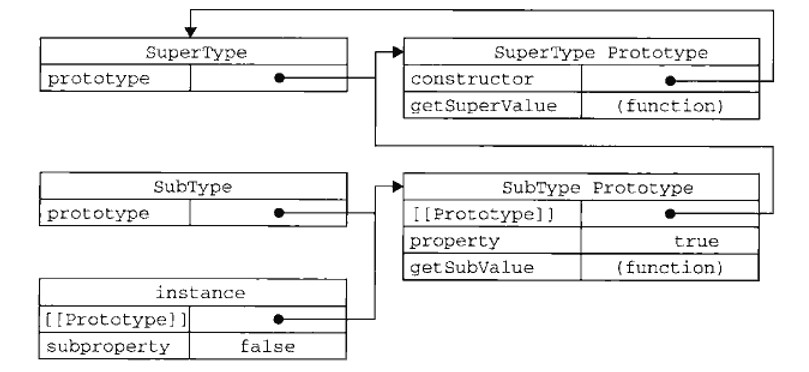

# 红宝书（javascirpt高级程序设计）学习笔记（四）

>  本文首发于[Liubasara的个人博客](https://blog.liubasara.info/#/post/%E7%BA%A2%E5%AE%9D%E4%B9%A6%E5%AD%A6%E4%B9%A0%E7%AC%94%E8%AE%B0%EF%BC%88%E4%BA%8C%EF%BC%89)，承蒙喜爱，欢迎转载。

## 第6章  面向对象的程序设计

**本章开始将会开始介绍在ECMAScript中对象真正的高级用法，本章适合仔细阅读，反复观看，做好笔记。**

### 6.1 理解对象

在ECMAScript中，每个对象都是基于一个引用类型创建的。这个引用类型可以是第5章讨论的原生类型，也可以是开发人员定义的类型。

创建自定义对象最简单的方式就是创建一个 *Object* 的实例，然后再为它添加属性和方法。

```javascript
// 示例
var person = new Object()
person.name = 'hw'
person.age = 29
person.sayName = function () {
    alert(this.name)
}
```

除了上面这种方式外，还有一种被称为通过**对象字面量**的创建方式。

```javascript
var person = {
    name: 'hw',
    age: 29,
    job: 'software',
    sayName: function () {
        alert(this.name)
    }
}
```

#### 6.1.1 属性类型

ECMAScript中有两种属性：数据属性和访问器属性。

1. 数据属性

   数据属性有4中描述其行为的特性：

   - Configurable：表示能否通过delete删除属性从而重新定义属性，默认为true
   - Enumerable：表示能否通过for-in循环返回属性，默认为true
   - Writable：表示能否修改属性的值，默认为true
   - Value：包含这个属性的数据值。读属性值的时候，从这个位置读；写入属性值的时候，把新值保存在这个位置，默认值为undefined。

   要改变某个属性的默认特性，必须使用ES 5中的 *Object.defineProperty()* 方法。

   ```javascript
   // 示例，修改某个属性的数据属性
   var person = {
       name: 'vivo'
   }
   Object.defineProperty(person, 'name', {
       writable: false, // 不可修改
       value: 'bibo'
   })
   person.name // bibo
   person.name = 'vivo' // 非严格模式下被忽略，严格模式下报错
   person.name // bibo
   ```

2. 访问器属性

   访问器属性不包含数据值；它们包含一对 *getter* 和 *setter* 函数。在读取访问器属性时，会调用 *getter* 函数，这个函数负责返回有效的值。在写入访问器属性时，会调用 *setter* 函数并传入新值，该函数决定如何处理数据。

   访问器属性有4个特性：

   - Configurable：能否通过delete删除属性从而重新定义属性，默认为true。
   - Enumerable：表示能否通过for-in循环返回属性，默认为true.。
   - Get：在读取属性时调用的函数。默认undefined。
   - Set：在写入属性时调用的函数。默认为undefined。

   **访问器属性不能直接定义**，只能使用 *Object.defineProperty()* 来定义。（但是在ES6中提供了额外的语法糖）

   ```javascript
   // ES5写法
   var book = {_year: 2004, edition: 1}
   Object.defineProperty(book, 'year', {
       get: function () {
           return this._year
       },
       set: function (newValue) {
           if (newValue > 2004) {
               this._year = newValue
               this.edition += newValue - 2004
           }
       }
   })
   // ES6写法
   var book = {
       _year: 2004,
       edition: 1,
       // 语法糖 get set前缀
       get year () {
           return this._year
       },
       set year (newValue) {
           if (newValue > 2004) {
               this._year = newValue
               this.edition += newValue - 2004
           }
       }
   }
   
   book.year = 2005
   book.edition // 2
   ```

   通过 *getter* 和 *setter* ，就可以达到设置一个属性导致另一个属性变化的效果。（数据监听）

#### 6.1.2 定义多个属性

使用 *Object.defineProperties()* 可以通过描述符一次定义多个属性。

```javascript
// 示例
Object.defineProperties(book, {
    _year: {
        writable: true,
        value: 2004
    },
    edition: {
        writable: true,
        value: 1
    },
    year: {
        get: function () {
            return this._year
        },
        set: function (newValue) {
            if (newValue > 2004) {
                this._year = newValue
                this.edition += newValue - 2004
            }
        }
    }
})
```

#### 6.1.3 读取属性的特性

使用 *ECMAScript5* 的 *object.getOwnPropertyDescriptor()* 方法，可以取得给定属性的描述符。其返回值，如果是访问器属性，这个对象的属性有configurable、enumerable、get和set；如果是数据属性，这个对象的属性有configurable、enumerable、writalbe和value。

在JACAScript中，可以针对任何对象——包括DOM和BOM对象，使用这个函数方法。

### 6.2 创建对象

**使用 *new* 操作符来创建对象，一般来说会经历以下四个步骤（重点理解）：**

1. 创建一个新对象（该对象是被调用的**构建函数**的原型对象，即Function.prototype）
2. 将构造函数的作用域赋给新对象（因此 *this* 就指向了这个新对象）
3. 执行构造函数的代码
4. 返回新对象（若构造函数没有return语句，则返回该原型对象）

以下是几种创建对象模式的详细介绍。

#### 6.2.1 工厂模式

```javascript
// 工厂模式创建对象
function createPerson(name, age, job) {
    var o = new Object()
    o.name = name
    o.age = age
    o.job = job
    o.sayName = function () {
        alert(this.name)
    }
}
var a = createPerson('mike', 18)
a.name // mike
a.age // 18
a instanceof Object //true
a instanceof createPerson // false
```

**PS：如上所示，工厂模式不能通过 *instanceof* 等操作符来告诉别人它的类型**

#### 6.2.2 构造函数模式

**构造函数按照规范应该始终以大写字母开头。**

```javascript
function Person(name, age) {
    this.name = name
    this.age = age
    this.sayName = function () {
        alert(this.name)
    }
}
var mike = new Person('mike', 18)
mike instanceof Object // true
mike instanceof Person // true
// 在另一个作用域中调用
var o = new Object()
Person.call(o, 'Jack', 8)
o.sayName() // Jack
```

#### 6.2.3 原型模式

每个函数在创建的时候都有一个 *prototype* (原型)属性，这是一个指向一个对象的指针属性，我们把这个对象称为函数的**原型对象**（调用 *new* 操作的第一步，就是将该函数原型对象赋给当前变量）。而原型模式就是通过修改原型对象的属性、加入方法，从而得到一个新的对象。

```javascript
// 原型模式 示例
function Person () {}
Person.prototype.name = 'mike'
Person.prototype.age = 29
Person.prototype.sayName = function () {
    alert(this.name)
}
var person1= new Person()
var person2 = new Person()
person1.sayName() // mike
```

关于原型对象，构造函数，实例之间的关系，可见下图。


更多详情请见原文的P148~P158页。

PS：这不是我偷懒...我自认为我的总结能力够好，可是这几页的内容实在是太过精炼，一个字都改不了，想要透彻的理解原型、构造函数和实例，我认为没有比这几页更好的教科书了。

如果单一的使用原型模式来创建对象，会出现所有根据该原型对象的实例共享一个引用类型值的属性（比如Array）的情况。所以为了解决这种状况，我们应该组合使用构造函数模式和原型模式。

#### 6.2.4 组合使用构造函数模式和原型模式

**这是最常用的创建自定义类型对象的方式。**

```javascript
function Person (name, age) {
    this.name = name
    this.age = age
    this.colors = ['red', 'blue']
}
Person.prototype.sayName = function () {
    return this.name
}
var person1 = new Person('mike', 18)
var person2 = new Person('jack', 20)
person1.colors.push('black')
person1.colors // ['red', 'blue', 'black']
person2.colors // ['red', 'blue']
```

#### 6.2.5 动态原型模式

进化版的组合模式，动态决定是否初始化原型方法。

```javascript
function Person(name, age, job) {
    // 属性
    this.name = name
    this.age = age
    this.job = job
    if (typeof this.sayName != 'function') {
        Person.prototype.sayName = function () {
            alert(this.name)
        }
    }
}
```


#### 6.2.6  寄生构造函数模式

```javascript
function SpecialArray(){
    var values = new Array();
    values.push.apply(values, arguments);
    values.toPipedString = function(){
        return this.join("|");
    }
    return values;
}
var a = new SpecialArray(2, 6, 8, 9, 4)
a.toPipedString()
var b = SpecialArray(2, 6, 8, 9, 4)
b.toPipedString()
```


> 寄生构造函数模式和工厂模式没有本质区别，通过new 操作符的就叫寄生构造函数模式，直接调用的就叫工厂模式
>
> JS里的构造函数就是一个用来构造对象的普通函数，和JAVA不同
>
> 你要知道，通过new 来调用函数，会自动执行下面操作
>
> 1. 创建一个全新的对象
> 2. 这个对象会被执行[[prototype]]连接原型
> 3. 函数调用中的this会绑定到新对象
> 4. 如果函数没有返回其他对象，那么new 构造就会自动返回这个新对象
>
> **使用寄生构造函数的目的是希望扩展Array的一个方法toPipeMessage，作者本意是期望能像使用普通Array一样使用SpecialArray，故虽然把specialarray当成函数也一样能用，但是这并不是作者的本意，也变得不优雅。** 

简单点来说，就是为了用个 *new* 操作符来告诉别人，哥用的是类，不是函数……

**PS：寄生构造函数模式也和工厂模式一样不能通过 *instanceof* 等操作符来告诉别人它的类型**

#### 6.2.7 稳妥构造模式

所谓稳妥对象，指的是没有公共属性，而且其方法也不引用this对象。这样可以防止数据被其它应用程序改动。

```javascript
function Person (name, age, job) {
    // 创建要返回的对象
    var o = new Object()
    o.sayName = function () {
        alert(name)
    }
    return o
}
var me = new Person('mike')
me.sayName() // mike
```

### 6.3 继承

继承在OO语言中分为两种，接口继承和实现继承。而ECMAScript只支持实现继承。

> [接口继承和实现继承的区别](https://www.cnblogs.com/bigberg/p/7182741.html)

在ECMAScript中年，继承主要是依靠原型链来实现的。

#### 6.3.1 原型链

使用原型链实现继承到的主要方法，其基本思想是利用原型让一个引用类型继承另一个引用类型的属性和方法。基本模式如下。

```javascript
function SuperType () {
    this.property = true
}
SuperType.prototype.getSuperValue = function () {
    return this.property
}
function SubType () {
    this.subproperty = false
}
// 让SubType继承SuperType
SubType.prototype = new SuperType()
// 定义SubType的原型方法
SubType.prototype.getSubValue = function () {
    return this.subproperty
}
var instance = new SubType()
instance.getSuperValue() // true
```

父类型和子类型的关系如下图所示。



详情见书P163 ~ P166

纯用原型链虽然可以实现继承，但是依然会遇到一些问题。最主要的问题就是包含引用类型值的原型，和使用原型模式创建对象一样，引用类型值会被所有实例共享，要解决这个问题，我们需要让这些引用类型值存在于实例中，而不是存在于原型对象中。所以，我们就需要用到构造函数。

#### 6.3.2 借用构造函数

```javascript
function SuperType () {
    this.colors = ['red', 'blue', 'green']
}
function SubType () {
    // 继承superType
    SuperType.call(this)
}
var instance = new SubType()
var instance1 = new SubType()
instance.colors.push('black')
innstance.colors // ['red', 'blue', 'green', 'black']
instance1.colors // ['red', 'blue', 'green']
```

通过使用 *call* 函数，在生成实例时将 *this* 指针传入父类中，调用父类的构造函数，从而继承了父类的方法。

但如果仅仅只是借用构造函数，就会之前提到过的问题——方法都在构造函数中定义，导致无法进行函数复用。所以，一般也很少单独使用构造函数来进行类的继承。

#### 6.3.3 组合继承

组合继承简单来说就是既使用原型链继承也借用构造函数。

```javascript
// 组合继承示例
function SuperType () {this.name = 'super'}
function SubType () {
    // 借用构造函数
    SuperType.call(this)
    this.age = 18
}
// 原型继承
SubType.prototype = new SuperType()
// 定义原型方法
SubType.prototype.sayHi = function () {
    console.log('hi')
}
var instance = new SubType()
```

上面这个方法既用到了原型继承，又借用了构造函数，避免了其各自方法的缺点，融合了它们的优点，可以说是十分常用的构建方法了。

但这种方法也有缺点，上面这种构建函数会在SubType.prototype中创建一个名为name的属性，这是在继承的时候不可避免创建的。虽然在实例中也有一个自己的name属性可以覆盖掉原型链上同名的参数，但是对于我们来说，这还不是最完美的解决方案。

#### 6.3.4 原型式继承

创建一个父类为超类的原型对象，然后返回它的实例，即称为原型式继承。。

```javascript
// Object.create 函数等同于下面这个函数
function createObject (o) {
    function F () {}
    F.prototype = o
    return new F ()
}
```

```javascript
function SuperType () {}
Object.create(SuperType.prototype) 
```

在没有必要兴师动众的创建构造函数，而只想让一个对象与另一个对象保持类似的情况下，可以使用原型式继承，不过要注意的是，使用这种方式的实例始终会共享其内部引用类型值的属性。

#### 6.3.5 寄生式继承

```javascript
function createAnthor(original) {
    var clone = Object.create(original)
    clone.sayHi = function () {
        alert("hi")
    }
    return clone
}
var person = {name: 'mike'}
var anthorPerson = createAnthor(person)
anthorPerson.syaHi() // hi
```

缺点跟构造函数模式类似，方法无法复用。

#### 6.3.6  寄生组合式继承（最完美的继承方式）

```javascript
function SuperType () {this.name = 'super'}
function SubType () {
    SuperType.call(this)
    this.age = 18
}
var o = Object.create(SuperType.prototype) // 创建一个分类为超类的原型对象
SubType.prototype = o // 将构造函数的原型对象指针指向该原型对象
o.constructor = SubType // 增强原型对象（该步可省略）
var instance = new SubType()
```

简单来说，寄生组合式继承就是创建了一个父类为超类的原型对象。然后把子类构造函数的prototype指向了这个原型对象（constructor属性可绑可不绑），同时又因为子类构造函数内部的call方法会调用超类构造函数，所以最终达到了**太子换狸猫**的效果。

不足：这种号称“最完美”的方式其实还有一点点不足，那就是这样创建的SubType.prototype的constructor属性是显式的（也就是说constructor属性的Enumerable为True）。

不过constructor本身就是一个没什么用处的属性......所以不加其实也无所谓。

**2019/2/12 更新**

最终版本的最优继承方式，解决了上述提出的一切问题！

```javascript
// 最优继承方式
function Parent(value) {
  this.val = value
}
Parent.prototype.getValue = function() {
  console.log(this.val)
}

function Child(value) {
  Parent.call(this, value)
}
// 以下干了三件事：
// 1. 创建一个与Parent原型对象一样的原型对象
// 2. 给这个原型对象添加一个constructor指针，指向要继承的子对象构造函数(增强对象，也可省略此步)
// 3. 将子对象构造函数的prototype指针指向增强过后的对象，完成原型对象的替换，实现继承
Child.prototype = Object.create(Parent.prototype, {
  constructor: {
    value: Child,
    enumerable: false,
    writable: true,
    configurable: true
  }
})
const child = new Child(1) // 继承完毕
```


