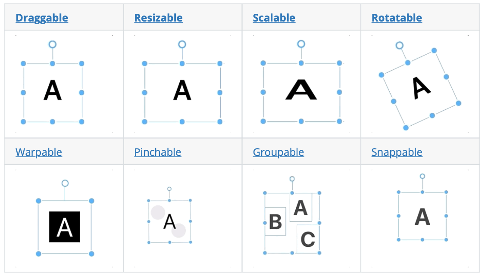
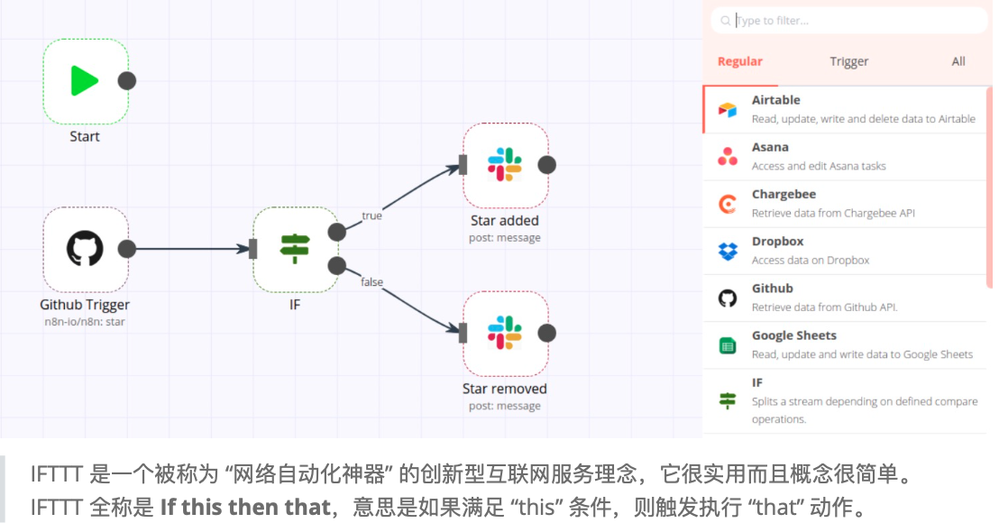

## 第13章 让人眼前一亮的 10 大 TS 项目

最后一章主要介绍 10 个优秀的 TS 项目。

- [ava](https://github.com/antvis/AVA)：这是阿里巴巴集团为了更简便的可视化分析而生的技术框架，其目标是成为一个自动化（Automated）、智能驱动（AI driven）、支持增强分析（Augmented）的可视化分析解决方案。

- [rough](https://github.com/pshihn/rough)：这是一个轻量的图形库，让开发者能够用手绘的方式绘制草图。该库提供绘制线条、曲线、弧线、多边形、圆形和椭圆的基础能力，同时支持绘制 SVG 路径。Rough.js 可同时支持 Canvas 和 SVG。

- [moveable](https://github.com/daybrush/moveable)：Moveable 可以把指定的元素变成可拖动的，可调整大小的，可伸缩的，可旋转的或者可以组合的元素。

  

- [n8n](https://github.com/n8n-io/n8n)：n8n 是一个基于节点的工作流自动化工具。利用 n8n 可以方便地实现党 A 条件发生、触发 B 服务这样的自动工作流程。

  

- [rrweb-io](https://github.com/rrweb-io/rrweb)：rrweb 是`record and replay the web`的简写，旨在利用现代浏览器所提供的强大 API 录制并回放任意 Web 界面中的用户操作。

- [hyper](https://github.com/vercel/hype)：Hyper 是使用 Web 技术开发的命令行工具，基于 Electron，提供实用的 Plugins 和 Themes

- [amis](https://github.com/baidu/amis)：由百度开源的前端低代码框架，通过 JSON 配置就能生成各种后台页面。

- [editor](https://github.com/codex-team/editor.js)：editor.js 是一个块风格的编辑器。块是组成条目的结构单元。而块是组成条目的结构单元，例如，段落、标题、图像、视频、列表都是块。

- [react-hook-form](https://github.com/react-hook-form/react-hook-form)：React Hook Form 是高性能、灵活、易扩展、易于使用的表单校验库，支持以下特性：

  - 使创建表单和集成更加便捷
  - 非受控表单校验
  - 以性能和开发体验为基础构建
  - 迷你的体积而没有其他依赖
  - 遵循 html 标准进行校验
  - 与 React Native 兼容
  - 支持 Yup、Joi、Superstruct 或自定义
  - 支持浏览器原生校验

- [nest](https://github.com/nestjs/nest)：是一个开箱即用的 Web 应用程序框架，结合了 OOP（面向对象编程），FP（函数式编程） 和 FRP（函数响应式编程） 的元素。

全书完。