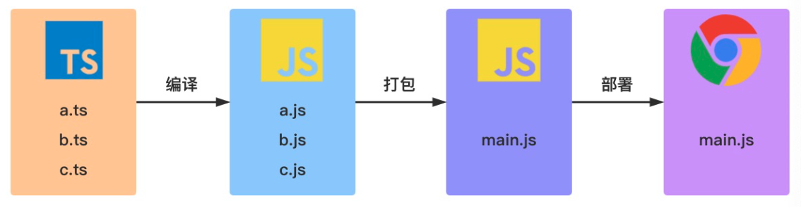

# 《重学TS》学习笔记（1）

## 第1章 TypeScript快速入门

### 一、TypeScript 是什么  

TypeScript 是由微软开发并开源的编程语言，它是 JavaScript 的一个超集，而且本质上是向 JavaScript 添加了可选的静态类型和基于类的面向对象编程。

#### 1.2 获取 TypeScript

命令行的 TypeScript 编译器可以使用 npm 包管理器来安装。

1. 安装 TypeScript

   ```shell
   npm install -g typescript
   ```

2. 验证 TypeScript

   ```shell
   tsc -v
   # Version x.x.x
   ```

3. 编译 TypeScript 文件

   ```shell
   tsc helloworld.ts
   # helloworld.tx => helloworld.js
   ```

此外，也可以直接使用线上的[TypeScript Playground](https://www.typescriptlang.org/play)来学习心得语法或新特性，通过配置 TS Config 的 Target，可以设置不同的编译目标。

#### 1.3 典型 TypeScript 工作流程



TypeScript 只会在编译阶段对类型进行静态检查，如果发现有错误，编译就会报错。而在运行时，编译生成的 JS 与普通的 JavaScript 文件一样，并不会进行类型检查。

### 二、TypeScript 基础类型

#### 2.1 Boolean 类型

```typescript
let isDone: boolean = false
// ES5: var isDone = false
```

#### 2.2 Number 类型

```typescript
let count: number = 10
// ES5: var count = 10
```

#### 2.3 String 类型

```typescript
let name: string = 'www'
// ES5: var name = 'www'
```

#### 2.4 Symbol 类型

```typescript
const sym = Symbol()
let obj = {
  [sym]: 'www'
}
console.log(obj[sym]) // www
```

#### 2.5 Array 类型

```typescript
let list: number[] = [1, 2, 3]
// ES5: var list = [1, 2, 3]

let list: Array<number> = [1, 2, 3] // Array<number> 是泛型语法
// ES5: var list = [1, 2, 3]
```

#### 2.6 Enum 类型

使用枚举可以定义一些带名字的常量。使用枚举可以清晰地表达意图或者创建一组有区别的用例。

TypeScript 支持数字和基于字符串的枚举。

1. 数字枚举

   ```typescript
   enum Direction {
     NORTH = 3,
     SOUTH,
     EAST,
     WEST
   }
   let dir: Direction = Direction.NORTH
   console.log(dir)
   console.log(Direction[4])
   ```

   在上述默认情况下，NORTH 的初始值为 0，其余的成员会从 1 开始自动增长。但是也可以自己设置枚举的初始值。

   上面的代码经过编译后，对应的代码如下：

   ```javascript
   "use strict";
   var Direction;
   (function (Direction) {
       Direction[Direction["NORTH"] = 3] = "NORTH";
       Direction[Direction["SOUTH"] = 4] = "SOUTH";
       Direction[Direction["EAST"] = 5] = "EAST";
       Direction[Direction["WEST"] = 6] = "WEST";
   })(Direction || (Direction = {}));
   let dir = Direction.NORTH;
   console.log(dir);
   console.log(Direction[4]);
   // 3
   // SOUTH
   ```

2. 字符串枚举

   ```typescript
   enum Direction {
     NORTH = 'NORTH',
     SOUTH = 'SOUTH',
     EAST = 'EAST',
     WEST = 'WEST'
   }
   ```

   在 TypeScript 2.4 版本后，ts 允许使用字符串进行枚举，在这种枚举里，每个成员都必须用字符串字面亮，或者用另一个字符串枚举成员进行初始化。

   ```javascript
   "use strict";
   var Direction;
   (function (Direction) {
       Direction["NORTH"] = "NORTH";
       Direction["SOUTH"] = "SOUTH";
       Direction["EAST"] = "EAST";
       Direction["WEST"] = "WEST";
   })(Direction || (Direction = {}));
   ```

3. 常量枚举

   常量枚举是使用`const`关键字修饰的枚举，这种枚举会使用内联语法，而不会为枚举类型编译生成任何 JavaScript 代码。比如下面的代码：

   ```typescript
   const enum Direction {
     NORTH,
     SOUTH,
     EAST,
     WEST
   }
   let dir: Direction = Direction.NORTH
   ```

   所对应的编译后代码如下：

   ```javascript
   "use strict";
   let dir = 0 /* NORTH */;
   ```

4. 异构枚举

   异构枚举指的是数字和字符串的混合：

   ```typescript
   enum Enum {
     A,
     B,
     C = 'C',
     D = 'D',
     E = 8,
     F
   }
   ```

   编译代码如下：

   ```javascript
   "use strict";
   var Enum;
   (function (Enum) {
       Enum[Enum["A"] = 0] = "A";
       Enum[Enum["B"] = 1] = "B";
       Enum["C"] = "C";
       Enum["D"] = "D";
       Enum[Enum["E"] = 8] = "E";
       Enum[Enum["F"] = 9] = "F";
   })(Enum || (Enum = {}));
   ```

   PS：要使用异构枚举，必须在指定字符串变量后，在接下来的一个变量中再使用数字重新赋值，否则会因为变量无法自动增长而报错。

#### 2.7 Any 类型

any 类型本质上是一个类型系统的逃逸仓，TypeScript 允许对 any 类型的值执行任何操作，而无序执行任何形式的检查。

使用 any 类型，可以很容易的编写类型正确的代码，但同时也就无法使用 TypeScript 提供的大量保护机制，为了解决这一问题，TypeScript 3.0 引入了 unknown 类型。

#### 2.8 Unknown 类型

就像所有类型都可以赋值给 any，所有的类型也都可以赋值给 unknown。

```typescript
let value: unknown
value = true
value = 42
value = 'Hello world'
value = []
value = {}
value = Math.random
value = null
value = undefined
value = new TypeError()
value = Symbol('type')
```

对 value 变量的所有赋值都被认为是类型正确的。但是，当我们尝试将类型为 unknown 的值赋值给其他类型的变量时，就会发现 unknown 类型只能被赋值给 any 类型或 unknown 类型本身。

```typescript
let value: unknown

let value1: unknown = value // true
let value2: any = value // true

let value3: boolean = value // Error
// ...
```

此外，将 value 变量类型设置为 unknown 后，一些操作都不再被认为是类型正确的。

```typescript
let value: unknown

value.foo.bar // Error
value.trim() // Error
value() // Error
new value() // Error
value[0][1] // Error
```

#### 2.9 Tuple 类型

在 JavaScript 中是没有元组的，这是 TypeScript 中特有的类型，其工作方式类似于数组。

元组可用于定义具有有限数量的，未命名属性的类型。每个属性都有一个关联的类型。使用元组时，必须提供每个属性的值。

```typescript
let tupleType: [string, boolean]
tupleType = ['www', true]
```

在元组初始化的时候，如果出现类型不匹配的话，比如：

```typescript
tupleType = [true, 'www']
```

TypeScript 编译器就会提示以下错误信息：

```txt
Type 'boolean' is not assignable to type 'string'.
Type 'string' is not assignable to type 'boolean'.
```

#### 2.10 Void 类型

从某种程度上来说，void 类型像是 any 类型相反，它表示没有任何类型。当一个函数没有返回值时，其返回值类型就是 void：

```typescript
// 声明函数返回值为 void
function warnUser(): void {
  console.log('This is a warning message')
}
```

需要注意的是，声明一个 void 类型的变量没有什么用，因为在严格模式下，void 类型的值只有 undefined：

```typescript
let unusable: void = undefined
// 等同于
let unusable: undefined = undefined
```

#### 2.11 Null 和 Undefined 类型

TypeScript 中，undefined 和 null 两者各自的类型分别为 undefined 和 null。

```typescript
let u: undefined = undefined
let n: null = null
```

#### 2.12 object, Object 和 {} 类型

1. object 类型

   object 类型是 TypeScript 2.2 引入的新类型，它用于表示**非原始类型**

   ```typescript
   interface ObjectConstructor {
     create(o: object | null): any;
   }
   
   const proto = {}
   
   Object.create(proto) // OK
   Object.create(null) // OK
   Object.create(undefined) // Error
   Object.create(1) // Error
   Object.create(true) // Error
   Object.create('oops') // Error
   ```

2. Object 类型

   它是所有 Object 类的实例的类型，由以下两个接口来定义：

   - Object 接口定义了 Object.prototype 原型对象上的属性

     ```typescript
     interface Object {
       constructor: Function;
       toString(): string;
       toLocaleString(): string;
       valueOf(): Object;
       hasOwnProperty(v: PropertyKey): boolean;
       isPrototypeOf(v: Object): boolean;
       propertyIsEnumerable(v: PropertyKey): boolean;
     }
     ```

   - ObjectConstructor 接口定义了 Object 类的属性

     ```typescript
     interface ObjectConstructor {
       new(value?: any): Object;
       (value?: any): any;
        readonly prototype: Object;
        getPrototypeOf(o: any): any;
     }
     
     declare var Object: ObjectConstructor
     ```

     Object 类的所有实例都继承了 Object 接口中的所有属性

3. {} 类型

   `{}`类型描述了一个没有成员的对象。当你试图访问这样一个对象的任意属性时，TypeScript 会产生一个编译时错误。

   ```typescript
   const obj = {}
   
   obj.prop = 'www' // Error: Property 'prop' does not exist on type '{}'.
   ```

   但是依然可以通过 JavaScript 的原型链对其 Object 类型上的属性和方法进行访问和使用。

#### 2.13 Never 类型

`never`类型表示的是那些永不存在的值的类型。例如`never`类型是那些一定会抛出异常，或是根本就不会有返回值的函数的返回值类型。

用一句话来说就是，返回 never 的函数必须存在无法到达的终点。

```typescript
function getError (): never {
    throw Error('123')
}

function alwaysLoop(): never {
    while (true) {}
}
```

在 TypeScript 中，可以利用 never 类型的特性来实现全面性检查。

```typescript
type Foo = string | number

function controlFlowAnalysisWithNever(foo: Foo) {
  if (typeof foo === 'string') {
    // foo 被收窄为 string 类型
  } else if (typeof foo === 'number') {
    // foo 被收窄为 number 类型
  } else {
    // foo 在这里是 never
    const check: never = foo
  }
}
```

通过上面的类型收缩，可以确保`controlFlowAnalysisWithNever`这个方法总是可以穷尽 Foo 的所有可能类型，否则就会报编译错误，也可以看出 never 的其中一种用法：可以避免出现新增了联合类型没有对应的实现，目的就是写出类型绝对安全的代码。

### 三、TypeScript 断言

#### 3.1 类型断言

通过类型断言的方式可以告诉编译器：“相信我，我知道自己在干什么”。类型断言就相当于其他语言里的类型转换，但是并不会进行特殊的数据检查和解构，并且只在编译阶段起作用。

类型断言有两种表现形式：

1. “尖括号”语法

   ```typescript
   let someValue: any = 'this is a string'
   let strLength: number = (<string>someValue).length
   ```

2. as 语法

   ```typescript
   let someValue: any = 'this is a string'
   let strLength: number = (someValue as string).length
   ```

#### 3.2 非空断言

在上下文当中，当类型检查器无法断定类型时，一个新的后缀表达式操作符`!`可以用于断言操作对象是非 null 和非 undefined 类型。具体而言，**x! 将从 x 值域中排除 null 和 undefined**

下面是非空断言操作符的一些使用场景：

1. 忽略 undefined 和 null 类型

   ```typescript
   function myFunc(maybeString: string | undefined | null) {
     const onlyString: string = maybeString // Error，maybeString 有可能是 null 或 undefined 值
     const ignoreUndefinedAndNull: string = maybeString! // Ok
   }
   ```

2. 调用函数时忽略 undefined 类型

   ```typescript
   type NumGenerator = () => number
   function myFunc(numGenerator: NumGenerator | undefined) {
     const num1 = numGenerator() // Error
     const num2 = numGenerator!() // OK
   }
   ```

如果使用了非空断言操作符，则需要自行注意并处理传入值为空的情况。

#### 3.3 确定赋值断言

TypeScript 2.7 版本中引入了赋值断言，允许在实例属性和变量声明后面放一个`!`号，从而告诉 TypeScript 这个属性可以被放心的使用（会被明确的赋值），比如下面的例子：

```typescript
let x: number
initialize()
console.log(2 * x)

function initialize(): void {
  x = 10
}

// Error: Variable 'x' is used before being assigned.
```

上面的代码会报错，是因为 TypeScript 无法确定 x 是否在使用的时候真的具有一个类型为 number 的值。使用赋值断言可以打消这种疑虑。

```typescript
let x!: number // 确定赋值断言，TypeScript 编译器就会知道该属性会被明确地赋值
initialize()
console.log(2 * x)

function initialize(): void {
  x = 10
}
```

### 四、类型守卫

类型守卫是可执行时检查的一种表达式，用于确保该类型在一定的范围内。

目前主要有四种方式来实现类型保护。

#### 4.1 in 关键字

```typescript
interface Admin {
  name: string;
  privileges: string[];
}
interface Employee {
  name: string;
  startDate: Date;
}
type UnknownEmployee = Employee | Admin;
function printEmployeeInformation(emp: UnknownEmployee) {
  console.log("Name: " + emp.name);
  if ("privileges" in emp) {
  	console.log("Privileges: " + emp.privileges);
  }
  if ("startDate" in emp) {
  	console.log("Start Date: " + emp.startDate);
  }
}
```

#### 4.2 typeof 关键字

```typescript
 function padLeft(value: string, padding: string | number) {
  if (typeof padding === "number") {
  	return Array(padding + 1).join(" ") + value; }
  if (typeof padding === "string") {
    return padding + value;
  }
  throw new Error(`Expected string or number, got '${padding}'.`);
 }
```

TypeScript 中的类型保护只支持两种形式：`typeof v === typename`和`typeof v !== typename`，而`typename`必须是`number`，`string`，`boolean`或`symbol`。其他的类型虽然 TypeScript 依然允许进行比较，**但不会把这些表达式识别为类型保护**。

#### 4.3 instanceof 关键字

```typescript
interface Padder {
  getPaddingString(): string;
}

class SpaceRepeatingPadder implements Padder {
  constructor(private numSpaces: number) {}
  getPaddingString() {
		return Array(this.numSpaces + 1).join(" ");
  }
}

class StringPadder implements Padder {
  constructor(private value: string) {}
  getPaddingString() {
		return this.value;
  }
}

let padder: Padder = new SpaceRepeatingPadder(6);

if (padder instanceof SpaceRepeatingPadder) {
  // padder的类型收窄为 'SpaceRepeatingPadder'
}
```

#### 4.4 自定义类型保护的类型谓词

> [TypeScript 中的 is（返回一个类型谓词和返回一个 boolean 值类型区别在哪里？）](https://segmentfault.com/a/1190000022883470)
>
> 答：区别是可以让 TS 进一步缩小变量的类型，让错误代码在编译阶段就被发现而不影响运行时。同时激活类型保护，让`if(isNumber(x)){}`后面的块级作用域将类型缩小。

```typescript
function isNumber(x: any): x is number {
  return typeof x === 'number'
}

function isString(x: any): x is string {
  return typeof x === 'string'
}
```

### 五、联合类型和类型别名


> 本次阅读至 19  五、联合类型和类型别名


