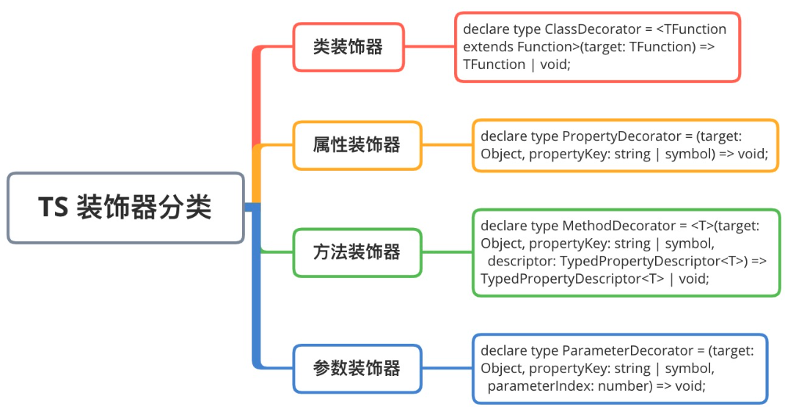
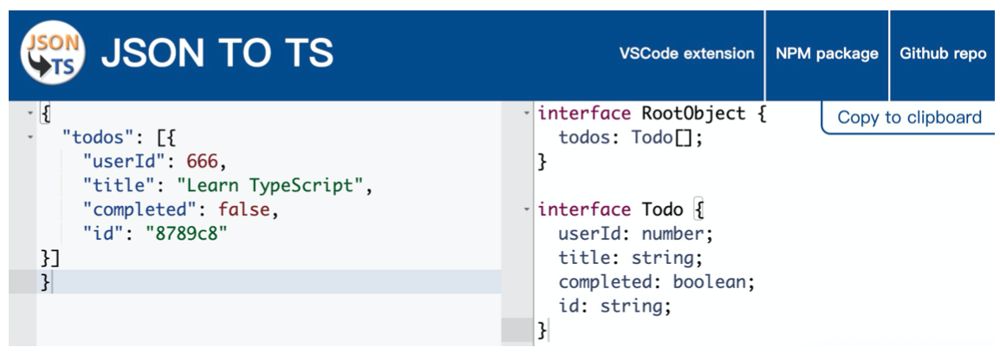

# 《重学TS》学习笔记（2）

## 第1章 TypeScript快速入门（下）

### 十、TypeScript 接口

在面向对象语言中，接口是一个很重要的概念，它是对行为的抽象，而具体如何行动需要由类去实现。

#### 10.1 对象的形状

```typescript
interface Person {
  name: string;
  age: number;
}

let semlinker: Person = {
  name: 'semlinker',
  age: 33
}
```

#### 10.2 可选｜只读属性

```typescript
interface Person {
  readonly name: string;
  age?: number;
}
```

只读属性用于限制只能在对象刚刚创建的同时进行属性的创建，此外 TypeScript 还提供了`ReadonlyArray<T>`类型，它与`Array<T>`相似，只是把所有可变方法取掉了，因此可以确保数组创建之后再也不能被修改。

```typescript
let a: number[] = [1, 2, 3, 4];
let ro: ReadonlyArray<number> = a;
ro[0] = 12; // error!
ro.push(5); // error!
ro.length = 100; // error!
a = ro; // error!
```

#### 10.3 任意属性

一个接口除了包含必选和可选属性以外，还允许有其他的任意属性，可以使用**索引签名**来满足上述要求。

```typescript
interface Person {
  name: string;
  age?: number;
  [propName: string]: any;
}
const p1 = { name: "semlinker" };
const p2 = { name: "lolo", age: 5 };
const p3 = { name: "kakuqo", sex: 1 };
```

#### 10.4 接口与类型别名的区别

> 个人总结：在使用 class 定义的时候尽量使用`interface`，可以方便地对继承父类（extend）的 interface 进行实现（implements），其余需要与其他类型联动的时候尽量使用`type`。

1. Objects/Functions

   `interface`和`type`都可以用来描述对象和函数。

   ```typescript
   // 使用 interface
   interface Point {
     x: number;
     y: number;
   }
   
   interface SetPoint {
     (x: number, y: number): void;
   }
   
   // 使用类型别名
   type Point = {
     x: number;
     y: number;
   }
   
   type SetPoint = (x: number, y: number) => void;
   ```

2. Other Types

   对于其他类型，比如原始类型，联合类型和元组，只能用 type。

   ```typescript
   // primitive
   type Name = string;
   
   // object
   type PartialPointX = { x: number; }
   type PartialPointY = { y: number; }
   
   // union
   type PartialPoint = PartialPointX | PartialPointY
   
   // tuple
   type Data = [number, string]
   ```

3. Extend

   interface 和 type 都能够被扩展，但语法有所不同。此外，接口和类型别名并不是互斥的，彼此之间可以互相扩展。

   ```typescript
   // 接口扩展接口
   interface PartialPointX { x: number; }
   interface Point extends PartialPointX {
     y: number;
   }
   
   // 类型扩展类型
   type PartialPointX = { x: number; };
   type Point = PartialPointX & { y: number; };
   
   // 接口扩展类型
   type PartialPointX = { x: number; };
   interface Point extends PartialPointX { y: number; }
   
   // 类型扩展接口
   interface PartialPointX { x: number; }
   type Point = PartialPointX & { y: number; };
   ```

4. Implements

   class 可以使用`implements`的方式来实现 interface 或 type，但注意使用 type 的时候，这个 type 不能是联合类型。

   ```typescript
   interface Point {
     x: number;
     y: number;
   }
   
   class SomePoint implements Point {
     x = 1;
     y = 2;
   }
   
   type Point2 = {
     x: number;
     y: number;
   }
   
   class SomePoint2 implements Point2 {
     x = 1;
     y = 2;
   }
   
   type PartialPoint = { x: number; } | { y: number; }
   
   // Error: A class can only implement an object type or intersection of object types with statically known members.
   class SomePartialPoint implements PartialPoint {
     x = 1;
     y = 2;
   }
   ```

5. Declaration merging

   与 type 不一样的是，interface 可以定义多次，并会自动合并为单个接口。

   ```typescript
   interface Point { x: number }
   interface Point { y: number }
   
   const point: Point = { x: 1, y: 2 }
   ```

### 十一、TypeScript 类

#### 11.1 类的属性与方法

在 TypeScript 中，可以通过`class`关键字来定义一个类。

```typescript
class Greeter {
  // 静态属性
  static cname: string = 'Greeter';
  // 成员属性
  greeting: string;
  // 构造函数 - 执行初始化操作
  constructor(message: string) {
    this.greeting = message;
  }
  // 静态方法
  static getClassName() {
    return 'Class name is Greeter'
  }
  // 成员方法
  greet() {
    return 'Hello, ' + this.greeting
  }
}

let greeter = new Greeter('world')
```

编译后的 JavaScript 代码如下（需要将 Export 的 JavaScript 版本设置为 ES5 才会比较直观）：


```javascript
"use strict";
var Greeter = /** @class */ (function () {
    // 构造函数 - 执行初始化操作
    function Greeter(message) {
        this.greeting = message;
    }
    // 静态方法
    Greeter.getClassName = function () {
        return 'Class name is Greeter';
    };
    // 成员方法
    Greeter.prototype.greet = function () {
        return 'Hello, ' + this.greeting;
    };
    // 静态属性
    Greeter.cname = 'Greeter';
    return Greeter;
}());
var greeter = new Greeter('world');
```

#### 11.2 ECMAScript 私有字段

TypeScript 3.8 版本以后开始支持 ECMAScript 私有字段，使用方式如下：

```typescript
// Error: Private identifiers are only available when targeting ECMAScript 2015 and higher.
class Person {
  #name: string;
  constructor(name: string) {
    this.#name = name;
  }

	greet() {
    console.log(`Hello, my name is ${this.#name}`)
  }
}

let semlinker = new Person('Semlinker')

// Property '#name' is not accessible outside class 'Person' because it has a private identifier.
console.log(semlinker.#name)
```

与常规属性（甚至使用`private`修饰符声明的属性）不同，私有字段要牢记以下规则：

- 编译的目标必须大于等于 ES6
- 私有字段以`#`字符开头
- 每个私有字段名称都唯一地限定于其包含的类
- 不能在私有字段上使用 TypeScript 可访问性修饰符（如 public 或 private）
- 私有字段不能在包含的类之外访问，甚至不能被检测到

#### 11.3 访问器

在 TypeScript 中，可以通过`getter`和`setter`方法来实现数据的封装和有效性检验，防止出现异常数据。

```typescript
let passcode = "Hello TypeScript";
class Employee {
  private _fullName: string = 'not defined';
  get fullName(): string {
    return this._fullName;
  }
  set fullName(newName: string) {
    if (passcode && passcode == "Hello TypeScript") {
      this._fullName = newName;
    } else {
      console.log("Error: Unauthorized update of employee!");
    }
  }
}
let employee = new Employee();
employee.fullName = "Semlinker";

if (employee.fullName) {
  console.log(employee.fullName); // Semlinker
}
```

#### 11.4 类的继承

继承指的是一个类（又称子类，子接口）继承另一个类（称为父类、父接口）的功能，是类与类或接口与接口之间最常见的关系。

在 TypeScript 中，可以通过`extends`关键字来实现继承。

```typescript
class Animal {
  name: string;
  constructor(theName: string) {
    this.name = theName;
  }
  move(distanceInMeters: number = 0) {
    console.log(`${this.name} moved ${distanceInMeters}m.`);
  }
}
class Snake extends Animal {
  constructor(name: string) {
    super(name); // 调用父类的构造函数
  }
  move(distanceInMeters = 5) {
    console.log("Slithering...");
    super.move(distanceInMeters);
  }
}

let sam = new Snake("Sammy the Python");
sam.move();
```

#### 11.5 抽象类

使用`abstract`关键字声明的类称为抽象类，抽象类不能被实例化，其中包含一个或多个抽象方法，即不包含具体实现的函数：

```typescript
abstract class Person {
  constructor(public name: string) {}
  abstract say(words: string): void;
}

// Error: Cannot create an instance of an abstract class.
const lolo = new Person()
```

可以看到抽象类不能被直接实例化，如果要使用，只能通过一个子类继承该抽象类，并实例化所有的抽象方法，如下：

```typescript
abstract class Person {
  constructor(public name: string) { }
  abstract say(words: string): void; // 抽象方法
}

class Developer extends Person {
  constructor(name: string) {
    super(name)
  }
  say(words: string): void {
    console.log(`${this.name} syas ${words}`)
  }
}

const lolo = new Developer('lolo')
lolo.say('hi') // lolo says hi
```

#### 11.6 类方法重载

如之前介绍，对于类的方法来说也支持重载。

```typescript
class ProductService {
  getProducts(): string;
  getProducts(id: number): number;
  
  getProducts(id?: number): string | number {
    if (typeof id === 'number') {
      console.log(`获取id为 ${id} 的产品信息`);
      return 123
    } else {
      console.log(`获取所有的产品信息`);
      return '23'
    }
  }
}
const productService = new ProductService();
const a = productService.getProducts(666); // 获取id为 666 的产品信息

const b = productService.getProducts(); // 获取所有的产品信息
```

PS：要注意具体的实现必须要支持所有定义的重载情况

> [重载函数类型的兼容性](https://juejin.cn/post/6912309038743191559#heading-17)
>
> 1. 参数个数：**目标函数的参数个数一定要多于源函数的参数个数**。
> 2. 参数类型：**目标函数的参数类型必须与源函数的返回值类型相同，或者是其子类型**。
> 3. 返回值类型：**目标函数的返回值类型必须与源函数的返回值类型相同，或者是其子类型**。

### 十二、TypeScript 泛型

泛型（Generics）是允许同一个函数接受不同类型参数的一种模板，**使用泛型可以创建可重用的组件，一个组件可以支持多种类型的数据。这样用户就可以定义自己的数据类型来使用组件**。

设计泛型的目的是在成员之间提供有意义的约束，这些成员可以是：

- 类的实例成员
- 类的方法
- 函数参数和函数返回值

#### 12.1 泛型语法


参考上图，当调用 idendity 方法时，会使用`identity<Number>(1)`这种调用方法，它将在出现`T`的任何位置填充该类型。

图中的`<T>`被称为类型变量，它是开发者希望传递给 identity 函数的类型占位符。

从上图可以看到它也被赋予给`value`参数和函数返回类型：此时`T`充当的是类型，而不是特定的 Number 类型。

T 代表 Type，在定义泛型时通常用作第一个类型变量名称，但实际上`T`可以用任何有效名称代替，除了`T`以外，还有几种在开发中常用的泛型变量代表：

- K（Key）：表示对象中的键类型
- V（Value）：表示对象中的值类型
- E（Element）：表示元素类型

我们可以引入希望定义的任何数量的类型变量，在使用时，类型可以像传递给函数的参数一样传递。


除此之外，在使用时也可以让编译器自动选择这些类型，从而使代码更加简洁，比如说可以这样：

```typescript
function identity<T, U>(value: T, message: U): T {
  console.log(message);
  return value;
}
// 编译器能够从参数自动读取类型并将它们赋值给 T 和 U，而不需要开发人员显式指定它们
console.log(identity(68, "Semlinker"));
```

#### 12.2 泛型接口

```typescript
interface GenericIndentityFn<T> {
  (arg: T): T;
}
```

#### 12.3 泛型类

```typescript
class GenericNumber<T> {
  zeroValue!: T;
  add!: (x: T, y: T) => T;
}

let myGenericNumber = new GenericNumber<number>();
myGenericNumber.zeroValue = 0;
myGenericNumber.add = function (x, y) {
  return x + y;
};
```

#### 12.4 泛型工具类型

为了方便开发者，TypeScript 内置了一些常用的工具类型，比如：

- Partial
- Required
- Readonly
- Record
- ReturnType

还有其余等等……

本节只会简单介绍 Partial 工具类型，但在介绍之前还会介绍一些相关的基础知识，方便自行学习其他的工具类型。

1. typeof

   在 TypeScript 中，`typeof`操作符可以用来获取一个变量声明或对象的类型，比如：

   ```typescript
   interface Person {
     name: string;
     age: number;
   }
   const sem: Person = { name: 'semlinker', age: 33 };
   type Sem = typeof sem; // -> Person
   function toArray(x: number): Array<number> {
     return [x];
   }
   type Func = typeof toArray; // -> (x: number) => number[]
   ```

2. keyof

   `keyof`操作符是在 TypeScript 2.1 版本引入的，该操作符可以用于获取某种类型的所有键，其返回类型是联合类型。

   ```typescript
   interface Person {
     name: string;
     age: number;
   }
   
   type K1 = keyof Person; // 'name' | 'age'
   type K2 = keyof Person[]; // number | 'length' | 'toString' | 'pop' | 'push' | 'concat' | 'join'
   type K3 = keyof { [x: string]: Person } // string | number
   ```

   TypeScript 中支持两种索引签名，分别是数字索引和字符串索引：

   ```typescript
   interface StringArray {
     // 字符串索引 -> keyof StringArray => string | number
     [index: string]: string;
   }
   
   const stringArray: StringArray = { 0: 'hi', 1: 'hi', 'go': 'hi', goo: 'hi' }
   
   interface StringArray1 {
     // 数字索引 -> keyof StringArray1 => number
     [index: number]: string;
   }
   
   const stringArray1:StringArray1 = ['hi', 'hi', 'hi']
   ```

   在 JavaScript 中，对象的索引既可以是 string 也可以是 number，而当对象使用数值索引时，JavaScript 在执行索引操作时，会先把数值索引转换为字符串索引。所以`keyof {[x: string]: Person}`的结果会返回`string|number`。

3. in

   `in`操作符用于遍历枚举类型。

   ```typescript
   type Keys = 'a' | 'b' | 'c'
   
   type Obj = {
     [p in Keys]: any
   } // -> { a: any, b: any, c: any }
   ```

4. infer

   > [TypeScript `infer` 关键字](https://www.cnblogs.com/wayou/p/typescript_infer.html)

   在条件类型语句中，可以使用`infer`操作符声明一个类型变量并且对它进行使用。

   ```typescript
   // 这里的 T 必然是一个函数类型，否则 ReturnType 只会返回 never
   type ReturnType<T extends (...args: any) => any> = T extends (...args: any[]) => infer R ? R : any;
   ```

   上面代码中的`infer R`会声明一个变量，用于承载传入函数签名的返回值类型，简单来说，就是可以用它取到函数的返回值的类型方便之后使用。

   > PS：个人理解，infer 的作用在于对一个类型描述（既可以是泛型也可以是其他的函数类型）进行类型抽取。
   >
   > 比如下面的这个，通过人工指定一个`(args: any[]) => Promise<infer U>`的类型描述，使用`infer`对其返回的类型的参数进行处理，既可以像上面的 ReturnType 一样将整体的返回类型抽出来作为 R，也可以单独抽取返回的泛型中的参数作为 R：
   >
   > ```typescript
   > type UnPromisify<T> = T extends (...args: any[]) => Promise<infer U> ? U : never;
   >                                                          
   > async function stringPromise() {
   >   	return "string promise"; // Promise<string>
   > }
   > 
   > type a = UnPromisify<typeof stringPromise>; // string
   > ```

5. extends

   有时候定义的泛型不想过于灵活，或者想继承某些类的时候，就可以通过 extends 关键字添加约束。

   ```typescript
   interface Lengthwise {
     length: number;
   }
   
   function loggingIdentity<T extends Lengthwise>(arg: T): T {
     console.log(arg.length);
     return arg;
   }
   ```

   现在这个泛型函数就被定义了约束，不再适用于任何类型，而是需要传入包含接口属性的约束类型。

   ```typescript
   loggingIdentity(3); // Error, number doesn't have a .length property
   
   loggingIdentity({length: 10, value: 3});
   ```

6. Partial

   `Partial<T>`的作用是将某个类型里的属性全部变成可选项`?`。

   ```typescript
   // 定义：首先通过 keyof T 拿到 T 的所有属性名，然后使用 in 进行遍历，将值赋给 P，最后通过 T[P] 取得相应的属性值
   
   /**
   * node_modules/typescript/lib/lib.es5.d.ts * Make all properties in T optional
   */
   type Partial<T> = {
     [P in keyof T]?: T[P];
   };
   ```

   使用示例：

   ```typescript
   interface Todo {
     title: string;
     description: string;
   }
   
   
   function updateTodo(todo: Todo, fieldsToUpdate: Partial<Todo>) {
     return { ...todo, ...fieldsToUpdate };
   }
   const todo1 = {
     title: "Learn TS",
     description: "Learn TypeScript",
   };
   const todo2 = updateTodo(todo1, {
     description: "Learn TypeScript Enum",
   });
   ```

   在上面的 updateTodo 方法中，利用`Partial<T>`工具类型，可以方便地将 fieldsToUpdate 参数的类型由 Todo 改为可选，即：

   ```txt
   {
      title?: string | undefined;
      description?: string | undefined;
   }
   ```

### 十三、TypeScript 装饰器

#### 13.1 装饰器是什么

- 它是一个表达式
- 该表达式被执行后，返回一个函数
- 函数的入参分别为 target、name 和 descriptor
- 执行该函数后，可能会返回 descriptor 对象，用于配置 target 对象

#### 13.2 装饰器的分类

- 类装饰器
- 属性装饰器
- 方法装饰器
- 参数装饰器



需要注意的是，若要启用实验性的装饰器特性，则必须在命令行或者`tsconfig.json`里面启用`experimentalDecorators`编译器选项：

**命令行**：

```shell
tsc --target ES5 --experimentalDecorators
```

**tsconfig.json**

```typescript
{
  "compilerOptions": {
    "target": "ES5",
      "experimentalDecorators": true
  }
}
```

#### 13.3 类装饰器

类装饰器声明：

```typescript
declare type ClassDecorator = <TFunction extends Function> (target: TFunction) => TFunction | void;
```

类装饰器顾名思义是用来装饰类的，它接收一个参数：

- target：TFunction - 被装饰的类

```typescript
function Greeter(target: Function): void {
  target.prototype.greet = function (): void {
    console.log('Hello Semlinker');
  }
}

@Greeter
class Greeting {
  constructor() {
    // 内部实现
  }
}

let myGreeting = new Greeting();
(myGreeting as any).greet(); // console output: Hello Semlinker
```

上面的例子中，定义了`Greeter`类装饰器，同时使用了`@Greeter`语法糖，来使用装饰器。

此外还有一种可以接受特定参数的装饰器：

```typescript
function Greeter(greeting: string): void {
  return function (target: Function) {
    target.prototype.greet = function (): void {
      console.log(greeting)
    }
  }
}

@Greeter('Hello TS!')
class Greeting {
  constructor() {
    // 内部实现
  }
}

let myGreeting = new Greeting();
(myGreeting as any).greet(); // console output: Hello Semlinker
```

#### 13.4 属性装饰器

属性装饰器声明：

```typescript
declare type PropertyDecorator = (target:Object, propertyKey: string | symbol ) => void;
```

属性装饰器接受两个参数：

- target：Object - 被装饰得类
- propertyKey：string｜symbol - 被装饰类的属性名

```typescript
function logProperty(target: any, key: string) {
  delete target[key];
  const backingField = "_" + key;
  Object.defineProperty(target, backingField, {
    writable: true,
    enumerable: true,
    configurable: true
  });
  // property getter
  const getter = function (this: any) {
    const currVal = this[backingField];
    console.log(`Get: ${key} => ${currVal}`);
    return currVal;
  };
  // property setter
  const setter = function (this: any, newVal: any) {
    console.log(`Set: ${key} => ${newVal}`);
    this[backingField] = newVal;
  };
  // Create new property with getter and setter
  Object.defineProperty(target, key, {
    get: getter,
    set: setter,
    enumerable: true,
    configurable: true
  });
}
class Person {
  @logProperty
  public name: string;
  constructor(name: string) {
    this.name = name;
  }
}
const p1 = new Person("semlinker");
p1.name = "kakuqo";

// [LOG]: "Set: name => semlinker" 
// [LOG]: "Set: name => kakuqo" 
```

以上代码定义了一个`logProperty`函数，来跟踪用户对属性的操作。

#### 13.5 方法装饰器

```typescript
declare type MethodDecorator = <T>(target: Object, propertyKey: string | symbol, descriptor: TypePropertyDescript<T>) => TypedPropertyDescriptor<T> | void;
```

方法装饰器顾名思义，用来装饰类的方法。它接收三个参数：

- target：Object - 被装饰的类
- propertyKey：string｜symbol - 方法名
- descriptor：TypePropertyDescript - 属性描述符

```typescript
function log(target: Object, propertyKey: string, descriptor: PropertyDescriptor) {
  let originalMethod = descriptor.value;
  descriptor.value = function (...args: any[]) {
    console.log("wrapped function: before invoking " + propertyKey);
    let result = originalMethod.apply(this, args);
    console.log("wrapped function: after invoking " + propertyKey);
    return result;
  };
}
class Task {
  @log
  runTask(arg: any): any {
    console.log("runTask invoked, args: " + arg); return "finished";
  }
}
let task = new Task();
let result = task.runTask("learn ts");
console.log("result: " + result);

// [LOG]: "Set: name => semlinker" 
// [LOG]: "Set: name => kakuqo" 
```

#### 13.6 参数装饰器

```typescript
declare type ParameterDecorator = (target: Object, propertyKey: string | symbol, parameterIndex: number) => void
```

参数装饰器用来装饰函数的参数，接受三个参数：

- target：Object - 被装饰的类
- propertyKey：string｜symbol - 方法名
- parameterIndex：number - 方法中参数的索引值

```typescript
function Log(target: Function, key: string, parameterIndex: number) {
  let functionLogged = key || target.prototype.constructor.name;
  console.log(`The parameter in position ${parameterIndex} at ${functionLogged} has been decorated`);
}
class Greeter {
  greeting: string;
  constructor(@Log phrase: string) {
    this.greeting = phrase;
  }
}

// [LOG]: "The parameter in position 0 at Greeter has been decorated" 
```

### 十四、TypeScript 4.0 新特性

#### 14.1 构造函数的类属性判断

当`noImplicitAny`配置属性被启用（Enable error reporting for expressions and declarations with an implied `any` type），TypeScript 4.0 就可以使用控制流分析来确认类中的属性类型。

```typescript
class Person {
  fullName; // string
  firstName; // string
  lastName; // string
  
  constructor(fullName: string) {
    this.fullName = fullName;
    this.firstName = fullName.split(' ')[0];
    this.lastName = fullName.split(' ')[0];
  }
}
```

上面的代码在 4.0 以前的版本会被编译器报错：

```txt
Errors in code
Member 'fullName' implicitly has an 'any' type.
Member 'firstName' implicitly has an 'any' type.
Member 'lastName' implicitly has an 'any' type.
```

而 4.0 的该功能使得 TypeScript 可以从构造函数推断类属性的类型。但要注意如果在使用过程中，没法保证对成员属性都进行赋值，那么该属性可能会被认为是`undefined`

```typescript
class Person {
  fullName; // (property) Person.fullName: string
  firstName; // (property) Person.fullName: string | undefined
  lastName; // (property) Person.fullName: string | undefined
  
  constructor(fullName: string) {
    this.fullName = fullName;
    if (Math.random()) {
      this.firstName = fullName.split(' ')[0];
    	this.lastName = fullName.split(' ')[0];
    }
  }
}
```

#### 14.2 标记的元组元素

TypeScript 4.0 以后允许在函数中，为元组参数的每一个元素都指定一个名字，从而让 IDE 的智能提示变得更加友好。

```typescript
// 未使用标签的智能提示
// addPerson(args_0: string, args_1: number): void
function addPerson(...args: [string, number]): void {
  console.log(`Person info: name: ${args[0]}, age: ${args[1]}`)
}

// 已使用标签的智能提示
// addPerson(name: string, age: number): void
function addPerson(...args: [name: string, age: number]): void {
  console.log(`Person info: name: ${args[0]}, age: ${args[1]}`);
}
```

### 十五、编译上下文

#### 15.1 tsconfig.json 的作用

- 用于标识 TypeScript 项目的根路径
- 用于配置 TypeScript 编译器
- 用于指定编译的文件

#### 15.2 tsconfig.json 重要字段

- files - 设置要编译的文件的名称
- include - 设置需要进行编译的文件，支持路径模式匹配
- exclude - 设置无需进行编译的文件，支持路径模式匹配
- compilerOptions - 设置与编译流程相关的选项

#### 15.3 compilerOptions 选项

compilerOptions 支持很多选项，详细说明如下：

```json
{
  "compilerOptions": {
    /* 基本选项 */
    "target": "es5", // 指定输出的 ECMAScript 目标版本选项：ES3(默认),ES5,ES6/ES2015,ES2016,ES2017,ESNEXT
    "module": "commonjs", // 指定使用模块：commonjs，amd，system，umd，es2015
    "lib": [], // 指定要包含在编译中的库文件
    "allowJs": true, // 允许编译 javaScript 文件
    "checkJs": true, // 报告 javaScript 文件中的错误
    "jsx": "preserve", // 指定 jsx 代码的生成：preserve, react-native, react
    "declaration": true, // 生成相应的 d.ts 文件
    "sourceMap": true, // 生成相应的 .map 文件
    "outFile": "./", // 将输出文件合并为一个文件
    "outDir": "./", // 指定输出目录
    "rootDir": "./", // 用来控制输出目录结构 --outDir
    "removeComments": true, // 删除编译后的所有注释
    "noEmit": true, // 不生成输出文件
    "importHelpers": true, // 从 tslib 导入辅助工具函数
    "esModuleInterop": true, // 允许编译生成文件时，在代码中注入工具类(__importDefault、__importStar)对ESM与commonjs混用情况做兼容处理
    "isolatedModules": true, // 将每个文件作为单独的模块（与 ts.transpileModule 类似）

    /* 严格的类型检查选项 */
    "strict": true, // 启用所有严格类型检查选项
    "noImplicitAny": true, // 在表达式和声明上有隐含的 any 类型时报错（该功能会使得 TypeScript 使用控制流分析来确认类中的属性类型。）
    "strictNullChecks": true, // 启用严格的 null 检查
    "noImplicitThis": true, // 当 this 表达式值为 any 类型的时候，生成一个错误
    "alwaysStrict": true, // 以严格模式检查每个模块，并在每个文件里加入 'use strict'

    /* 额外的检查 */
    "noUnusedLocals": true, // 有未使用的变量时，抛出错误
    "noUnusedParameters": true, // 有未使用的参数时，抛出错误
    "noImplicitReturns": true, // 并不是所有函数都有返回值时，抛出错误
    "noFallthroughCasesInSwitch": true, // 不允许 switch 中的 case 语句贯穿，否则报错

    /* 模块解析选项 */
    "moduleResolution": "node", // 模块解析策略：node（Node.js）或 classic（typeScript pre-1.6）
    "baseUrl": "./", // 用于解析非相对模块名称的基目录
    "paths": {}, // 模块名到基于 baseUrl 的路径映射的列表
    "rootDirs": [], // 根文件夹列表，其组合内容表示项目运行时的结构内容
    "typeRoots": [], // 包含类型声明的文件列表
    "types": [], // 需要包含的类型声明文件名列表
    "allowSyntheticDefaultImports": true, // 允许从没有设置默认导出的模块中默认导出
    

    /* Source Map Options */
    "sourceRoot": "./", // 指定调试器应该找到 TypeScript 文件而不是源文件位置
    "mapRoot": "./", // 指定调试器应该找到映射文件而不是生成文件的位置
    "inlineSourceMap": true, // 生成单个 sourcemaps 文件，而不是将 sourcemaps 生成不同的文件
    "inlineSources": true, // 将代码与 sourcemaps 生成到一个文件中，要求同时设置了 --inlineSourceMap 或 --sourceMap 属性

    /* 其他选项 */
    "experimentalDecorators": true, // 启用装饰器
    "emitDecoratorMetadata": true // 为装饰器提供元数据支持
  }
}
```

### 十六、TypeScript 开发辅助工具

下面会介绍一些学习 TypeScript 时的辅助工具：

- [TypeScript PlayGround](https://www.typescriptlang.org/play/)

  TypeScript 官方提供的在线 TypeScript 运行环境，可以方便地学习 TypeScript 相关知识与不同版本的功能特性。

  除此以外，还可以选择 codepen.io、stackblitz 或 jsbin.com 等网站。

- [TypeScript UML Playground](https://tsuml-demo.firebaseapp.com/)

  一款在线的 TypeScript UML 工具，可以使用指定的 TypeScript 代码生成 UML 类图

- [JSON TO TS](http://www.jsontots.com/)

  可以使用指定的 JSON 数据生成对应的 TypeScript 接口定义

  

- [Schemats](https://github.com/SweetIQ/schemats)

  利用 Schemats 可以基于 SQL 数据库（Postgres，MySQL）中的 schema 自动生成 TypeScript 接口定义。

- [TypeScript AST Viewer](https://ts-ast-viewer.com/)

  一款 TypeScript AST 在线工具，类似于 TypeScript 版本的 [astexplorer](https://astexplorer.net/)，利用它你可以查看制定 TypeScript 代码对应的抽象语法数。

- [TypeDoc](https://typedoc.org/)

  用于将 TypeScript 源代码中的注释转换为 HTML 文档或 JSON 模型。

- [TypeScript ESLint](https://typescript-eslint.io/)

  TypeScript 版本的 ESLint。


