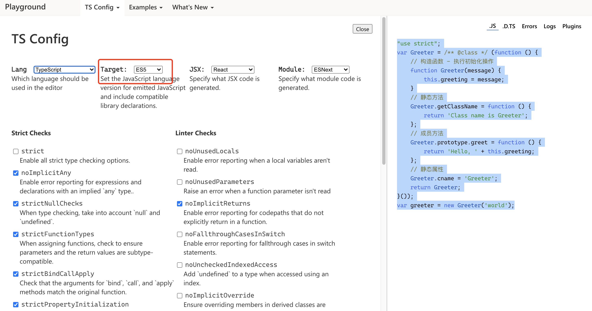
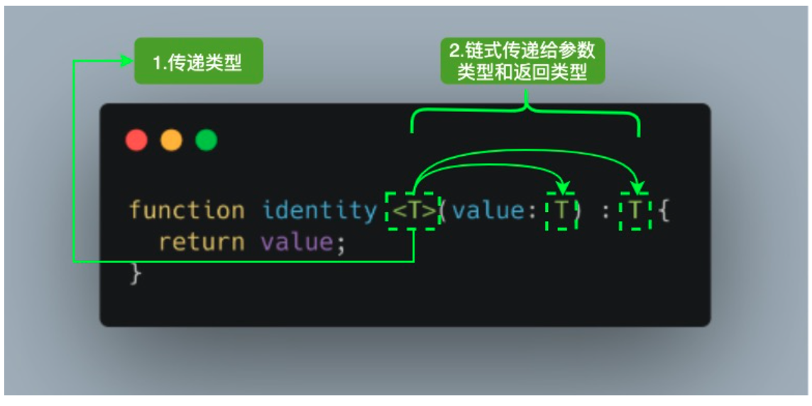
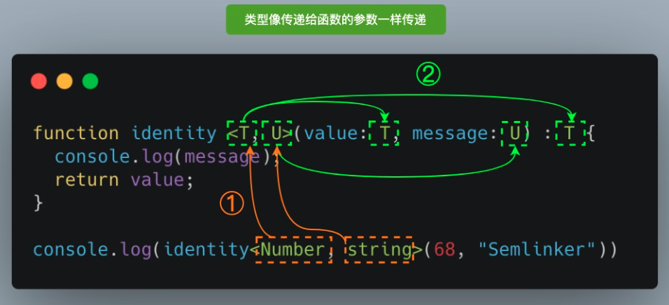

# 《重学TS》学习笔记（2）

## 第1章 TypeScript快速入门（下）

### 十、TypeScript 接口

在面向对象语言中，接口是一个很重要的概念，它是对行为的抽象，而具体如何行动需要由类去实现。

#### 10.1 对象的形状

```typescript
interface Person {
  name: string;
  age: number;
}

let semlinker: Person = {
  name: 'semlinker',
  age: 33
}
```

#### 10.2 可选｜只读属性

```typescript
interface Person {
  readonly name: string;
  age?: number;
}
```

只读属性用于限制只能在对象刚刚创建的同时进行属性的创建，此外 TypeScript 还提供了`ReadonlyArray<T>`类型，它与`Array<T>`相似，只是把所有可变方法取掉了，因此可以确保数组创建之后再也不能被修改。

```typescript
let a: number[] = [1, 2, 3, 4];
let ro: ReadonlyArray<number> = a;
ro[0] = 12; // error!
ro.push(5); // error!
ro.length = 100; // error!
a = ro; // error!
```

#### 10.3 任意属性

一个接口除了包含必选和可选属性以外，还允许有其他的任意属性，可以使用**索引签名**来满足上述要求。

```typescript
interface Person {
  name: string;
  age?: number;
  [propName: string]: any;
}
const p1 = { name: "semlinker" };
const p2 = { name: "lolo", age: 5 };
const p3 = { name: "kakuqo", sex: 1 };
```

#### 10.4 接口与类型别名的区别

> 个人总结：在使用 class 定义的时候尽量使用`interface`，可以方便地对继承父类（extend）的 interface 进行实现（implements），其余需要与其他类型联动的时候尽量使用`type`。

1. Objects/Functions

   `interface`和`type`都可以用来描述对象和函数。

   ```typescript
   // 使用 interface
   interface Point {
     x: number;
     y: number;
   }
   
   interface SetPoint {
     (x: number, y: number): void;
   }
   
   // 使用类型别名
   type Point = {
     x: number;
     y: number;
   }
   
   type SetPoint = (x: number, y: number) => void;
   ```

2. Other Types

   对于其他类型，比如原始类型，联合类型和元组，只能用 type。

   ```typescript
   // primitive
   type Name = string;
   
   // object
   type PartialPointX = { x: number; }
   type PartialPointY = { y: number; }
   
   // union
   type PartialPoint = PartialPointX | PartialPointY
   
   // tuple
   type Data = [number, string]
   ```

3. Extend

   interface 和 type 都能够被扩展，但语法有所不同。此外，接口和类型别名并不是互斥的，彼此之间可以互相扩展。

   ```typescript
   // 接口扩展接口
   interface PartialPointX { x: number; }
   interface Point extends PartialPointX {
     y: number;
   }
   
   // 类型扩展类型
   type PartialPointX = { x: number; };
   type Point = PartialPointX & { y: number; };
   
   // 接口扩展类型
   type PartialPointX = { x: number; };
   interface Point extends PartialPointX { y: number; }
   
   // 类型扩展接口
   interface PartialPointX { x: number; }
   type Point = PartialPointX & { y: number; };
   ```

4. Implements

   class 可以使用`implements`的方式来实现 interface 或 type，但注意使用 type 的时候，这个 type 不能是联合类型。

   ```typescript
   interface Point {
     x: number;
     y: number;
   }
   
   class SomePoint implements Point {
     x = 1;
     y = 2;
   }
   
   type Point2 = {
     x: number;
     y: number;
   }
   
   class SomePoint2 implements Point2 {
     x = 1;
     y = 2;
   }
   
   type PartialPoint = { x: number; } | { y: number; }
   
   // Error: A class can only implement an object type or intersection of object types with statically known members.
   class SomePartialPoint implements PartialPoint {
     x = 1;
     y = 2;
   }
   ```

5. Declaration merging

   与 type 不一样的是，interface 可以定义多次，并会自动合并为单个接口。

   ```typescript
   interface Point { x: number }
   interface Point { y: number }
   
   const point: Point = { x: 1, y: 2 }
   ```

### 十一、TypeScript 类

#### 11.1 类的属性与方法

在 TypeScript 中，可以通过`class`关键字来定义一个类。

```typescript
class Greeter {
  // 静态属性
  static cname: string = 'Greeter';
  // 成员属性
  greeting: string;
  // 构造函数 - 执行初始化操作
  constructor(message: string) {
    this.greeting = message;
  }
  // 静态方法
  static getClassName() {
    return 'Class name is Greeter'
  }
  // 成员方法
  greet() {
    return 'Hello, ' + this.greeting
  }
}

let greeter = new Greeter('world')
```

编译后的 JavaScript 代码如下（需要将 Export 的 JavaScript 版本设置为 ES5 才会比较直观）：



```javascript
"use strict";
var Greeter = /** @class */ (function () {
    // 构造函数 - 执行初始化操作
    function Greeter(message) {
        this.greeting = message;
    }
    // 静态方法
    Greeter.getClassName = function () {
        return 'Class name is Greeter';
    };
    // 成员方法
    Greeter.prototype.greet = function () {
        return 'Hello, ' + this.greeting;
    };
    // 静态属性
    Greeter.cname = 'Greeter';
    return Greeter;
}());
var greeter = new Greeter('world');
```

#### 11.2 ECMAScript 私有字段

TypeScript 3.8 版本以后开始支持 ECMAScript 私有字段，使用方式如下：

```typescript
// Error: Private identifiers are only available when targeting ECMAScript 2015 and higher.
class Person {
  #name: string;
  constructor(name: string) {
    this.#name = name;
  }

	greet() {
    console.log(`Hello, my name is ${this.#name}`)
  }
}

let semlinker = new Person('Semlinker')

// Property '#name' is not accessible outside class 'Person' because it has a private identifier.
console.log(semlinker.#name)
```

与常规属性（甚至使用`private`修饰符声明的属性）不同，私有字段要牢记以下规则：

- 编译的目标必须大于等于 ES6
- 私有字段以`#`字符开头
- 每个私有字段名称都唯一地限定于其包含的类
- 不能在私有字段上使用 TypeScript 可访问性修饰符（如 public 或 private）
- 私有字段不能在包含的类之外访问，甚至不能被检测到

#### 11.3 访问器

在 TypeScript 中，可以通过`getter`和`setter`方法来实现数据的封装和有效性检验，防止出现异常数据。

```typescript
let passcode = "Hello TypeScript";
class Employee {
  private _fullName: string = 'not defined';
  get fullName(): string {
    return this._fullName;
  }
  set fullName(newName: string) {
    if (passcode && passcode == "Hello TypeScript") {
      this._fullName = newName;
    } else {
      console.log("Error: Unauthorized update of employee!");
    }
  }
}
let employee = new Employee();
employee.fullName = "Semlinker";

if (employee.fullName) {
  console.log(employee.fullName); // Semlinker
}
```

#### 11.4 类的继承

继承指的是一个类（又称子类，子接口）继承另一个类（称为父类、父接口）的功能，是类与类或接口与接口之间最常见的关系。

在 TypeScript 中，可以通过`extends`关键字来实现继承。

```typescript
class Animal {
  name: string;
  constructor(theName: string) {
    this.name = theName;
  }
  move(distanceInMeters: number = 0) {
    console.log(`${this.name} moved ${distanceInMeters}m.`);
  }
}
class Snake extends Animal {
  constructor(name: string) {
    super(name); // 调用父类的构造函数
  }
  move(distanceInMeters = 5) {
    console.log("Slithering...");
    super.move(distanceInMeters);
  }
}

let sam = new Snake("Sammy the Python");
sam.move();
```

#### 11.5 抽象类

使用`abstract`关键字声明的类称为抽象类，抽象类不能被实例化，其中包含一个或多个抽象方法，即不包含具体实现的函数：

```typescript
abstract class Person {
  constructor(public name: string) {}
  abstract say(words: string): void;
}

// Error: Cannot create an instance of an abstract class.
const lolo = new Person()
```

可以看到抽象类不能被直接实例化，如果要使用，只能通过一个子类继承该抽象类，并实例化所有的抽象方法，如下：

```typescript
abstract class Person {
  constructor(public name: string) { }
  abstract say(words: string): void; // 抽象方法
}

class Developer extends Person {
  constructor(name: string) {
    super(name)
  }
  say(words: string): void {
    console.log(`${this.name} syas ${words}`)
  }
}

const lolo = new Developer('lolo')
lolo.say('hi') // lolo says hi
```

#### 11.6 类方法重载

如之前介绍，对于类的方法来说也支持重载。

```typescript
class ProductService {
  getProducts(): string;
  getProducts(id: number): number;
  
  getProducts(id?: number): string | number {
    if (typeof id === 'number') {
      console.log(`获取id为 ${id} 的产品信息`);
      return 123
    } else {
      console.log(`获取所有的产品信息`);
      return '23'
    }
  }
}
const productService = new ProductService();
const a = productService.getProducts(666); // 获取id为 666 的产品信息

const b = productService.getProducts(); // 获取所有的产品信息
```

PS：要注意具体的实现必须要支持所有定义的重载情况

> [重载函数类型的兼容性](https://juejin.cn/post/6912309038743191559#heading-17)
>
> 1. 参数个数：**目标函数的参数个数一定要多于源函数的参数个数**。
> 2. 参数类型：**目标函数的参数类型必须与源函数的返回值类型相同，或者是其子类型**。
> 3. 返回值类型：**目标函数的返回值类型必须与源函数的返回值类型相同，或者是其子类型**。

### 十二、TypeScript 泛型

泛型（Generics）是允许同一个函数接受不同类型参数的一种模板，**使用泛型可以创建可重用的组件，一个组件可以支持多种类型的数据。这样用户就可以定义自己的数据类型来使用组件**。

设计泛型的目的是在成员之间提供有意义的约束，这些成员可以是：

- 类的实例成员
- 类的方法
- 函数参数和函数返回值

#### 12.1 泛型语法



参考上图，当调用 idendity 方法时，会使用`identity<Number>(1)`这种调用方法，它将在出现`T`的任何位置填充该类型。

图中的`<T>`被称为类型变量，它是开发者希望传递给 identity 函数的类型占位符。

从上图可以看到它也被赋予给`value`参数和函数返回类型：此时`T`充当的是类型，而不是特定的 Number 类型。

T 代表 Type，在定义泛型时通常用作第一个类型变量名称，但实际上`T`可以用任何有效名称代替，除了`T`以外，还有几种在开发中常用的泛型变量代表：

- K（Key）：表示对象中的键类型
- V（Value）：表示对象中的值类型
- E（Element）：表示元素类型

我们可以引入希望定义的任何数量的类型变量，在使用时，类型可以像传递给函数的参数一样传递。



除此之外，在使用时也可以让编译器自动选择这些类型，从而使代码更加简洁，比如说可以这样：

```typescript
function identity<T, U>(value: T, message: U): T {
  console.log(message);
  return value;
}
// 编译器能够从参数自动读取类型并将它们赋值给 T 和 U，而不需要开发人员显式指定它们
console.log(identity(68, "Semlinker"));
```

#### 12.2 泛型接口

```typescript
interface GenericIndentityFn<T> {
  (arg: T): T;
}
```

#### 12.3 泛型类

```typescript
class GenericNumber<T> {
  zeroValue!: T;
  add!: (x: T, y: T) => T;
}

let myGenericNumber = new GenericNumber<number>();
myGenericNumber.zeroValue = 0;
myGenericNumber.add = function (x, y) {
  return x + y;
};
```

#### 12.4 泛型工具类型

为了方便开发者，TypeScript 内置了一些常用的工具类型，比如：

- Partial
- Required
- Readonly
- Record
- ReturnType

还有其余等等……

本节只会简单介绍 Partial 工具类型，但在介绍之前还会介绍一些相关的基础知识，方便自行学习其他的工具类型。

1. typeof

   在 TypeScript 中，`typeof`操作符可以用来获取一个变量声明或对象的类型，比如：

   ```typescript
   interface Person {
     name: string;
     age: number;
   }
   const sem: Person = { name: 'semlinker', age: 33 };
   type Sem = typeof sem; // -> Person
   function toArray(x: number): Array<number> {
     return [x];
   }
   type Func = typeof toArray; // -> (x: number) => number[]
   ```

2. keyof

   `keyof`操作符是在 TypeScript 2.1 版本引入的，该操作符可以用于获取某种类型的所有键，其返回类型是联合类型。

   ```typescript
   interface Person {
     name: string;
     age: number;
   }
   
   type K1 = keyof Person; // 'name' | 'age'
   type K2 = keyof Person[]; // number | 'length' | 'toString' | 'pop' | 'push' | 'concat' | 'join'
   type K3 = keyof { [x: string]: Person } // string | number
   ```

   


> 本次阅读至 40 keyof 操作符


