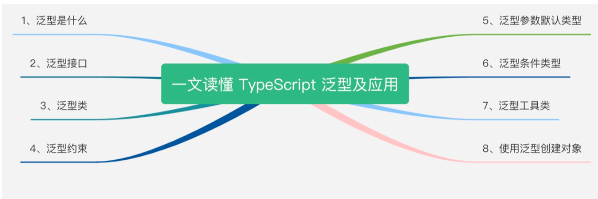

# 《重学TS》学习笔记（3）

## 第2章 一文读懂 TypeScript 泛型及应用

本章将全方位一步步学习 TypeScript 中的泛型。



### 一、泛型是什么

设计泛型的关键目的是在成员之间提供有意义的约束，这些成员可以是：类的实例成员、类的方法、函数参数和函数返回值。

比如下面定义了一个通用的`identity`函数：

```javascript
function identity(value) {
  return value
}

console.log(identity(1)) // 1
```

然后将`identity`函数作适当调整，以支持 Number 类型的参数：

```typescript
function identity(value: Number): Number {
  return value
}
```

上面的函数仅可用于 Number 类型，并不是可扩展或通用的函数，而如果把 Number 换成 any，就会失去定义应该返回哪种类型的能力，并且让编译器失去了类型保护的作用。

所以这种情况下就可以使用泛型了。

```typescript
function identity <T>(value: T) : T {
  return value;
}

console.log(identity<Number>(1))
// 也可以省略掉上面的 Number，让编译器自行推断参数的类型
console.log(identity(1))
```

那如果想要返回两种类型的对象怎么办呢？一种方案是使用元组，即为元组设置通用的类型：

```typescript
function identity<T, U>(value: T, message: U) : [T, U] {
  return [value, message]
}
```

虽然使用了元组解决了这个问题，但更好的方案是使用**泛型接口**。

### 二、泛型接口

为了解决上面提到的问题，首先可以创建一个`Identities`接口，用于定义`identity`函数的返回类型：

```typescript
interface Identities<V, M> {
  value: V,
  message: M
}
```

在上述的`Identities`接口中引入了类型变量`V`和`M`，来进一步说明有效的字母都可以用于表示类型变量，之后就可以将该接口作为 identity 函数的返回类型：

```typescript
function identity<T, U> (value: T, message: U): Identities<T, U> {
  console.log(`value: ${typeof value}`);
  console.log(`message: ${typeof message}`)
  let identities: Identities<T, U> = {
    value,
    message
  }
  return identities;
}

console.log(identity(68, 'Semlinker'))

/*
[LOG]: "value: number" 
[LOG]: "message: string" 
[LOG]: {
  "value": 68,
  "message": "Semlinker"
} 
*/
```

### 三、泛型类

泛型除了可以应用在函数和接口之外，也可以应用在类中。

```typescript
interface GenericInterface<U> {
  value: U
  getIdentity: () => U
}

class IdentityClass<T> implements GenericInterface<T> {
  value: T
  constructor(value: T) {
    this.value = value
  }
  getIdentity(): T {
    return this.value
  }
}

const myNumberClass = new IdentityClass<Number>(68);
console.log(myNumberClass.getIdentity()); // 68

const myStringClass = new IdentityClass<string>("Semlinker!");
console.log(myStringClass.getIdentity()); // Semlinker!
```

泛型类可以确保在整个类中一致性地使用指定的数据类型，以确保类中的属性是类型安全的。

通常在决定是否使用泛型时，会有以下两个参考标准：

- 当你的函数、接口或者类将处理多种数据类型时
- 当函数、接口或类在多个地方使用该数据类型时

### 四、泛型约束

泛型的作用在于限制每个类型变量接受的类型数量，下面将介绍如何使用泛型约束。

#### 4.1 确保属性存在

举一个见简单的例子，当开发者处理通常的字符串或数组时，会假设`length`属性是可用的，但是当使用泛型时，编译器不会确切的知道泛型`T`确实包含`length`属性。

```typescript
function identity<T>(arg: T): T {
  console.log(arg.length); // Error return arg;
}
```

这时候就需要让类型变量`T`进行`extends`一个含有所需属性的接口，比如这样：

```typescript
interface Length {
  length: number;
}
function identity<T extends Length>(arg: T): T {
  console.log(arg.length); // 可以获取length属性
  return arg;
}
```

此外，还可以使用`,`来分割多种约束类型，就像`<T extends Length, Type2, Type3>`，而对于上述问题，显式地将变量设置为数组类型，也可以设置该问题，比如这样：

```typescript
function identity<T>(arg: T[]): T[] {
  console.log(arg.length);
  return arg;
}
// or
function identity<T>(arg: Array<T>): Array<T> {
  console.log(arg.length);
  return arg;
}
```

#### 4.2 检查对象上的键是否存在

泛型约束的另一个常见的使用场景就是检查对象上的键是否存在。而通过`keyof`操作符，开发者可以获取制定类型的所有键，并返回一个联合类型。然后使用`extends`进行配合，即可达成约束的目的，具体的例子比如：

```typescript
function getProperty<T, K extends keyof T>(obj: T, key: K): T[K] {
  return obj[key]
}
```

在上面的函数中，就可以通过`K extends keyof T`的约束确保参数 key 一定是对象中含有的键，这样就能确保不会发生运行时的错误，而是在编译阶段就能提前发现。**这是一个类型安全的解决方案，与简单调用`let value = obj[key];`不同**。

### 五、泛型参数的默认类型

在 TypeScript2.3 以后，可以为泛型中的类型参数指定默认类型。**当没有在代码中直接指定类型参数，也无法从实际值的参数中推断出类型时，这个默认类型就会起作用**。

```typescript
interface A<T=string> {
  name: T;
}

const strA: A = { name: 'Semlinker' }
const numB: A<number> = { name: 101 }
```

泛型参数的默认类型遵循以下规则：

- 有默认类型的类型参数被认为是可选的
- 必选的类型参数不能再可选的类型参数后
- 如果类型参数有约束，类型参数的默认类型必须满足这个约束
- 当指定类型实参时，只需要指定必选类型参数的类型实参。未指定的类型参数会被解析为它们的默认类型。
- 如果指定了默认类型，且类型推断无法选择一个候选类型，那么将使用默认类型作为推断结果。
- 一个被现有的类或接口合并的类或接口的声明，可以为现有类型参数引为默认类型
- 一个被现有类或接口合并的类或者接口的声明可以引入新的类型参数，只要它指定了默认类型。

### 六、泛型条件类型

在 TypeScript 2.8 中引入了条件类型，使得可以根据某些条件而得到不同的类型，具体来说，就是使用`extends`关键字，检查是否满足结构兼容性（也就是并不一定要强制满足继承关系）：

```typescript
T extends U ? X : Y
```

以上表达式的意思是：若`T`能够赋值给`U`，那么类型是`X`，否则为`Y`。在条件类型表达式中，通常还会结合`infer`关键字，实现**类型抽取**：

```typescript
interface Dictionary<T = any> {
  [key: string]: T;
}

type StrDict = Dictionary<string>;

type DictMember<T> = T extends Dictionary<infer V> ? V : never;

type strDictMember = DictMember<StrDict>; // string
```

在上面的事例中，当类型 T 满足`T extends Dictionary`的约束时，就会使用`infer`关键词声明一个类型变量 V，并返回该类型，否则就返回`never`类型。

> 在 TypeScript 中，never 类型是那些永不存在的值的类型。例如那些总是会抛出异常或者根本就不会有返回值的函数表达式或箭头函数表达式的返回类型。
>
> 另外，需要注意的是，never 没有任何子类型，也没有任何类型可以赋值给 never 类型（除了 never 本身以外）。除此以外即便是 any 也不可以赋值给 never。

除此以外，利用条件类型和`infer`关键字，还可以方便地实现获取 Promise 对象的返回值类型：

```typescript
type UnPromisify<T> = T extends (...args: any[]) => Promise<infer U> ? U : never;

async function stringPromise() {
	return "string promise"; // Promise<string>
}

type a = UnPromisify<typeof stringPromise>; // string
```

> 在该条件类型表达式中，对于约束的类型用到的所有变量都能进行抽取，并不局限于返回，甚至还能这么干：
>
> ```typescript
> type UnPromisify<T> = T extends (...args: Array<infer G>) => Promise<infer U> ? { args: G, re: U } : never;
> 
> async function stringPromise(c: string = '123') {
> 	return "string promise"; // Promise<string>
> }
> 
> type a = UnPromisify<typeof stringPromise>; // { args: string | undefined, re: string }
> ```

### 七、泛型工具类型

TypeScript 内置了一些常用的工具类型，以下会介绍一些常用的工具。

#### 7.1 Partial

`Partial<T>`的作用是将某个类型里的属性全部变为可选项`?`。

定义：

```typescript
type Partial<T> = {
  [P in keyof T]?: T[P];
};
```

#### 7.2 Record

`Record<K extends any, T>`的作用是将`K`中所有的属性的值转化为`T`类型。

定义：

```typescript
type Record<K extends keyof any, T> = {
  [P in K]: T;
}
```

示例：

```typescript
interface PageInfo {
  title: string;
}

type Page = 'home' | 'about' | 'contact';

const x: Record<Page, PageInfo> = {
  about: { title: 'about' },
  contact: { title: 'contact' },
  home: { title: 'home' }
}
```

#### 7.3 Pick

`Pick<T, K extends keyof T>`的作用是将某个类型的子属性挑出来，变成包含这个类型部分属性的子类型。

定义：

```typescript
type Pick<T, K extends keyof T> = {
  [P in K]: T[P];
}
```

示例：

```typescript
interface Todo {
  title: string;
  description: string;
  completed: boolean;
}

type TodoPreview = Pick<Todo, 'title' | 'completed'>

const todo: TodoPreview = {
  title: 'clean',
  completed: false
}
```

#### 7.4 Exclude

`Exclude<T, U>`的作用是将某个类型中属于另一个的类型移除掉。

定义：

```typescript
type Exclude<T, U> = T extends U ? never : T;
```

如果`T`能够赋值给`U`类型的话，那么就会返回`never`类型，否则就会返回`T`类型。而最终实现的效果就是将`T`中的某些属于`U`的类型给移除掉。

示例：

```typescript
type T0 = Exclude<'a' | 'b' | 'c', 'a'> // 'b' | 'c'
type T1 = Exclude<'a' | 'b' | 'c', 'a' | 'b'> // 'c'
type T2 = Exclude<string | number | (() => void), Function> // string | number
```

#### 7.5 ReturnType

`ReturnType<T>`的作用是用于获取函数`T`的返回类型。

定义：

```typescript
type ReturnType<T extends (...args: any) => any> = T extends (...args: any) => infer R ? R : any;
```

示例：

```typescript
type T0 = ReturnType<() => string>; // string
type T1 = ReturnType<(s: string) => void>; // void
type T2 = ReturnType<<T>() => T>; // {}
type T3 = ReturnType<<T extends U, U extends number[]>() => T>; // number[]
type T4 = ReturnType<any>; // any
type T5 = ReturnType<never>; // any
type T6 = ReturnType<string>; // Error
type T7 = ReturnType<Function>; // Error
```

### 八、使用泛型创建对象

#### 8.1 构造签名

有时泛型类需要基于传入的泛型 T 来创建其类型相关的对象：

```typescript
class FirstClass {
  id: number | undefined;
}

class SecondClass {
  name: string | undefined;
}

class GenericCreator<T> {
  create(): T {
    return new T()
  }
}

const creator1 = new GenericCreator<FirstClass>()
const firstClass: FirstClass = creator1.create()

const creator2 = new GenericCreator<SecondClass>()
const secondClass: SecondClass = creator2.create()

/*
Errors in code
'T' only refers to a type, but is being used as a value here.
*/
```

上面的代码会编译报错，原因是使用了`new`关键字只能在运行时接受一个实际传入的构造函数，而不应该将编译时的`T`类型赋予给它并试图创建对象。

那么该怎样才能使通用类能够创建`T`类型的对象呢？

```typescript
class GenericCreator<T> {
  create<T>(c: { new (): T}): T {
    return new c()
  }
}
```

要理解上面的这段代码，需要首先介绍一下构造签名。

**构造签名**

在 TypeScript 接口中，可以使用`new`关键字来描述一个构造函数：

```typescript
interface Point {
  new (x: number, y: number): Point;
}
```

以上接口中的`new (x: number, y: number)`称之为构造签名，语法如下：

> *ConstructSignature:*  new  *TypeParametersopt*  (  *ParameterListopt*  )  *TypeAnnotationopt*
>
> 其中，`TypeParametersopt`、`ParameterListopt`、`TypeAnnotationopt`分别表示：可选的类型参数、可选的参数列表和可选的类型注解。常见的使用形式如下：
>
> ```typescript
> new C;
> new C(...);
> new C<...>(...);
> ```

#### 8.2 构造函数类型

TypeScript 的规范中定义了构造函数类型：

- 包含一个或多个构造签名的对象类型被称为构造函数类型
- 构造函数类型可以使用构造函数类型字面量或者包含构造签名的对象类型字面量来编写

具体来说，构造函数类型字面量的形式如下：

```typescript
new <T1, T2, ...>(p1, p2, ...) => R
// eg.
new (x: number, y: number) => Point
```

该形式与以下对象类型字面量是等价的：

```typescript
{ new <T1, T2, ...> (p1, p2, ...) : R }
// eg.
{
  new (x: number, y: number): Point;
}
```

#### 8.3 构造函数类型的应用

对于构造函数类型的应用，需要将接口进行分离，即把接口的属性和构造函数类型进行分离（否则编译器会报错）：

```typescript
interface Point {
  x: number;
  y: number;
}

interface PointConstructor {
  new (x: number, y: number): Point;
}
```

完成接口拆分后，就可以定义相应的类和对应的工厂函数了：

```typescript
class Point2D implements Point {
  readonly x: number;
  readonly y: number;
  
  constructor(x: number, y: number) {
    this.x = x;
    this.y = y;
  }
}

function newPoint(
	pointConstructor: PointConstructor,
  x: number,
  y: nubmer
): Point {
  return new pointConstructor(x, y);
}
```

#### 8.4 使用泛型创建对象

现在就可以理解上面写到的 GenericCreator 类中的 create 方法了：

```typescript
class GenericCreator<T> {
  create<T>(c: { new (): T}): T {
    return new c()
  }
}
```

如果构造函数含有参数的话，还可以这样定义 create 方法：

```typescript
class GenericCreator<T> {
  create<T>(c: { new(a: number): T; }, num: number): T {
    return new c(num);
  }
}
```

然后就可以使用该泛型类来创建对应类型的实例：

```typescript
const creator1 = new GenericCreator<FirstClass>();
const firstClass: FirstClass = creator1.create(FirstClass);
const creator2 = new GenericCreator<SecondClass>();
const secondClass: SecondClass = creator2.create(SecondClass);
```


