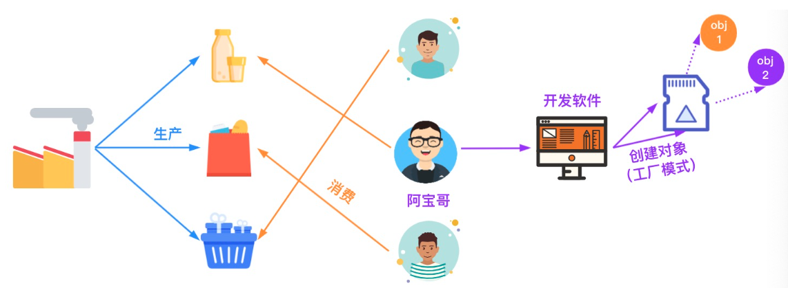
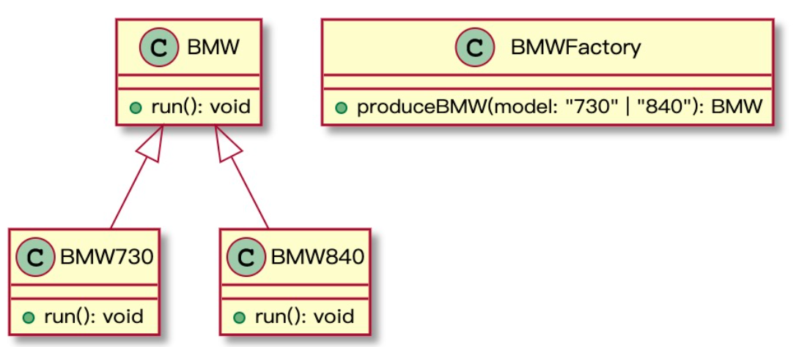
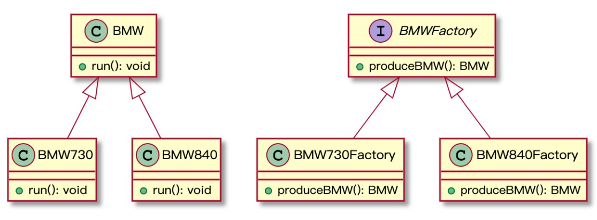
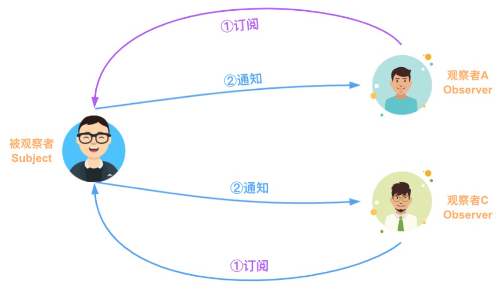
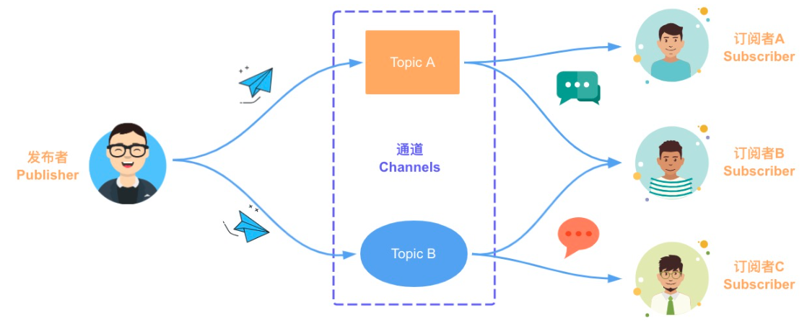

# 《重学TS》学习笔记（5）

## 第4章 工厂方法模式

在软件系统的设计与开发过程中，可以利用各种设计模式来提高代码的可重用性、可扩展性和可维护性。而工厂模式就提供了创建对象的最佳方式。



### 一、简单工厂模式

#### 1.1 简单工厂模式简介

简单工厂工厂模式又称为**静态方法模式**，因为工厂类中定义了一个静态方法用于创建对象。简单工厂让使用者不用知道具体的参数就可以创建出所需要的对象。

#### 1.2 简单工厂模式实战



上面的模型的意思是：可以通过 BMWFactory 这个工厂类，通过 BMW730 和 BMW840 这两个不同的模型，创建出不同的实例。

1. 定义 BMW 抽象类

   ```typescript
   abstract class BMW {
     abstract run(): void;
   }
   ```

2. 创建 BMW730 和 BMW840 类

   ```typescript
   class BMW730 extends BMW {
     run: void: {
       console.log('BMW 730 发动')
     }
   }
   
   class BMW840 extends BMW {
     run: void: {
       console.log('BMW 840 发动')
     }
   }
   ```

3. 创建 BMWFactory 工厂类

   ```typescript
   class BMWFactory {
     public static produceBMW(model: '730' | '840'): BMW {
       if (model === '730') {
         return new BMW730()
       } else {
         return new BMW840()
       }
     }
   }
   ```

4. 生产并发动 BMW730 和 BMW840

   ```typescript
   const bmw730 = BMWFactory.produceBMW('730')
   const bmw840 = BMWFactory.produceBMW('840')
   
   bmw730.run()
   bmw840.run()
   
   /*
   BMW730 发动咯
   BMW840 发动咯
   */
   ```

#### 1.3 简单工厂模式优缺点

优点：

- 将创建实例与使用实例的任务分开，使用者无需关心对象是如何创建的，实现了系统的解耦
- 客户端无须知道所创建的具体产品类的类名，只需要所对应的入参参数即可

缺点：

- 由于工厂类集中了所有产品创建逻辑，一旦不能正常工作，整个系统都要受到影响
- 系统扩展困难，一旦添加新产品就不得不修改工厂逻辑，在产品类型较多时，也有可能造成工厂逻辑过于复杂，不利于扩展和维护

#### 1.4 简单工厂模式应用场景

满足以下条件时可以考虑使用简单工厂模式：

- 工厂类负责创建的对象较少，工厂方法中业务逻辑较为简单
- 客户端只需知道传入工厂类静态方法的参数，而不需要关心创建对象的细节

### 二、工厂方法模式

工厂方法模式（Factory Method Pattern）又称为工厂模式，也叫多态工厂（Polymorphic Factory）模式，它属于类创建型模式（简单来说就是每一个 Model 都有对应的工厂创建类）。

#### 2.2 工厂方法实战



1. 定义 BMW 抽象类

   ```typescript
   abstract class BMW {
     abstract run(): void
   }
   ```

2. 创建 BMW 730 和 BMW 840 类：

   ```typescript
   class BMW730 extends BMW {
     run: void: {
       console.log('BMW 730 发动')
     }
   }
   
   class BMW840 extends BMW {
     run: void: {
       console.log('BMW 840 发动')
     }
   }
   ```

3. 定义 BMWFactory 接口

   ```typescript
   interface BMWFactory {
     produceBMW(): BMW;
   }
   ```

4. 创建 BMW730Factory 类和 BMW840Factory 类

   ```typescript
   class BMW730Factory implements BMWFactory {
     produceBMW(): BMW {
       return new BMW730();
     }
   }
   
   class BMW840Factory implements BMWFactory {
     produceBMW(): BMW {
       return new BMW840();
     }
   }
   ```

5. 生产并发动 BMW730 和 BMW840

   ```typescript
   const bmw730Factory = new BMW730Factory()
   const bmw840Factory = new BMW840Factory()
   
   const bmw730 = bmw730Factory.produceBMW()
   const bmw840 = bmw840Factory.produceBMW()
   
   bmw730.run()
   bmw840.run()
   
   /*
   BMW730 发动咯
   BMW840 发动咯
   */
   ```

可以看出，相比于前面的简单工厂模式，工厂方法模式通过创建不同的工厂来生产不同的产品。

#### 2.3 工厂方法优缺点

优点：

- 符合开闭原则，在系统扩展时无需修改原有工厂类的判断逻辑
- 符合单一职责原则，每个具体工厂类只负责创建对应的产品
- 所有的具体工厂类都具有同一抽象父类，而如何创建对象的细节则完全封装在具体工厂类的内部，基于工厂角色和产品角色进行多态性设计，使得工厂可以自主确定创建何种产品对象。

缺点：

- 再添加新产品时，需要编写新的具体产品类，还要提供与之对应的具体工厂类，在一定程度上增加了系统复杂度并带来额外的性能开销
- 一个具体工厂只能创建一种具体产品

#### 2.4 工厂方法应用场景

- 一个类不知道它所需要的对象的类，所以使用者也不需要知道具体产品类的类名，只需要知道所对应的工厂即可
- 一个类通过其子类来指定创建哪个对象，对于抽象工厂类只需要提供一个创建产品的接口，而由其子类来确定具体要创建的对象，从而使得系统更加容易扩展。

## 第 5 章 发布订阅模式

> PS：啥情况..越来越水了

### 一、背景

发布订阅模式可以用于消息通信的场景，比如实现组件间通信、实现插件间通信、实现不同的系统间通信。

### 二、场景与模式

#### 2.2 观察者模式

观察者模式定义了一种一对多的关系，让多个观察者对象同时监听某一个主题对象，这个主题对象的状态发生变化时就会通知所有的观察者对象，使得它们能够自动更新自己。



#### 2.3 发布订阅模式

>  个人理解：发布订阅模式是观察者模式的进阶。

发布订阅模式中有三个主要角色：Publisher（发布者）、Channels（通道）和 Subscriber（订阅者）。



发布者通过在通道中进行事件的触发，然后由通道来通知订阅者进行相应的操作。而发布者和订阅者之间则是完全解耦的（与观察者模式的不同）。

### 三、发布订阅模式的应用

- Vue 使用 EventBus 进行消息通信
- 在 Ionic3 中使用`ionic-angular`模块中的 Events 组件来实现模块间或者页面间的消息通信。
- Reids 的发布与订阅功能

### 四、发布订阅模式实战

#### 4.1 定义 EventEmitter 类

```typescript
type EventHandler = (...args: any[]) => any;

class EventEmitter {
  private c = new Map<string, EventHandler[]>()
  // 订阅指定的主题
  subscribe(topic: string, ...handlers: EventHandler[]) {
    let topics = this.c.get(topic)
    if (!topics) {
      topics = []
      this.c.set(topic, topics)
    }
    topics.push(...handlers)
  }
  // 取消订阅指定的主题
  unsubscribe(topic: string, handler?: EventHandler): boolean {
    if (!handler) {
      return this.c.delete(topic)
    }
    const topics = this.c.get(topic)
    if (!topics) {
      return false
    }
    const index = topics.indexOf(handler)
    if (index < 0) {
      return false
    }
    topics.splice(index, 1)
    if (topics.length === 0) {
      this.c.delete(topic)
    }
    return true
  }
  // 为指定的主题发布消息
  publish(topic: string, ...args: any[]): any[] | null {
    const topics = this.c.get(topic)
    if (!topics) return null
    return topics.map(handler => {
      try {
        return handler(...args)
      } catch(e) {
        console.log(e)
        return null
      }
    })
  }
}
```

#### 4.2 使用示例

```typescript
const eventEmitter = new EventEmitter();
eventEmitter.subscribe("ts", (msg) => console.log(`收到订阅的消息:${msg}`));
eventEmitter.publish("ts", "TypeScript发布订阅模式");
eventEmitter.unsubscribe("ts");
eventEmitter.publish("ts", "TypeScript发布订阅模式");
```

