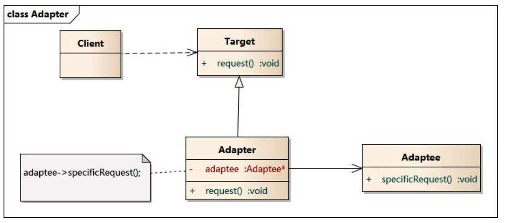
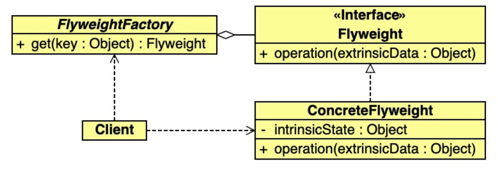

# 《重学TS》学习笔记（6）

## 第6章 适配器模式

### 一、简介

适配器模式的作用是解决两个软件实体间的接口不兼容的问题。

### 二、优缺点

优点：

- 将目标类和适配者类解耦，通过引入一个适配器类来重用现有的适配器类，而无序修改原有代码
- 增加了类的透明性和复用性，将具体的实现封装在适配者类中，对于客户端类来说是透明的，提高了适配者的复用性
- 灵活性和扩展性都很好，通过使用配置文件可以方便地更换适配器，可以在不修改原有代码的基础上增加新的适配器类，符合开闭原则。

缺点

- 过多地使用适配器会让系统非常凌乱而不易整体进行把握

### 三、应用场景

- 系统需要使用现有的类，但这些类的接口不符合系统的需要
- 想要建立一个可以重复使用的类，用于与一些彼此之间没有太大关联的一些类，包括一些可能在将来引进的类一起工作

### 四、模式结构

适配器模式包含以下角色：

- Target：目标抽象类
- Adapter：适配器类
- Adaptee：适配者类
- Client：客户类

适配器模式有**对象适配器**和**类适配器**两种，这里主要介绍对象适配器。



### 五、实战

```typescript
// 定义 Target 接口：
interface Target {
  request(): void;
}
// 创建 Adaptee（适配者）类
class Adaptee {
  public specificRequest(): void {
      console.log('specificRequest of Adaptee is being called')
  }
}
// 创建 Adapter(适配者)类
class Adapter implements Target {
    public request(): void {
        console.log('Adapter\'s request method is being called')
        const adaptee: Adaptee = new Adaptee()
        adaptee.specificRequest()
    }
}
// 使用示例
function show(): void {
    const adapter: Adapter = new Adapter()
    adapter.request()
}

show()
```

> 个人理解，适配器模式其实就是将一个不符合 Target 类型描述的 Adaptee（适配者）通过 Adapter(适配者) 的转换，最终符合 Target 类型描述的一种模式。
>
> 也就是 Adaptee ==(Adapter)==> Target

## 第7章 享元模式

### 一、简介

- 内部状态：在享元对象内部不随外界环境改变而改变的共享部分
- 外部状态：随着环境的改变而改变，不能够共享的状态就是外部状态

享元模式通过区分内部状态和外部状态，使得可以通过设置不同的外部状态来让相同的对象具备一些不同的特性，而内部状态设置为相同部分。

### 二、优缺点

优点：

- 能够极大减少系统中对象的个数
- 享元对象由于外部状态相对独立不会影响到内部状态，所以能够在不同的环境被共享

缺点：

- 享元模式需要区分外部状态和内部状态，使得程序设计更为复杂
- 为了使对象可以共享，需要将享元对象的状态外部化，而读取外部状态使得运行时间变长

### 三、应用场景

- 程序中使用了大量的相似对象
- 由于使用了大量的对象造成了很大的内存开销
- 对象的大多数状态都可以变为外部状态
- 剥离出对象的外部状态后，可以用相对较少的共享对象取代大量对象

### 四、模式结构

享元模式包含以下角色：

- Client：调用 FlyweightFactory 获取享元对象
- FlyWeightFactory：
  - 创建和管理享元对象
  - 当请求某个享元对象不存在时，会创建一个新的享元对象
  - 新创建的享元对象会被存储起来，用于下次请求
- Flyweight：维护要在应用程序之间共享的固有数据



### 五、实战

未使用享元模式前的代码，会创建非常多数量的对象：

```typescript
class Iphone11 {
  constructor(model: string, screen: number, memory: number, sn: number) {
    
  }
}

const phones = []

for (let i = 0; i < 10000; i++) {
  let memory = i % 2 == 0 ? 128 : 256;
  phones.push(new Iphone11("iPhone11", 6.1, memory, i));
}
```

使用享元模式优化的代码如下：

```typescript
// 根据业务逻辑分析出共用的数据并定义享元类
// 比如在 Iphone11 中，大部分的硬件数据都是共用的
class IphoneFlyweight {
    constructor(model: string, screen: number, memory: number) {}
}

// 定义享元工厂，用于维护这些公共的数据
class FlyweightFactory {
    private phonesMap: {
        [s: string]: IphoneFlyweight
    } = {}

    public get(model: string, screen: number, memory: number): IphoneFlyweight {
        const key = model + screen + memory
        if (!this.phonesMap[key]) {
            this.phonesMap[key] = new IphoneFlyweight(model, screen, memory)
        }
        return this.phonesMap[key]
    }
}

// 定义 Iphone 类，其中 sn 号是会随着每个实例变化的特有数据
class Iphone {
    constructor(flyweight: IphoneFlyweight, sn: number) {}
}

// 定义 IphoneFactory 类
class IphoneFactory {
    private static flyweightFactory: FlyweightFactory = new FlyweightFactory()

    public getIphone(model: string, screen: number, memory: number, sn: number) {
        const flyweight: IphoneFlyweight = IphoneFactory.flyweightFactory.get(model, screen, memory)
        return new Iphone(flyweight, sn)
    }
}

// 使用
const iphoneFactory = new IphoneFactory()
const phones = []

for (let i = 0; i < 10000; i++) {
  let memory = i % 2 == 0 ? 128 : 256;
  phones.push(iphoneFactory.getIphone("iPhone11", 6.1, memory, i));
}
```

在上面的例子中，将型号、屏幕、内存三个属性作为内部状态独立了出去，而对于外部状态 sn，则重新定义了一个 Iphone 类来包含该外部状态。在创建 Iphone 对象时，在内部属性相同的前提下，会共享这些内部属性。


