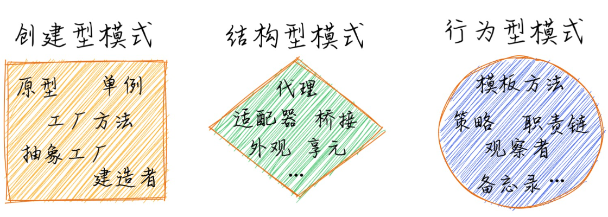
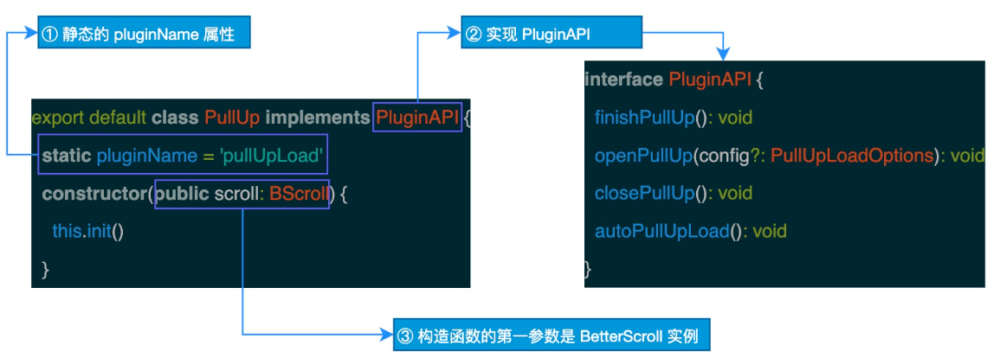

# 《重学TS》学习笔记（7）

> 无聊的两章。

## 第8章 图解常用的九种设计模式

设计模式是对软件设计中国呢普遍存在的各种问题所提出的解决方案，设计模式可以分为以下 3 种类型：

- 创建型类型：用来描述“如何创建对象”，它的主要特点是“将对象的创建和使用分离”。
- 结构型模式：用来描述如何将类或对象按照某种布局组成更大的结构。
- 行为型模式：用来识别对象之间的常用交流模式以及如何分配指责。

常用的设计方法有以下这几种：

- 建造者模式
- 工厂模式
- 单例模式
- 适配器模式
- 观察期模式 & 发布订阅模式
- 策略模式
- 职责链模式
- 模板方法模式

> PS：TMD 又开始水了...我又不是为了设计模式看这本书的，看清楚这本书的标题啊混蛋！

## 第9章 TypeScript 进阶之插件化结构

本章重心将以[BetterScroll](https://github.com/ustbhuangyi/better-scroll)的插件架构设计为例，展开 TypeScript 在插件化中的学习。

### 一、BetterScroll 简介

BetterScroll 是一款重点解决移动端（已支持 PC）各种滚轮场景需求的插件。它的核心是借鉴 iscroll 的实现。

为了支持插件的按需加载，BetterScroll 2.0 采用了插件化的设计。代码采用的是 monorepos 的组织方式，使用 lerna 进行多包管理，每个组件都是一个独立的 npm 包。

### 二、开发体验方面

TypeScript 可以给予 BetterScroll 库更好的开发体验。

### 三、插件化结构简介

插件化架构模式包括两种类型的架构组件：

- 核心系统（Core System）
- 插件模块（Plugin modules）

插件化架构的本质就是将可能需要不断变化的部分封装在插件中，从而达到快速灵活扩展的目的，而又不影响整体系统的稳定。

### 四、BetterScroll 插件化架构实现

对于插件化的核心系统设计来说涉及三个关键点：

- 插件管理
- 插件连接
- 插件通信

BetterScroll2.0 约定了统一的插件开发规范，插件需要一个类并且具有以下特性：

1. 静态的 pluginName 属性
2. 实现 pluginAPI 接口
3. constructor 的第一个参数就是 BetterScroll 实例 bs，可以通过 bs 的事件或者钩子来注入自己的逻辑。

### 五、工程化方面

在工程化方面，BetterScroll 使用了一些常见的解决方案：

- lerna：包管理发布工具
- prettier：代码格式化工具
- tslint：代码静态分析工具
- commitizen & cz-conventional-changelog：用于帮助生成符合规范的 commit message
- husky：用于防止不规范代码被 commit、push、merge 的结局
- coveralls：用于获取 Coveralls.io 的覆盖率报告，并在 README 中添加一个覆盖率按钮
- vuepress：Vue 驱动的静态网站生成器，用于生成 BetterScroll 文档

