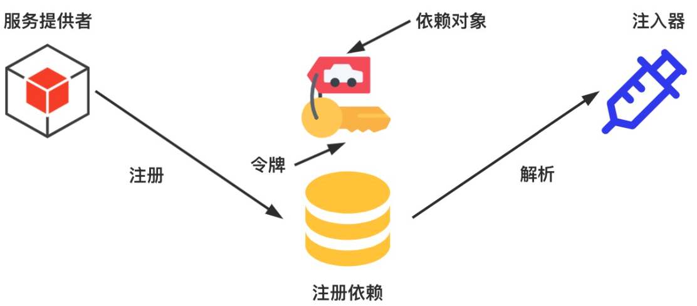

# 《重学TS》学习笔记（8）

## 第10章 TypeScript 进阶之控制反转和依赖注入

本章介绍 IoC（控制反转）和 DI（依赖注入）设计思想，了解如何使用 TypeScript 实现一个 IoC 容器，并了解装饰器、反射的相关知识。

### 二、IoC 是什么

IoC（Inversion of Control），即“控制反转”。在开发中，IoC 意味着将设计好的对象交给容器控制，而不是使用传统的方式，在对象内部直接控制。

要理解 IoC，关键是要明确以下几点：

- **谁控制谁，控制什么**：在传统的程序设计中，是程序主动创建依赖对象（也就是直接在对象内部通过`new`的方式创建对象）；而 IoC 是有专门一个容器来创建这些对象，即由 IoC 容器控制对象的创建；

  谁控制谁？IoC 容器控制了对象。

  控制什么？主要是控制外部资源（依赖对象）获取。

- **为何是反转，哪些方面反转了**：传统的应用程序是由开发者自己在程序中主动控制去获取依赖对象，而反转则是容器来帮忙创建以及注入依赖对象；

  为何是反转？因为由容器来注入依赖对象，而对象只是被动的接受依赖对象，所以是反转。

  哪些方面反转了？依赖对象的获取被反转了

比如说，在传统的程序中，一个类被这样创建：

```typescript
class Car {
  engine: Engine;
	chassis: Chassis;
  body: Body;
  
  constructor() {
    this.engine = new Engine()
    this.body = new Body()
    this.chassis = new Chassis()
  }
}
const car = new Car()
```

但是在控制反转的程序中，一个类是这样的：

```typescript
class Car {
  engine: Engine;
	chassis: Chassis;
  body: Body;
  
  constructor(engine, body, chassis) {
    this.engine = engine
    this.body = body
    this.chassis = chassis
  }
}

const engine = new Engine()
const body = new Body()
const chassis = new Chassis()

const car = new Car(engine, body, chassis)
```

### 三、IoC 能做什么

IoC 不是技术，而是一种思想和设计原则，用于减少代码之间的耦合度，以及方便测试，更重要的是，使得程序的整个体系结构变得非常灵活。

### 四、IoC 与 DI 之间的关系

对于控制反转来说，最常见的方式叫做依赖注入，简称为 DI（Dependency Injection）。

组件之间的依赖关系由容器在运行期间决定，而依赖注入的目的并非为软件带来更多功能，而是为了提升组件重用的频率，并为系统搭建一个灵活、可扩展的平台。

理解 DI 的关键有以下几点：

- **谁依赖了谁**：应用程序依赖 IoC 容器
- **为什么需要依赖**：应用程序需要 IoC 容器来提供对象需要的外部资源（包括对象、资源、常量数据）
- **谁注入谁**：明显是 IoC 容器注入应用程序依赖的对象
- **注入了什么**：注入某个对象所需的外部资源（包括对象、资源、常量数据）

IoC 和 DI 是同一个概念的不同角度的描述。（PS：个人认为也可以说 DI 是 IoC 的一种具体实现）

#### 4.1 未使用依赖注入框架


#### 4.2 使用依赖注入框架


### 五、DI 的应用

DI 在前端和服务端都有相应的应用，在前端领域的代表是 AugularJS 和 Angular，而在服务端领域 Node.js 生态中比较出名的有 NestJS。

#### 5.1 DI 在 AugularJS 中的应用

在 AugularJS 中，声明依赖项有 3 种方式：

```javascript
// 方式一 使用 $inject annotation 方式
let fn = function (a, b) {}
fn.$inject = ['a', 'b']

// 方式二：使用 array-style annotations 方式
let fn = ['a', 'b', function (a, b) {}]

// 方式三：使用隐式声明方式
let fn = function (a, b) {} // 不推荐
```

AngularJS 的 DI 还是很强大的，但随着 AngualrJS 的普及和应用的复杂度不断提高，DI 系统的问题就暴露出来了：

- 内部缓存：AugularJS 应用程序中所有的依赖项都是单例，开发者不能控制是否使用新的实例
- 命令空间冲突：在系统中使用字符串来标识服务的名称，假设项目中已经有了一个 CarService，然而第三方库中也引入了同样的服务，这样的话就容易出现混淆。

由于 AngurlarJS DI 存在以上问题，所以在后续的 Angular 中重新设计了 DI 系统。

#### 5.2 DI 在 Angular 中的应用

以前面的例子为例，在 DI 系统中，可以把汽车、发动机、底盘和车身这些认为是一种“服务”，它们会以服务提供者的形式注册到 DI 系统中。为了区分不同的服务，需要使用不同的令牌（Token）来标识它们。接着会基于已注册的服务提供者创建注入器对象。

之后当需要获取指定服务时，就可以通过该服务对应的令牌，从注入器对象中获取令牌对应的依赖对象。



> 其实 DI 并不是 AngularJS/Angular 和 NestJS 所特有的，如果想要在其他项目中使用 DI/IoC 的功能特性，可以使用[InversifyJS](https://inversify.io/)，它是一个可用于 JavaScript 和 Node.js 应用，功能强大、轻量的 IoC 容器。

### 六、手写 IoC 容器

接下来可以使用 TypeScript 实现一个简单的 IoC 容器，该容器实现功能如下：


#### 6.3 定义 Token 和 Provider

IoC 容器将使用两个主要的概念：令牌（Token）和提供者（Provider）。Token 是 IoC 容器所要创建对象的标识符，而 Provider 用于描述如何创建这些对象。

IoC 容器最小的公共接口如下所示：

```typescript
/** 定义 Token Start */
interface Type<T> extends Function {
    new(...args: any[]): T;
}

class InjectionToken {
    constructor(public injectionIdentifier: string) { }
}

type Token<T> = Type<T> | InjectionToken
/** 定义 Token End */

/** 定义三种类型的 Provider Start */
export type Factory<T> = () => T

export interface BaseProvider<T> {
    provide: Token<T>;
}

export interface ClassProvider<T> extends BaseProvider<T> {
    provide: Token<T>
    useClass: Type<T>
}

export interface ValueProvider<T> extends BaseProvider<T> {
    provide: Token<T>
    useValue: T
}

export interface FactoryProvider<T> extends BaseProvider<T> {
    provide: Token<T>;
    useFactory: Factory<T>
}

export type Provider<T> = ClassProvider<T> | ValueProvider<T> | FactoryProvider<T>

/** 定义三种类型的 Provider End */

/** IoC 容器 */
export class Container {
    addProvider<T>(provider: Provider<T>) { }
    inject<T>(type: Token<T>): T {
        return {} as T
    }
}
```

为了区分这三种不同类型的 Provider，还可以自定义类型守卫函数：

```typescript
export function isClassProvider<T> (provider: BaseProvider<T>): provider is ClassProvider<T> {
    return (provider as any).useClass !== undefined
}

export function isValueProvider<T> (provider: BaseProvider<T>): provider is ValueProvider<T> {
    return (provider as any).useValue !== undefined
}

export function isFactoryProvider<T> (provider: BaseProvider<T>): provider is FactoryProvider<T> {
    return (provider as any).useFactory !== undefined
}
```

#### 6.4 定义装饰器

对于类或者函数，需要使用装饰器来修饰它们，这样才能保存元数据。因此，接下来会创建 Injectable 和 inject 装饰器。

用法：

```typescript
@Injectable()
export class HttpService {
  constructor(private httpClient: HttpClient) {}
}
```

类装饰器接收一个参数：`target: TFunction`，表示被装饰的类。下面来看 Injectable 装饰器的具体实现：


> 本次阅读至 183  6.4 定义装饰器