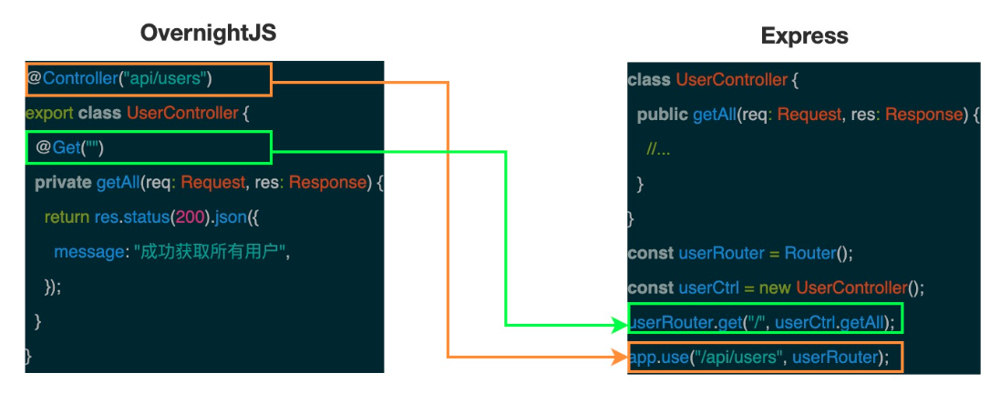

# 《重学TS》学习笔记（9）

## 第11章 TypeScript 进阶之装饰 Web 服务器

本章重心围绕装饰器的应用展示，以 OvernightJS 库为例，介绍如何使用 TypeScript 装饰器来装饰 Express。

### 一、OvernightJS 简介

OvernightJS 用于为调用 Express 路由的方法添加 TypeScript 装饰器，还包含了用于管理 json-web-token 和打印日志的包。

该库为开发者提供了以下特性：

- 使用`@Controller`装饰器定义基础路由
- 提供把类方法转化为 Express 路由的装饰器（比如 @Get，@Put，@Post，@Delete）
- 提供用于处理中间件的`@Middleware`和`@ClassMiddleware`装饰器
- 提供用于处理异常的`@ErrorMiddleware`装饰器
- 提供`@Wrapper`和`@ClassWrapper`装饰器用于包装函数
- 通过`@ChildControllers`装饰器支持子控制器

#### 初始化项目

```shell
# 在项目中安装 express 和 overnightJS
npm i @overnightjs/core express -S

# 项目中集成 typeScript 和直接在 node 环境下运行 TS 命令的包
npm i typescript ts-node -D

# 为 Node.js 和 Express 安装声明文件
npm i @types/node @types/express -D
```

安装完以上依赖后，package.json 中就会新增如下的依赖：

```json
{
    "devDependencies": {
        "@types/express": "^4.17.8",
      	"@types/node": "^14.11.2",
      	"ts-node": "^9.0.0",
      	"typescript": "^4.0.3"
    }
}
```

#### 初始化 TypeScript 配置文件

为了能够灵活配置 TypeScript 项目，需要为本项目生成 TypeScript 配置文件。

```shell
# 在项目中输入如下命令就会自动创建一个 tsconfig.json 文件
tsc --init
```

在本项目中，使用如下配置项：

```json
{
    "compilerOptions": {
        "target": "es6",
        "module": "commonjs",
      	"rootDir": "./src",
        "outDir": "./build",
      	"esModuleInterop": true,
      	"experimentalDecorators": true,
      	"strict": true
    }
}
```

#### 添加 index.ts 和第一个 Controller 文件

**index.ts**

```typescript
import { Server } from "@overnightjs/core";
import { UserController } from "./controllers/UserController";
const PORT = 3000;
export class SampleServer extends Server {
    constructor() {
        super(process.env.NODE_ENV === "development");
        this.setupControllers();
    }
    private setupControllers(): void {
        const userController = new UserController(); super.addControllers([userController]);
    }
    public start(port: number): void {
        this.app.listen(port, () => {
            console.log(` [server]:Serverisrunningathttp://localhost:${PORT}`);
        });
    }
}
const sampleServer = new SampleServer(); sampleServer.start(PORT);
```

**UserController.ts**

```typescript
import { Controller, Get } from "@overnightjs/core";
import { Request, Response } from "express";

@Controller("api/users") export class UserController {
    @Get("")
    private getAll(req: Request, res: Response) {
        return res.status(200).json({
            message: "成功获取所有用户",
        });
    }
}
```

#### 添加启动命令

在 package.json 中添加 start 命令来启动项目：

```json
{
  "script": {
    "start": "ts-node ./src/index.ts"
  }
}
```

#### 安装 nodemon

使用 nodemon 库可以自动检测目录中文件的更改，当发现文件异动时，会自动重启 Node.js 应用程序。

```shell
# 安装 nodemon
npm i nodemon -D
```

package.json:

```json
{
  "script": {
    "start": "nodemon ./src/index.ts"
  }
}
```

### 二、OvernightJS 原理分析



利用 OvernightJS 提供的装饰器，可以让开发显得更加便捷。但其实 OvernightJS 底层还是基于 Express，内部最终还是通过 Express 提供的 API 来处理路由。

> PS：要使用装饰器，必须要将 tsconfig 中的 compilerOptions.experimentalDecorators 选项设置为 true，或者在执行 tsc 命令时使用
>
> `tsc --target ES5 --experimentalDecorators`


> PS：接下来的源码分析看得头大，而且作者也只写了一部分...有兴趣再回顾吧

## 第 12 章 编写高效 TS 代码的一些建议

### 一、尽量减少重复代码

- 灵活使用`extends`关键字和交叉运算符（&）来定义类型和接口

  ```typescript
  interface Person {
    firstName: string;
    lastName: string;
  }
  
  interface PersonWithBirthDate extends Person {
    birth: Date;
  }
  
  type PersonWithBirthDateType = Person & { birth: Date };
  ```

- 使用`typeof`操作符来快速获取配置对象的「形状」：

  ```typescript
  const INIT_OPTIONS = {
    width: 640,
    height: 480,
    color: '#00FF00',
    label: 'VGA'
  }
  
  type Options = typeof INIT_OPTIONS
  ```

- 为了避免重复定义一些属性，可以使用成员访问语法，来提取对象中属性的类型

  ```typescript
  interface SaveAction {
    type: 'save'
  }
  
  interface LoadAction {
    type: 'load'
  }
  
  type Action = SaveAction | LoadAction
  type ActionType = Action['type'] // 'save' | 'load'
  ```

- 在实际开发中，重复的类型也许并不是那么容易被发现，此时可以提取统一的类型签名来节省代码。

  ```typescript
  // 优化前：在定义方法时描述类型
  function get(url: string, opts: Options): Promise<Response> {}
  function post(url: string, opts: Options): Promise<Response> {}
  
  // 优化后：提取统一类型并定义符合该类型的方法
  type HTTPFunction = (url: string, opts: Options) => Promise<Response>
  const get:HTTPFunction = (url, opts) => {}
  const post:HTTPFunction = (url, opts) => {}
  ```

### 二、使用更精确的类型代替字符串类型

某些情况下，可能想要将字符串限制为某种格式，而不是单纯的 string 类型，比如下面这种：

```typescript
interface Albun {
  artist: string;
  title: string;
  releaseDate: Date; // 发行日期：YYYY-MM-DD
  recordingType: 'studio' | 'live'; // 录制类型：live 或 studio
}
```

此外，在抽取对象的某个属性的值时，可以利用泛型来保证返回的属性能够明确类型，而不是 any。

```typescript
function pluck<T, K extends keyof T>(record: T[], key: K): T[K] {
  return record.map(r => r[key])
}
```

### 三、定义的类型总是表示有效的状态

简单来说，就是在复杂情况下，由多个类型的合并而来的联合类型要比使用 Options 选项的类型要好用。

```typescript
// 优化前的类型，error 状态和正常状态的返回都放在同一个接口定义里面
interface State {
  pageContent: string;
  isLoading: boolean;
  errorMsg?: string;
}

// 优化后，分别定义请求态、成功态、错误态
interface RequestPending {
  state: 'pending';
}
interface RequestError {
  state: 'error';
  errorMsg: string;
}
interface RequestSuccess {
  state: 'ok';
  pageContent: string;
}
type RequestState = RequestPending | RequestError | RequestSuccess

interface State {
  currentPage: string;
  requests: {
    [page: string]: RequestState;
  }
}
```

### 四、选择条件类型而不是重载声明

```typescript
// 优化前，使用重载声明
function dobule(x: number): number;
function dobule(x: string): string;
function dobule(x: string | number): string | number;
function dobule(x: any) {
  return x + x
}

let test!: number | string

const a  = dobule(test) // number | string

// 优化后，使用条件类型泛型
/**
	PS: 注意这里要先定义方法类型，后实现
*/
function dobule<T extends number | string>(x: T): T extends string ? string : number
function dobule (x: any) {
  return x + x
}
```

PS：要注意的是，虽然都使用了 extends 语法，但函数返回中的 extends 是用于推测函数返回类型的，而泛型中的 extends 是用于约束参数传入类型的，两者的作用并不相同。而当**函数的返回值**使用了条件类型的时候（即`T extends ...`这种语法），这个 T 依赖的是实际传入的类型，所以必须要先定义方法类型，后进行实现。

```typescript
// 也可以这样写
type dobuleFuncType = <T extends number | string>(x: T) => T extends string ? string : number;

const dobule: dobuleFuncType = function dobule(x: any) {
  return x + x
}
```

### 五、一次性创建对象

在 TypeScript 中，对于对象而言，如果不在初始化对象的时候就定义好接口中的属性，而是后续在进行添加，会让编译器报错。要解决这个问题，解决方案有：

- 一次性创建对象。
- 使用类型断言来消除类型检查。
- 使用较小的对象组合成一个大对象

```typescript
interface Point {
    x: number;
    y: number;
}

/*
Error: Type '{}' is missing the following properties from type 'Point': x, y
*/
let point: Point = {}

point.x = 1;
point.y = 2;

// 解决方法1 一次性创建对象。
let point: Point = {
  x: 1,
  y: 2
}

// 解决方法2 使用类型断言来消除类型检查
let point: Point = {} as Point
point.x = 1;
point.y = 2;

// 解决方案3 使用较小的对象组合成一个大对象
const x = { x: 1 }
const y = { y: 2 }
const hasY = false // 通过 hasY 的值，就可以控制 y 属性的值
const point: Point = { ...x, ...(hasY ? { y: 2 } : y) }
```

