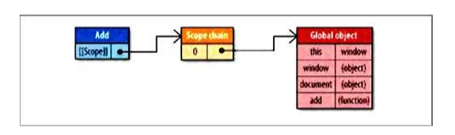

# 《高性能JavaScript》学习笔记（一）

> 资料下载地址(pdf压缩文件):
>
> [百度网盘](https://pan.baidu.com/s/1SGSWVpribkbNhVXvSkyZwg)
>
> 提取码: tjdd
>
> **本资料仅用于学习交流，如有能力请到各大销售渠道支持正版 !**

## 第1章 加载和运行

大多数浏览器使用单进程处理 UI 更新和 JavaScript 运行等多个任务，而同一时间只能有一个任务被执行。也就是说在通常情况下，页面加载时，JavaScript 运行了多长时间，用户的等待时间就有多长。

当浏览器遇到一个`<script>`标签时，浏览器会停下来运行此 JavaScript 代码，然后再继续解析，翻译页面。同样的事情发生在使用 src 属性加载 JavaScript 的过程中。浏览器必须首先下载外部文件的代码，然后解析并运行此代码。此过程中，页面解析和用户交互式被完全阻塞的。

**脚本位置**

因为脚本阻塞其他页面资源的下载过程，**所以推荐的办法是，将所有`<script>`标签放在尽可能接近`<body>`标签底部的位置，尽量减少对整个页面下载的影响**。

**成组脚本**

由于每个`<script>`标签下载时阻塞页面解析过程，所以限制页面的`<script>`总数也可以改善性能。每个 HTTP 请求都会产生额外的性能负担，下载一个 100KB 的文件比下载4个 25KB 的文件要快。

你可以通过一些打包工具来将你的 JavaScript 脚本打包成一个单独的文件。

#### 非阻塞脚本

保持 JavaScript 文件短小，并限制 HTTP 请求的数量，只是创建反应迅速的网页应用的第一步。尽管下载一个大 JavaScript 文件只产生一次 HTTP 请求，却会锁定浏览器一大段时间。为避免这种情况，你需要向页面中逐步添加JavaScript。而这意味着在 window 的 load 事件发出之后开始下载代码。

有几种方法可以实现这种效果：

1. 延期脚本

   HTML4 为 `<script>`标签定义了一个扩展属性: defer。一个带有 defer 属性的 script 标签可以放置在文档的任何位置而不会影响性能。

   **PS**：对于现代浏览器来说，该书对于 defer 的描述是错误的。正确的描述可见[这篇文章](https://www.cnblogs.com/jiasm/p/7683930.html)

2. 动态脚本元素

   DOM 允许你使用 JavaScript 动态创建 HTML 中几乎全部的文档内容。一个新的 script 元素可以非常容易地通过标准 DOM 函数创建：

   ```javascript
   var script = document.createElement("script")
   script.type = "text/javascript"
   script.src="file1.js"
   document.getElementsByTagName("head")[0].appendChild(script); 
   ```

   你可以在页面中动态加载很多 JavaScript 文件，但要注意，浏览器不保证文件加载的顺序。如果多个文件的次序十分重要，更好的办法是将这些文件按照正确的次序连成一个文件。

   动态脚本加载时非阻塞 JavaScript 下载中最常用的模式。

3. XHR 脚本注入

   另一个非阻塞方式获得脚本的方法是使用 XHR 对象将脚本注入到页面中。即大名鼎鼎的 Ajax 技术。

   ```javascript
   ajax('example.com/url.js', async: true, success: function (data) {
       var script = document.createElement("script")
       script.type = 'text/javascript'
       script.text = data
       document.getElementsByTagName("head")[0].appendChild(script)
   })
   ```

   此方法的有点是，你可以下载不立即执行的 JavaScript 代码。另一个优点是，同样的代码在所有现代浏览器中都不会引发异常。

   此方法也有缺点：即 JavaScript 文件必须与页面放置在同一个域内，不能从 CDN 下载。(否则会出现跨域问题)

**推荐的非阻塞模式**

本书推荐给读者的加载大量 JavaScript 的方法分为两个步骤：

- 包含动态加载 JavaScript 所需的代码，然后加载页面初始化所需的除 JavaScript 之外的部分。
- 当初始代码加载完毕后，用它来加载其余的 JavaScript。

简单来说，就是先加载一部分不会影响页面 DOM 结构的代码，然后再在页面准备好后，在代码中通过异步的方式加载新的代码。

```html
<script>
    function loadScript(url, callback) {
      var script = document.createElement("script")
      script.type = "text/javascript"
      script.onload = function () {
        callback()
      }
      script.src = url
      document.getElementByTagName("head")[0].appendChild(script)
    }
</script>
```

通过上面的 loadScript 函数，一旦页面初始化代码下载完成，就可以使用 loadScript() 函数加载页面所需的额外函数功能。

## 第2章 Data Access 数据访问

数据应当存放在什么地方，以实现最佳的读写效率。数据存储在哪里，关系到代码运行期间数据被检索到的速度。也是性能优化需要注意的一个重要点。

### 管理作用域

要裂解速度与作用域的关系，首先要理解作用域的工作原理。

#### 作用域链和标识符解析

每一个 JavaScript 函数都被表示为对象，进一步说，它是一个函数实例。函数对象正如其他的一样，哟拥有你可以编程访问的属性，和一系列不能被程序访问，仅供 JavaScript 引擎使用的内部属性，其中一个内部属性的名称为 [[Scope]]。

[[Scope]] 属性包含一个函数被创建的作用域中对象的集合。此集合被称为作用域链，可以决定哪些数据可由函数访问。

当一个函数被创建后，它的作用域链被对象填充，这些对象代表创建此函数的环境中可以访问的数据，如下面的全局函数。

```javascript
function add (num1, num2) {
    var sum = num1 + num2
    return sum
}
```

其作用域链如图所示：



#### 标识符识别性能

标识符识别不是免费的。在运行期上下文的作用域链中，一个标识符所处的位置越深，它的读写速度就越慢。所以，函数中局部变量的访问速度总是最快的。而全局变量通常是最慢的。

#### 改变作用域链

一般来说，一个运行期上下文的作用域链不会被改变，但是有两种表达式可以在运行时改变运行期上下文作用域链：

- 第一种，with表达式
- 第二种，try-catch 表达式中的 catch 子句

#### 闭包，作用域和内存

闭包是 JavaScript 最强大的一个方面，它允许函数访问局部范围之外的函数，这使得它在当今复杂的网页应用中几乎无处不在。

但由于闭包的[[Scope]]属性包含与运行期上下文作用域链相同的对象引用，会产生副作用。通常，一个函数的激活对象与运行期上下文一同销毁，而当涉及闭包时，激活对象就无法销毁了。因为引用仍然存在于闭包的[[Scope]]属性中。这意味着脚本中的闭包与非闭包函数相比，需要更多的内存开销。

#### 原型链

当数据深入原型链的时候，深入越深，搜索的速度就越慢。虽然使用优化 JavaScript 引擎的新式浏览器在此任务中表现良好，但是老的浏览器，每深入原型链一层都会增加性能损失。

#### 缓存对象成员的值

在编写代码时，要注意做好对深度对象的缓存，只在必要情况下使用对象成员。没有任何理由在一个函数中多次读取同一个对象成员的值。正如上文所言，**局部变量的访问速度要快得多**。