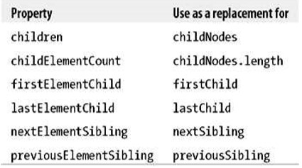

# 《高性能JavaScript》学习笔记（二）

## 第3章 DOM编程

对 DOM 的操作代价昂贵，在网页应用的开发中，这往往是一个性能瓶颈所在。本章讨论可能对程序响应造成负面影响的 DOM 编程，并给出提高响应速度的建议。

本章讨论三类问题：

- 访问和修改 DOM 元素
- 修改 DOM 元素的样式，造成重绘和重新排版
- 通过 DOM 事件处理用户响应

但首先要搞清楚的是，什么是 DOM ？

### 浏览器世界中的 DOM

DOM 是一个独立于语言的，使用 XML 和 HTML 文档操作的应用程序接口(API)。但尽管它是与语言无关的API，但它在浏览器中的接口却是用 JavaScript 实现的。

浏览器通常要求 DOM 实现和 JavaScript 实现保持相互独立，比如在 chrome 中，其 JavaScript 引擎 V8 和 DOM 引擎 Gecko 就是分离的。

**天生就慢**

两个独立的部分以功能接口相接意味着什么呢？就像是两座岛屿之间仅仅用一道收费的桥梁连着，每次 ECMAScript 需要访问 DOM 时，就像是过桥，交一次过桥费。操作 DOM 的次数越多，其费用就越高。而最糟糕的情况下，就是在 HTML 集合中使用循环。

### 访问和修改

考虑下面的两个例子

```javascript
function innerHTMLLoop() {
    for (var count = 0; count < 1500;count++) {
        document.getElementById('here').innerHTML += 'a'
    }
}

function innerHTMLLoop2() {
    var content = ''
    for (var count = 0; count < 1500;count++) {
        content += 'a'
    }
    document.getElementById('here').innerHTML += content
}
```

在所有的浏览器中，以上`innerHTMLLoop2`方法都会比`innerHTMLLoop`的效率要高得多，在 IE6 的测试中，第二种方法的运行效率要比第一种高 155 倍。

#### innerHTML 和 DOM 方法比较

innerHTML 和 普通的 DOM 方法的速度区别不大，但是总的来说，还是 innerHTML 更快一些。

#### 节点克隆

克隆节点，即用一个已有的节点去替代创建新的 DOM 元素，会让网页的性能高出 2% ~ 3%。

**HTML 集合**

HTML collection 是用于存放 DOM 节点引用的类数组对象。HTML 集合实际上是在查询文档，当你更新信息的时候，每次都要重复执行这种查询操作，而这正是低效率的来源。

遍历数组的速度要明显快于同样大小和内容的 HTML 集合。

**访问集合元素时使用局部变量**

一般来说，对于任何类型的 DOM 访问，如果同一个DOM属性或者方法被访问一次以上，最好使用一个局部变量来缓存此 DOM 成员，当遍历一个集合时，第一个优化是将集合引用存储于局部变量，并在循环外缓存 length 属性。

#### Walking the DOM

DOM API 提供了多种途径访问文档结构，让开发者针对特定操作选择最有效的API。

**抓取 DOM **

如果你经常需要从一个 DOM 元素开始，操作其相邻的元素，或者递归迭代所有子节点。那么你可以使用 childNode 集合或者使用 nextSibling 来获得下一个节点。

### 元素节点

许多现代浏览器提供了 API 函数只返回元素节点，可以方便的让你过滤和更好的找到页面元素。



遍历 children 比 childNodes 更快，因为 children 中不含文本节点。在 IE7 中，前者比后者快了124倍。

### 选择器API

使用 querySelectorAll() 函数可以实现更准确地 DOM 抓取。当然，如果你只想要符合条件的第一个元素，那也可以选择 querySelector 方法。

### 重绘（Repaint）和重排版（Reflow）

当浏览器下载完了所有的 HTML 标记，JavaScript，CSS，图片以后，就会开始解析文件，最终创建出两个内部数据结构：

- DOM tree，DOM树 表示页面结构
- render tree 渲染树 表示DOM节点如何显示

渲染树为每个需要显示的 DOM 树节点存放至少一个节点（隐藏 DOM 元素在渲染树中没有对应的节点）。一旦 DOM 树和渲染树构造完毕，浏览器就会开始绘制页面上的元素了。

当 DOM 的改变不影响几何属性（如颜色）时，浏览器只会触发重绘，对性能影响较小。

当 DOM 改变影响到元素的几何属性（宽高）时，浏览器就需要重构渲染树，这个过程称为重排版(以下称为回流)，对性能影响较大。

**回流(Reflow)时会发生什么**？

当以下几种情况发生时，页面会发生回流(Reflow)：

- 添加或删除可见的 DOM 元素
- 元素位置改变
- 元素尺寸改变(Resize)
- 内容改变
- 最初的页面渲染
- 浏览器窗口改变尺寸
- 当滚动条出现或消失时

**查询并刷新渲染树改变**

手动更改下面的值，会强制触发回流：

- offsetTop，offsetLeft，offsetWidth，offsetHeight
- scrollTop，scrollLeft，scrollWidth，scrollHeight
- clientTop，...
- getComputedStyle() （currentStyle in IE）

### 最小化重绘和回流

重绘和回流代价高昂，所以，我们应该尽可能将多个 DOM 和风格改变合并到一个批次中一次性执行。

通过使用 cssText 属性可以达到修改一次 DOM 多个 css 属性的同时改变的效果。

```javascript
var el = document.getElementById('mydiv')
el.style.cssText += 'border-left: 1px;border-right: 2px;padding: 5px;' // 这样就可以做到既不覆盖之前的css，又加入新的css
```

还有一种方法是通过`el.className`来改变类名称，从而一次性更换多个 css 属性。

### 批量修改 DOM

如果需要对 DOM 元素进行多次修改，可以通过以下步骤来减少重绘和回流的次数：

1. 从文档流中摘除该元素
2. 对其应用多重改变
3. 将文档带回文档中

这个过程一共会引发两次重排版，第一步引发一次，第三步引发一次。而如果你忽略了这个步骤，那么第二步中的每一次改变都会引发一次重排版。

对于步骤一，有三种基本方法可以将 DOM 从文档中摘除：

- 隐藏元素，进行修改(display 属性)，然后再显示它
- 使用一个文档片段( document.createDocumentFragment() )在已存 DOM 之外创建一个子树，然后将它拷贝到文档中
- 将原始元素拷贝到一个脱离文档的节点中，修改副本，然后哦覆盖原始元素

推荐使用第二种方法，文档片段来解决，因为它涉及最少数量的 DOM 操作和重排版。

### 缓冲布局信息

涉及到 DOM 信息的动态提取时，我们应该尽可能的把握它的变化规律，然后使用一个局部变量来代表这个 DOM 元素动态变化的属性，以免进行多次查询。

### 将元素提出动画流

动画是一种常见的交互模式，但为了减少页面的重绘和回流，我们应尽可能将动画脱离出页面布局流，尽可能使用绝对坐标定位页面动画的元素。

### IE 和 :hover

在 IE 中，如果大量元素使用了 :hover ，其性能会大幅度下降。

### 事件托管

基于事件冒泡的原理，我们可以使用事件托管的模式来减少很多不必要的工作与性能损耗。

根据 DOM 标准，每个事件有三个阶段：

- 捕获
- 到达目标
- 冒泡