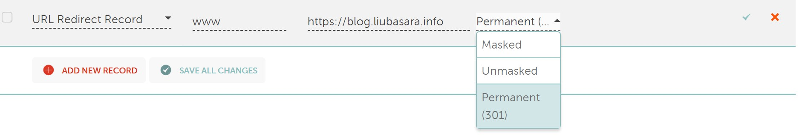

# 浅谈githubPage博客如何添加301域名跳转

## 为什么

301跳转相较于302跳转的优点：

1. 301代表永久重定向，302代表暂时重定向，302重定向有被搜索引擎误解为URL劫持的风险
2. SEO权重影响，301可以继承原来网站的权重，302不可以
3. 301重定向不会对原网站进行解析，但302有可能会，造成原服务器更大的负担

## 解决方案

**国外域名服务提供商**：

namecheap厂商自带可以使用301跳转设置(话说我居然是弄好了页面跳转之后，才发现域名厂商直接就自带了...Orz)



**国内域名**：

可以参考这篇文章：

> 引用资料：[Github Pages页面重定向到新网址，实现域名跳转](https://www.jianshu.com/p/2c31cfb6c9b1)

其实不需要那么麻烦，现在大多数博客都是单页面的，而且我的博客路由用的是hash模式，所以只要弄一下域名和hash跳转就可以了。

分享一下我的跳转文件：

```html
<!-- 404.html -->
<!-- index.html -->
<script type="text/javascript">
  var hash = window.location.hash
  window.location.href = hash ? 'https://blog.liubasara.info' + '/' + hash : 'https://blog.liubasara.info'
</script>
```

## 两种方法的区别以及优劣

上面两种方法，一种是通过域名厂商的DNS服务来进行301重定向，一个是通过我们自己的JavaScript脚本，人为重新定向，明眼人一眼就能看出，第一种方法肯定是更靠谱的，因为不论怎么说，第二种方法都让浏览器发送了两次请求，属于**客户端重定向**的范畴。

但是自2011年以来，国内的域名厂商好像已经大部分取消了URL重定向这个选项了(详细的不是太清楚，反正没几家是支持301重定向的)，而如果用国外域名的话，就意味着你要牺牲我国最大流量的搜索引擎——度娘。因为据我亲身体验，没有备案的域名是上不了度娘的(~~大雾~~)，连搜索引擎都用不了，SEO就更加无从谈起了。

而且严格上来说我国应该是不允许使用国外服务商提供的域名的，更别说做早就禁掉的域名重定向了，从某种意义上来说，在看这篇文章的你现在就正处于互联网违法犯罪的第一现场哦(︿(￣︶￣)︿)。

综上所述上面的第二种方法，牺牲一点点速度来做301重定向应该是更为靠谱的选项，当然缺点也很明显，github规定每个账户只能有一个名为`{username}.github.io`的仓库来作为个人主页，也就是说当你的页面需要不止一个重定向的域名的时候，你就只能申请多个github账号来挨个重定向过去。

不过有得必有失嘛，对于小型的博客项目来说，第二个这方案也已经已经够用了。实在不行，就花点钱上个VPS，自己搞个nginx来重定向咯~