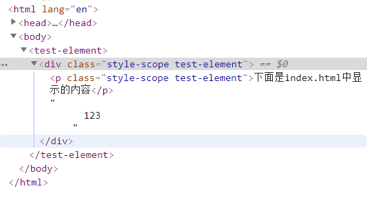
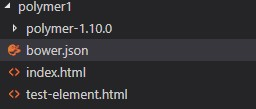

# 手把手从零搭建一个Polymer Demo(从入门到放弃)

> 引用资料：
>
> - [开坑，写点Polymer 1.0 教程第0篇——介绍篇](https://segmentfault.com/a/1190000003810019)
> - [本地运行polymer项目](https://polymer-zh.cn/1.0/start/first-element/intro)

> [项目源代码戳这里](https://github.com/Liubasara/Polymer-demo)

随着前端领域的爆炸性发展，直至如今2019年，相信已经没有多少人会说前端只是切切图写写页面这种话了。从 JQuery、bootStrap 到三大框架，从 Ajax 到 WebSocket ，在这股堪比娱乐圈小鲜肉的迭代浪潮之下，谁都不知道哪种技术会成为下一个香饽饽。但凡事总有苗头，身处这样的前端大时代中，总不乏有野心的人想要掌控未来，推陈出新，投身战场。而今天我们要来介绍的，就是这样一个自出生以来就号称“面向未来”的前端开发框架，Polymer。

相较于三大框架绞尽乳汁，千方百计的实现组件化，Polymer 则显得大气得多，或者说，它在浏览器兼容上显得狭隘的多。没有虚拟DOM，也没有 diff 更新算法，Polymer 的开发是基于浏览器能够原生实现组件化的基础上的。但鉴于目前的浏览器只有 Chrome 能够原生支持这个标准(毕竟谷歌亲儿子)，其它的浏览器都需要通过 polyfill 实现。而这种标准，就是谷歌大力推行的 Web Component。

一个支持 Web Component 的浏览器通过 Polymer 框架开发出来的网页最后在控制台表现出来是这样的。



从上图可以看到，chrome 中直接显示出了我们创建的 test-element 自定义组件，这也直接证明了 Web Component 是基于真实 DOM 的，由浏览器直接支持的功能。

接下来我们通过两个简单的例子来手把手的进行 Polymer 1.0 项目和 Polymer 2.0 项目的搭建。（其实最近谷歌还出了 Polymer 3.0 ，向 npm 生态靠拢了。本博客并不会研究 Polymer 3.0 ，仅仅只进行 1.0 和 2.0 的搭建。）

## 开始之前

开始之前，要确定电脑里面有 node 环境，npm 工具和 bower 工具。

node 下载在此不作赘述，bower 可以通过以下命令下载。

```shell
npm install -g bower
npm install -g polymer-cli
```

bower 用于构建 Polymer 源码，而 polymer-cli 则是官方的脚手架，但这个脚手架实在是不怎么好用，我们只单纯的用它来开启网页服务，解决本地资源请求的跨域问题。

## Polymer 1.0

1. [点击这里下载](https://github.com/Polymer/polymer/archive/v1.10.0.zip) Polymer 1.10.0 源码版本。

2. 解压缩，进入目录，执行命令

   ```shell
   bower install
   ```

3. 项目目录如下所示

   

4. 上面的 bower.json 用于注明项目版本，内容如下

   ```json
   {
     "name": "my-project",
     "version": "0.0.1",
     "dependencies": {
       "polymer": "Polymer/polymer#^1.10.0"
     }
   }
   ```

5. 随后加入 index.html ，这里的重点是要记得引入 webcomponents.min.js 文件，该文件是 polyfill 的关键，没有它 Polymer 项目在其他浏览器上将寸步难行。

   ```html
   <!DOCTYPE html>
   <html lang="en">
     <head>
       <meta charset="UTF-8" />
       <meta name="viewport" content="width=device-width, initial-scale=1.0" />
       <meta http-equiv="X-UA-Compatible" content="ie=edge" />
       <title>Polymer Demo 1</title>
   
       <script src="./polymer-1.10.0/bower_components/webcomponentsjs/webcomponents.min.js"></script>
       <link rel="import" href="./test-element.html">
     </head>
     <body>
       <test-element>
         polymer1 content
       </test-element>
     </body>
   </html>
   ```

6. 随后加入 test-element.html 文件，在该文件中正式引入 polymer 库。

   ```html
   <link rel="import" href="./polymer-1.10.0/bower_components/polymer/polymer.html">
   <dom-module id="test-element">
     <template>
       <div>
         <p>[[ demoData ]]</p>
         <content></content>
       </div>
     </template>
     <script>
       Polymer({
         is: "test-element", // is来标示组件的标签名
         // add a callback to the element's prototype
         ready: function() { // ready是组件生命周期的一部分
           // this.textContent = "I'm a proto-element. Check out my prototype!"  //为组件赋上一段文字
         },
         properties: {
           demoData: {
             type: String,
             value: '下面是index.html中显示的插槽内容'
           }
         }
       })
     </script>
   </dom-module>
   ```

7. 最后，在当前目录打开命令行，执行命令，运行 demo 。

   ```shell
   polymer serve --open
   ```

   --open 指令会在运行服务后帮你自动打开浏览器。

## Polymer 2.0

Polymer2.0 的项目构建方法与 Polymer1.0 大同小异，只是写法上发生了翻天覆地的变化，这里对于相同的步骤就不再赘述了，有兴趣的可以自行查看 [Polymer2 demo 项目的源码](https://github.com/Liubasara/Polymer-demo/tree/master/polymer2) ，在这里主要说一下开发 demo 时遇到的几个坑：

- Polymer2 组件中，css 要写在 `<dom-module>`标签的`<template>`标签内，否则不会被`shadow-dom`所识别。
- Polymer2 组件中，使用`<slot></slot>`来替代了 Polymer1 中的`<content></content>`。

## 结语

与其说 Polymer 是一个框架，倒不如说他是一种新型的 Web 开发途径。相较于现在的三大框架为了实现模块组件化你死我活的较劲，各种 JSX ，Proxy 、虚拟DOM用得不亦乐乎。以 Polymer 为代表的 Web Component 技术就像是一个默默无闻的苦修僧，你们慢慢玩，等玩到哪一天我神功大成，**浏览器标准原生支持组件化的时候**，就是你们叫爸爸的一天。

没错，Polymer 就是这样一种技术框架，哪怕现如今只有 Google 旗下的 Chrome 浏览器内核能原生支持 Web Component 技术，哪怕其现在的功能大多都要靠 Polyfill 来填平，哪怕时至今日各大浏览器之间的鸿沟依然宽阔如天堑，甚至于就连 Polymer 自身，其每一次版本更新也几乎都是断裂式，文档和 demo 对初学者也都及其不友好。

但如果有一天，在 Google 的主导推进下，真的所有浏览器都能原生支持组件化 Web，那无疑是又一次革命式的演变。他会让现在三大框架所做的很大一部分努力都变成可笑的无用功。而达成这一目的所需要的勇气、魄力和财力都无比巨大，放眼如今的大前端世界，似乎也只有一家 Google 能这么玩。以一己之力推动整个 Web 市场进行变革，提前布局下一代 Web 技术的核心框架，这大概就是 Google 这种大公司的的格局和野心吧。

但很可惜的是，即便在不远的未来（以前端技术目前的这种迭代程度，完全实现大概只需要3到4年，但要普及开来......保守点计算也要5到6年吧），浏览器真正完全兼容了 Web Component 标准，但到了那个时候，标准的真正受益人真的是 Polymer 吗？以其堪称贫瘠的生态和社区，生涩难懂的文档，即便在明面上，Polymer 是目前对 Web Component 标准实现得最好的框架，但这也是在三大框架没有入场的情况下。当 Web Component 技术成熟之时，三大框架携带着其庞大的生态圈直接介入（而这正是 Polymer 非常缺少，也难以在短暂的时间里弥补的东西），到时候的胜负格局，恐怕尚未可知。再者说，谁又能担保在各项技术都趋于稳定情况下的未来，不会杀出来一匹截胡黑马，从零开始，横扫千军，实现真正的前端大一统呢？

最后的最后，总结起来就是，Polymer 是一个大有前景的框架，但既然这是面向未来的框架，那还是让他留在未来吧。Polymer，让我们在不远的未来有缘再见，sayonara ~
