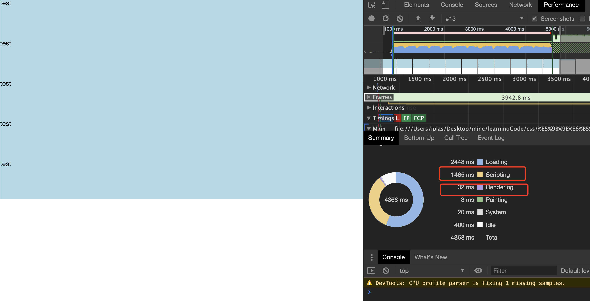
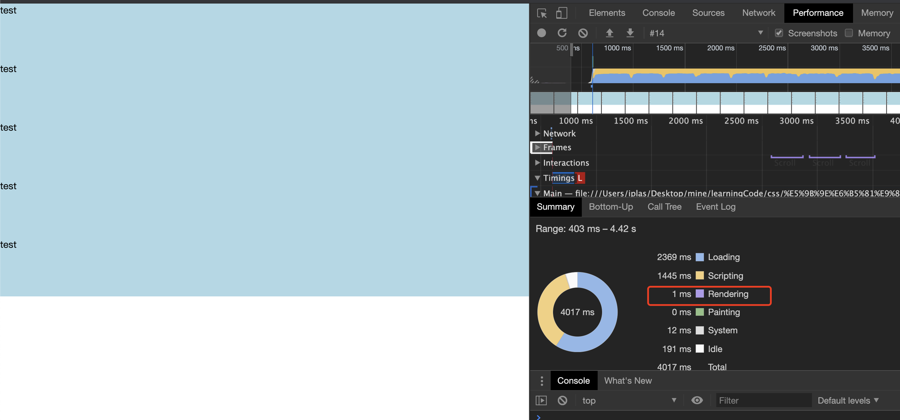

# 浅谈 display:none 结点对浏览器渲染造成的影响

> 经典面试题：
>
> 当遇到很多需要渲染的 DOM 结点时，应该怎么优化？

```html
<!-- demo代码 -->
<!DOCTYPE html>
<html lang="en">
<head>
  <meta charset="UTF-8">
  <meta name="viewport" content="width=device-width, initial-scale=1.0">
  <title>display: none 性能测试</title>
  <style>
    * {
      box-sizing: border-box;
      margin: 0;
      padding: 0;
    }
    html, body {
      height: 100%;
    }
  </style>
</head>
<body>
  <script>
    window.onload = function () {
      var testDOM = document.createElement('div')
      var wrapperDOM = document.createElement('div')
      testDOM.appendChild(wrapperDOM)
      for (let i = 0; i < 5; i++) {
        wrapperDOM.innerHTML += `<div style="background: lightblue; height: 100px;">test</div>`
      }
      setTimeout(() => {
        var dontNeedDOM = document.createElement('div')
        var wrapperDOM2 = document.createElement('div')
        dontNeedDOM.appendChild(wrapperDOM2)
        for (let i = 0; i < 1900; i++) {
          // opacity: 0 和 visibility: hidden 都会触发渲染
          // wrapperDOM2.innerHTML += `<div style="opacity: 0; background: lightblue; height: 100px;">test</div>`
          // display: none 则不会触发渲染
          wrapperDOM2.innerHTML += `<div style="display: none; background: lightblue; height: 100px;">test</div>`
        }
        document.body.appendChild(dontNeedDOM.firstChild)
      }, 0)
      document.body.appendChild(testDOM.firstChild)
      
    }
  </script>
</body>
</html>
```

使用`opacity: 0`或`visibility: hidden`情况下，2000 个结点的浏览器渲染情况：



此时浏览器可以滚动，证明进行了渲染。

使用 display: none 进行渲染的情况：



可以看出随安此时页面的 DOM 结点依然存在，但是却没有进行渲染，页面无法滚动。


**结论**：在前端优化性能中，如果遇到需要生成很多结点的情况，需要优化的主要有两个点：

- javascript 创建生成 dom 结点需要时间，针对这一步的优化，我们可以使用 setTimeout 的方式将第二第三屏的元素事先生成好并插入文档，以达到既不阻塞当前渲染又能生成结点的效果。
- 浏览器 rendering 需要时间，这一点其实是由于第一点优化而带来的，因为既然生成并插入了元素，那么浏览器就会默认进行渲染，而这势必会造成性能干扰。关于这一点，就需要我们在生成元素的时候加上 display: none 属性，让浏览器主动忽略该元素的渲染。等到用户触发下拉事件至某处时，再通过批量设置 display 的方式提醒浏览器进行渲染。（像 Vue 这样的基于虚拟 DOM 框架则更彻底，直接在 VDOM 的层面就可以删除掉这个元素不让浏览器进行渲染。但也正因如此，如果单屏元素过多的话，Vue 会在第一步创建元素上花费大量时间，所以遇到这种情况，追求极端性能优化的方案应该是：对列表进行 Object.freeze 的操作阻止 Vue 对该对象响应式处理，然后自己手动进行生成 DOM 元素的生成和渲染）

