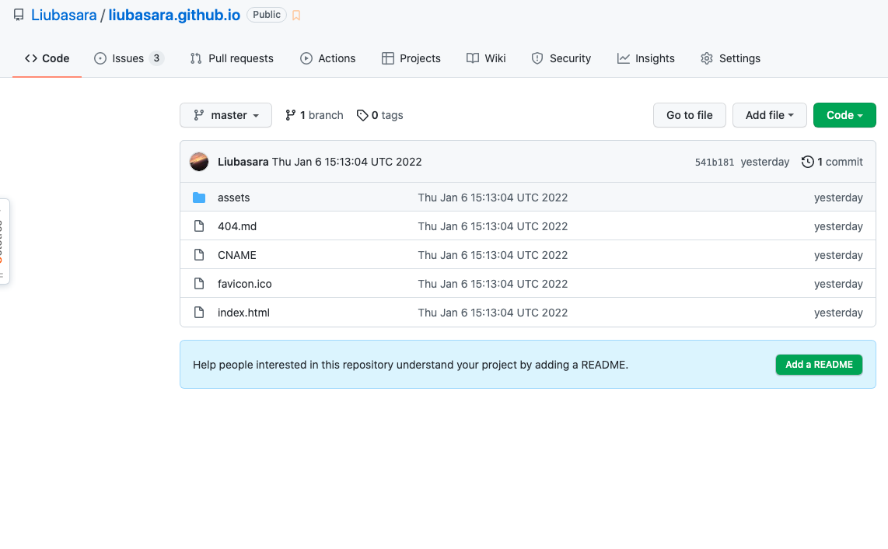
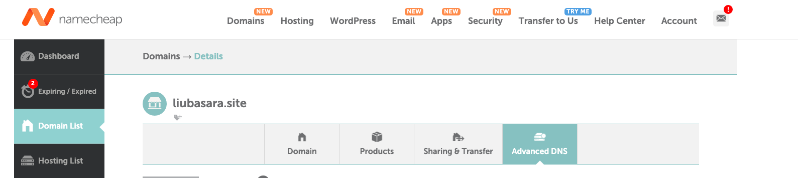
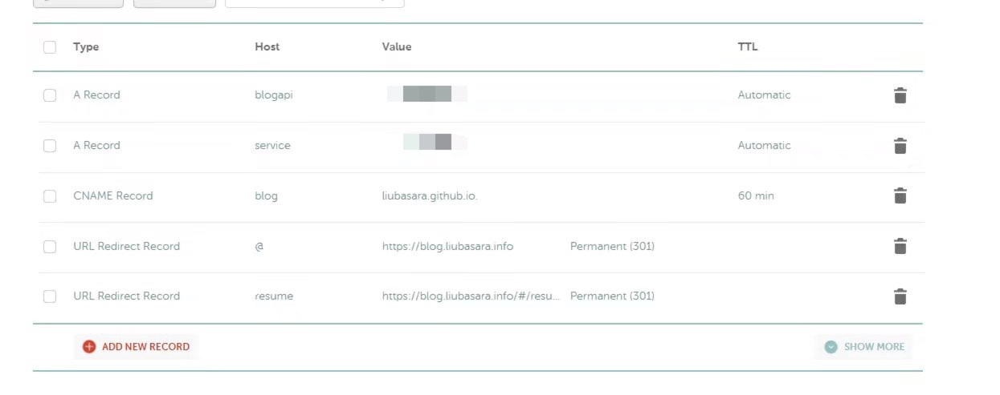
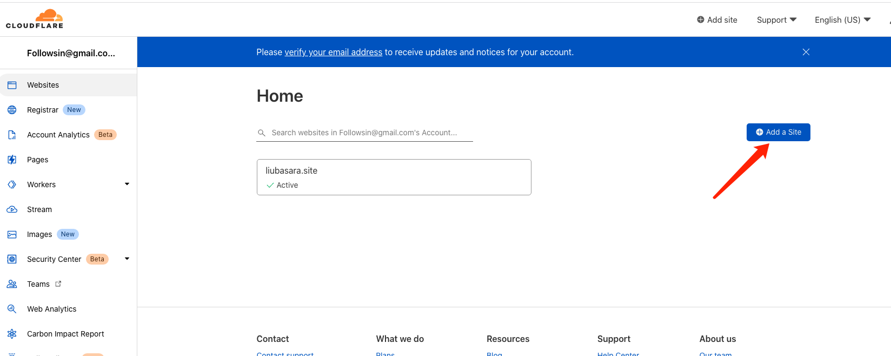
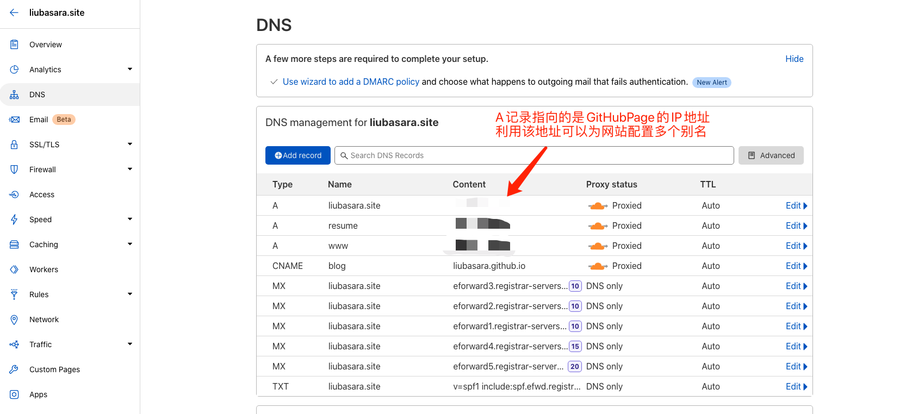
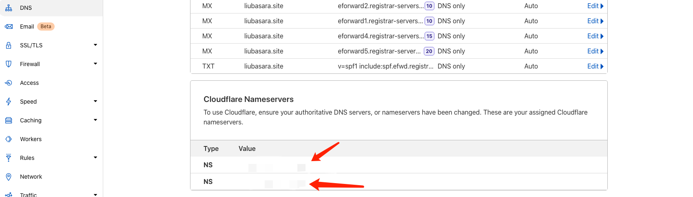
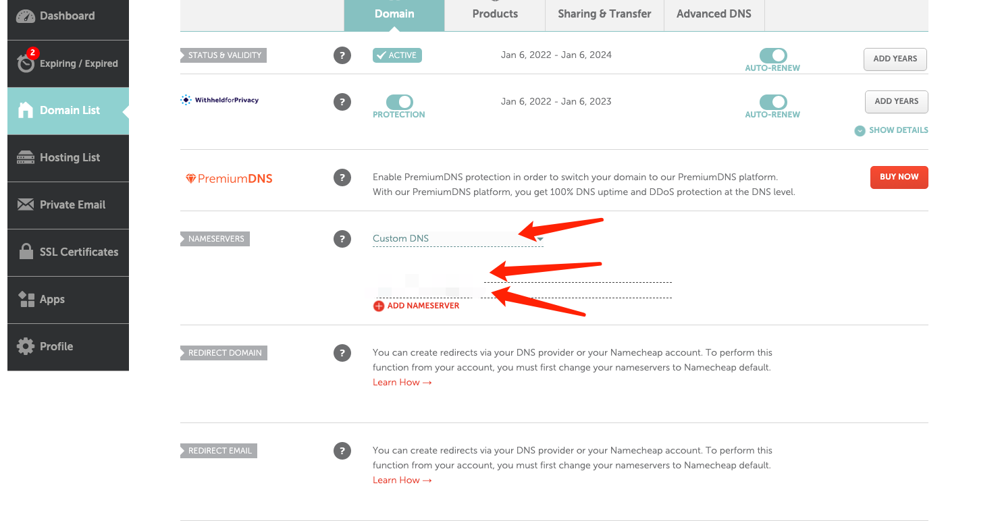
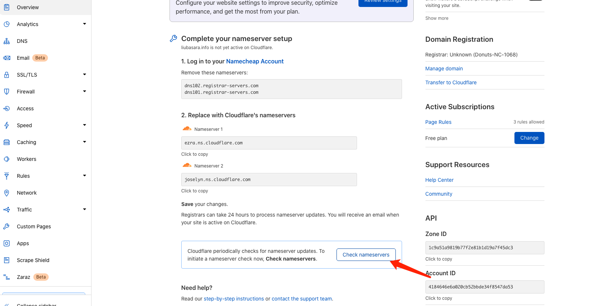
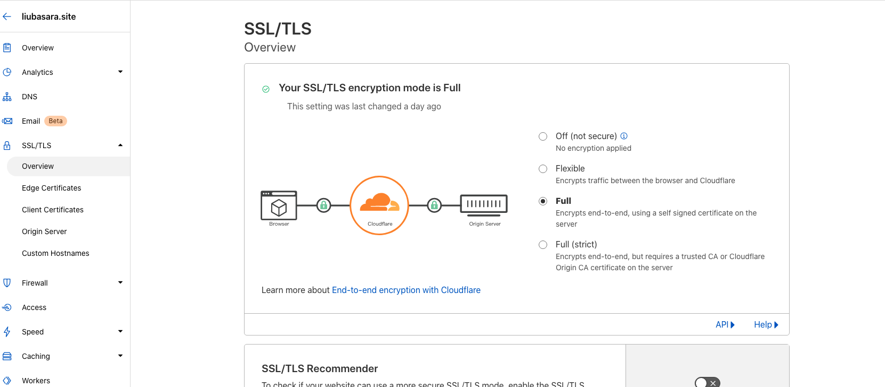
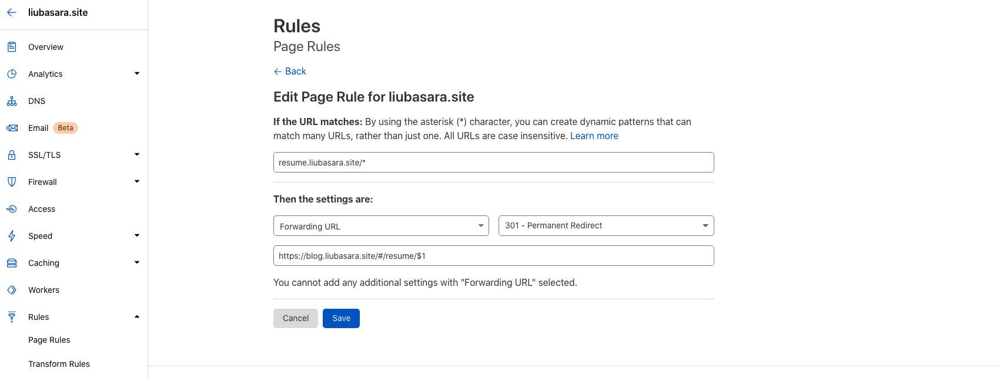

# NameCheap+cloudflare对githubPage进行部署

> 参考资料：
>
> - [为Github page绑定自定义域名并实现https访问](https://blog.csdn.net/yucicheung/article/details/79560027)

## 背景

最近使用 nameCheap 域名提供商和 cloudflare 对博客进行了一次升级，乱七八糟折腾了一晚上终于搞定，趁着网页还没关赶紧记录一下，避免下次换域名的时候把坑再踩一遍。

## 步骤

### 1. 部署 githubPage



首先在 <用户名>.github.io 的仓库中上传你的博客网页，其中 CNAME 中要包含待部署的域名：

```txt
blog.liubasara.site
```

### 2. NameCheap 购买域名

> 购买之前可以先通过 https://www.domcomp.com/?refcode=59cb7d261000007eddec5305 进行域名比价，选择合适的域名提供商





NameCheap 购买完域名之后在面板中配置 DNS，其中最重要的是 CNAME Record 配置：`liubasara.github.io.`，要留意最后的点（`.`）不能忘。

### 3. cloudflare 配置域名服务器

前往 cloudflare 中添加对应的网站，注意是根地址：`liubasara.site`，可以选择免费的部署计划。



然后 cloudflare 会自动查询已有的 DNS 记录，一般来说会有一个 CNAME 记录和一个指向网站 IP 地址的 A 记录。



然后在下面获取到 cloudflare 提供的域名服务器，将其填入 NameCheap 的自定义 DNS 服务器设置中。





设置完成后回到 cloudflare，点击 Check nameservers，等待片刻，非 HTTPS 的网页应该就部署好了。



此时可以尝试访问`http://blog.liubasara.site`，成功后进行下一步进阶设置。

### 4. cloudflare Https、301 跳转设置

有些良心的服务商是会自带 https 服务的，但一般来说都需要额外购买，而 cloudflare 提供了免费的 https 认证。



配置非常简单，进入 SSL 界面将选项置为**Full**模式，等待片刻后即可。


此外每个免费用户拥有三条配置规则的权限，可以使用该规则来对网站进行一些特殊的 301 重定向，比如我就想将`resume.liubasara.site`重定向为`blog.liubasara.site/#/resume`。

**首先需要在 cloudflare DNS 中添加一条 resume 的 A 记录，IP 地址指向与 blog 的 A 记录的 IP 相同（见上图）**，然后再进行如下规则配置：



将`resume.liubasara.site/*`指向`https://blog.liubasara.site/#/resume/$1`，保存后等待片刻即可。

至此大功告成。