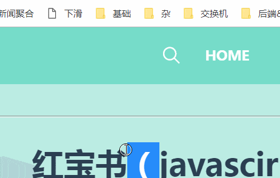
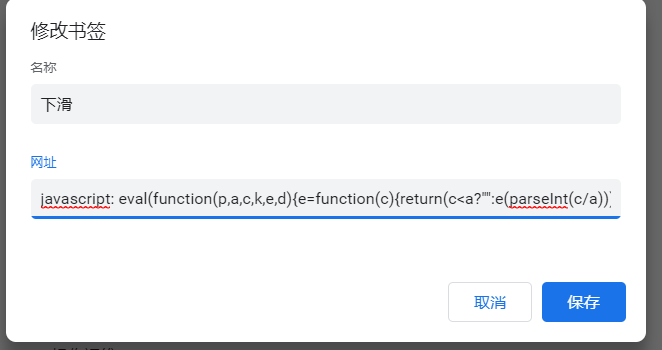

# chrome标签小工具之缓慢下滑页面

> 引用资料：
>
> [js控制滚动条缓慢滚动到顶部实现代码](https://www.jb51.net/article/34907.htm)

## 动机

假期看小说看文档时实在懒得动，想找个能自动下滑的脚本，结果找了半天，发现还不如自己写。

## 最终效果

通过 Chrome 的标签页为当前页面添加双击下滑，双击取消下滑的效果，同时也可以在控制台输入代码进行滑动的控制。



## 工具代码

```javascript
var ReadingUtil = (function() {
  var currentPosition, topTimer, bottomTimer
  function goTop(speed = 10) {
    topTimer = setInterval(runToTop, speed)
    return {
      topTimer,
      stop: function() {
        clearInterval(topTimer)
        topTimer = null
      }
    }
  }
  function goBottom(speed = 10) {
    bottomTimer = setInterval(runToBottom, speed)
    return {
      bottomTimer,
      stop: function() {
        clearInterval(bottomTimer)
        bottomTimer = null
      }
    }
  }
  function runToTop() {
    currentPosition =
      document.documentElement.scrollTop || document.body.scrollTop
    currentPosition -= 1
    if (currentPosition > 0) {
      window.scrollTo({top: currentPosition, behavior: 'smooth'})
    } else {
      window.scrollTo({top: 0, behavior: 'smooth'})
      clearInterval(topTimer)
      topTimer = null
    }
  }
  function runToBottom() {
    currentPosition =
      document.documentElement.scrollTop || document.body.scrollTop
    currentPosition += 1
    if (parseInt(document.documentElement.scrollHeight - document.documentElement.scrollTop) !== document.documentElement.clientHeight) {
      window.scrollTo({top: currentPosition, behavior: 'smooth'})
    } else {
      window.scrollTo({top: document.documentElement.scrollHeight, behavior: 'smooth'})
      clearInterval(bottomTimer)
      bottomTimer = null
    }
  }
  function top (speed = 10) {
    window.stopReading = goTop(speed).stop
  }
  function bottom (speed = 10) {
    window.stopReading = goBottom(speed).stop
  }
  // 监听双击事件下滑页面，也可以通过控制台操控
  document.documentElement.ondblclick = function () {
    if (bottomTimer) {
      // 已经处于下滑状态, 取消下滑
      clearInterval(bottomTimer)
      bottomTimer = null
      return
    }
    // 开始下滑
    bottom()
  }
  return {
    goTop,
    goBottom,
    top,
    bottom
  }
})()
```

## chrome 标签代码

在 chrome 标签页中添加代码，如图所示



代码如下所示，代码进行了压缩混淆（在压缩前切记找个翻译器把分号加上），以缩小容量。

```javascript
eval(function(p,a,c,k,e,d){e=function(c){return(c<a?"":e(parseInt(c/a)))+((c=c%a)>35?String.fromCharCode(c+29):c.toString(36))};if(!''.replace(/^/,String)){while(c--)d[e(c)]=k[c]||e(c);k=[function(e){return d[e]}];e=function(){return'\\w+'};c=1;};while(c--)if(k[c])p=p.replace(new RegExp('\\b'+e(c)+'\\b','g'),k[c]);return p;}('d z=4(){d 8,6,3;4 m(){d 7=2.h>0&&2[0]!==i?2[0]:o;6=y(v,7);n{6:6,c:4 c(){e(6);6=f}}}4 q(){d 7=2.h>0&&2[0]!==i?2[0]:o;3=y(t,7);n{3:3,c:4 c(){e(3);3=f}}}4 v(){8=5.a.g||5.u.g;8-=1;r(8>0){b.k({9:8,j:\'l\'})}w{b.k({9:0,j:\'l\'});e(6);6=f}}4 t(){8=5.a.g||5.u.g;8+=1;r(B(5.a.x-5.a.g)!==5.a.C){b.k({9:8,j:\'l\'})}w{b.k({9:5.a.x,j:\'l\'});e(3);3=f}}4 9(){d 7=2.h>0&&2[0]!==i?2[0]:o;b.s=m(7).c}4 p(){d 7=2.h>0&&2[0]!==i?2[0]:o;b.s=q(7).c}5.a.A=4(){r(3){e(3);3=f;n}p()};n{m:m,q:q,9:9,p:p}}();',39,39,'||arguments|bottomTimer|function|document|topTimer|speed|currentPosition|top|documentElement|window|stop|var|clearInterval|null|scrollTop|length|undefined|behavior|scrollTo|smooth|goTop|return|10|bottom|goBottom|if|stopReading|runToBottom|body|runToTop|else|scrollHeight|setInterval|ReadingUtil|ondblclick|parseInt|clientHeight'.split('|'),0,{}))
```


