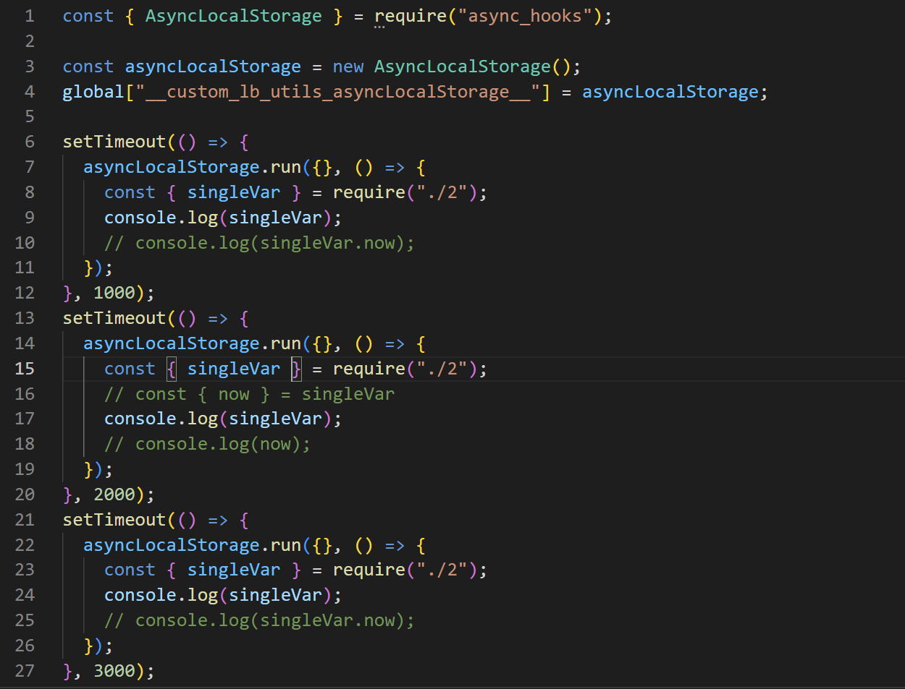
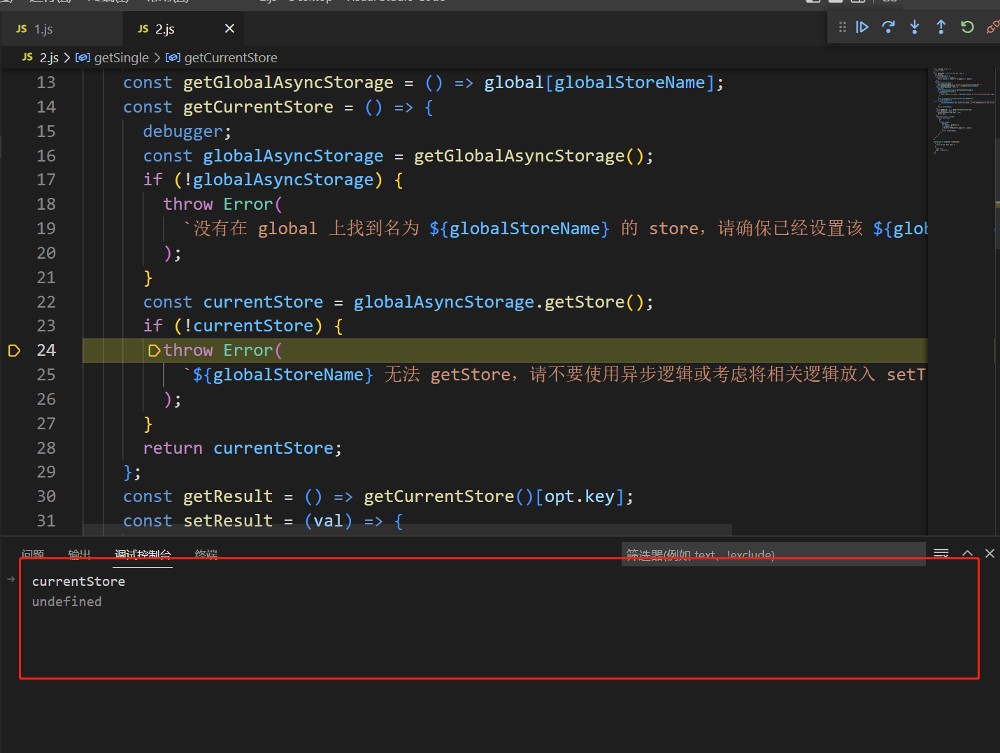

# nodeJs中关于Proxy和AsyncLocalStorage的神奇BUG

> 相关资料：
>
> - [Nodejs AsyncLocalStorage getStore() return undefined](https://stackoverflow.com/questions/64330910/nodejs-asynclocalstorage-getstore-return-undefined)
> - [Why does console.log not trigger proxy getter trap?](https://stackoverflow.com/questions/55630414/why-does-console-log-not-trigger-proxy-getter-trap)
> - [JavaScript proxy handler does not work on object itself](https://stackoverflow.com/questions/70822011/javascript-proxy-handler-does-not-work-on-object-itself)
> - [AsyncLocalStorage 的妙用](https://juejin.cn/post/7121176644596793374)
> - [Catch proxy error?](https://github.com/http-party/node-http-proxy/issues/264)
> - [Why does console.log not trigger proxy getter trap?](https://stackoverflow.com/questions/55630414/why-does-console-log-not-trigger-proxy-getter-trap)

前情提要：本 BUG 并未找到解决办法，仅做记录。

## 背景

nodeJs 版本：v16.14.2

看到 [AsyncLocalStorage 的妙用](https://juejin.cn/post/7121176644596793374) 这篇文章，在了解到 AsyncLocalStorage 这个 API 后，想要基于这个 API 做一个能够适配 SSR 场景下的单例模式，简单来说就是让单例能够在 SSR 运行的时候去绑定当前回调的上下文，而不是全局的上下文。

## 实现

一个简单的实现如下，兼容了 SSR 场景和普通浏览器场景：

```typescript
import type { AsyncLocalStorage } from 'async_hooks'

export const kgp3UtilsSingleAsyncLocalStorageSymbol =
  '__kgp3_utils_single_async_localStorage_symbol__'

/**
 * ```ts
 *
 * const { AsyncLocalStorage } = require("async_hooks")
 *
 * const asyncLocalStorage = createGlobalAsyncLocalStorage(AsyncLocalStorage)
 *
 * asyncLocalStorage.run({}, () => {
 *   const singleVar = getSingle(() => ({ a: 1 }), { client: 'ssr', key: 'a' })
 * })
 * ```
 *
 * @param storage
 * @returns
 */
export const createGlobalAsyncLocalStorage = <T>(
  storage: typeof AsyncLocalStorage
): typeof AsyncLocalStorage<T> => {
  return (
    global[kgp3UtilsSingleAsyncLocalStorageSymbol] ||
    (global[kgp3UtilsSingleAsyncLocalStorageSymbol] = new storage())
  )
}

export type InSsrSingleType = { client: 'ssr'; globalStoreName?: string; key: string }
export type InBrowserSingleType = { client: 'browser' }
export type GetSingleOptType = InSsrSingleType | InBrowserSingleType

/**
 * SSR 环境下:
 *```ts
 * const { AsyncLocalStorage } = require("async_hooks")
 *
 * const asyncLocalStorage = createGlobalAsyncLocalStorage(AsyncLocalStorage)
 *
 * asyncLocalStorage.run({}, () => {
 *   const singleVar = getSingle(() => ({ a: 1 }), { client: 'ssr', key: 'a' })
 * })
 * ```
 *
 * 浏览器环境下:
 * ```ts
 * const singleVar = getSingle(() => ({ a: 1 }))
 * ```
 */
export const getSingle = function <
  T extends Record<string, any> | ((...args: any[]) => any),
  U extends any[]
>(fn: (...args: U) => T, opt: GetSingleOptType = { client: 'browser' }) {
  let result: T

  if (opt.client === 'browser') {
    return function <V extends string>(
      this: unknown,
      ...args: V extends 'init' ? U : any[]
    ) {
      return result || (result = fn.apply(this, args as U))
    }
  } else if (opt.client === 'ssr') {
    type LocalStorageInstanceType = InstanceType<
      typeof AsyncLocalStorage<{
        [key: string]: T
      }>
    >
    const globalStoreName = opt.globalStoreName || kgp3UtilsSingleAsyncLocalStorageSymbol
    const getGlobalAsyncStorage: () => LocalStorageInstanceType | void = () =>
      (global as any)[globalStoreName]
    const getCurrentStore = () => {
      const globalAsyncStorage = getGlobalAsyncStorage()
      if (!globalAsyncStorage) {
        throw Error(
          `没有在 global 上找到名为 ${globalStoreName} 的 store，请确保已经设置该 ${globalStoreName} 全局变量`
        )
      }
      const currentStore = globalAsyncStorage.getStore()
      if (!currentStore) {
        throw Error(
          `${globalStoreName} 无法 getStore，请不要使用异步逻辑或考虑将相关逻辑放入 setTimeout 中执行`
        )
      }
      return currentStore
    }
    const getResult = () => getCurrentStore()[opt.key]
    const setResult = (val: T) => {
      getCurrentStore()[opt.key] = val
      return val
    }
    return function <V extends string>(
      this: unknown,
      ...args: V extends 'init' ? U : any[]
    ) {
      // eslint-disable-next-line @typescript-eslint/no-this-alias
      const that = this
      const proxyRes = fn.apply(that, args as U)
      return new Proxy<T>(proxyRes, {
        apply(_t, thisArg, argumentList) {
          let result = getResult()
          if (!result) {
            result = setResult(fn.apply(that, args as U))
          }
          return result.apply(thisArg, argumentList)
        },
        get(_t, prop, receiver) {
          let result = getResult()
          if (!result) {
            result = setResult(fn.apply(that, args as U))
          }
          const targetProp = Reflect.get(result, prop, receiver)
          if (typeof targetProp === 'function') {
            return targetProp.bind(result)
          }
          return targetProp
        }
      })
    }
  } else {
    throw Error('getSingle 传入 client 必须为 browser 或 ssr')
  }
}
```

上述函数用法示例如下（BUG 的地方用注释指出）：

```javascript
// 执行命令: node 1.js
// 1.js
const { AsyncLocalStorage } = require("async_hooks");
const { createGlobalAsyncLocalStorage } = require('./2')
const asyncLocalStorage = createGlobalAsyncLocalStorage(AsyncLocalStorage);

setTimeout(() => {
  asyncLocalStorage.run({}, () => {
    const { singleVar, singleFn, singleArray } = require("./3");
    console.log(singleVar.now);
    console.log('singleFn()1-1', singleFn())
    console.log('singleFn()1-2', singleFn())

    console.log('singleArray()1-1', JSON.parse(JSON.stringify(singleArray))) // 直接 console.log 会有问题！
    singleArray.push(1)
    console.log('singleArray()1-2', JSON.parse(JSON.stringify(singleArray))) // 直接 console.log 会有问题！
  });
}, 1000);
setTimeout(() => {
  asyncLocalStorage.run({}, () => {
    const { singleVar, singleFn, singleArray } = require("./3");
    console.log(singleVar.now);
    console.log('singleFn()2-1', singleFn())
    console.log('singleFn()2-2', singleFn())
    console.log('singleArray()2-1', JSON.parse(JSON.stringify(singleArray))) // 直接 console.log 会有问题！
    singleArray.push(2)
    console.log('singleArray()2-2', JSON.parse(JSON.stringify(singleArray))) // 直接 console.log 会有问题！
  });
}, 2000);
setTimeout(() => {
  asyncLocalStorage.run({}, () => {
    const { singleVar, singleFn, singleArray } = require("./3");
    console.log(singleVar.now);
    console.log('singleFn()3-1', singleFn())
    console.log('singleFn()3-2', singleFn())

    console.log('singleArray()3-1', JSON.parse(JSON.stringify(singleArray))) // 直接 console.log 会有问题！
    singleArray.push(3)
    console.log('singleArray()3-2', JSON.parse(JSON.stringify(singleArray))) // 直接 console.log 会有问题！
  });
}, 3000);

// 2.js
exports.getSingle = exports.createGlobalAsyncLocalStorage = exports.kgp3UtilsSingleAsyncLocalStorageSymbol = void 0;
exports.kgp3UtilsSingleAsyncLocalStorageSymbol = '__kgp3_utils_single_async_localStorage_symbol__';
/**
 * ```ts
 *
 * const { AsyncLocalStorage } = require("async_hooks")
 *
 * const asyncLocalStorage = createGlobalAsyncLocalStorage(AsyncLocalStorage)
 *
 * asyncLocalStorage.run({}, () => {
 *   const singleVar = getSingle(() => ({ a: 1 }), { client: 'ssr', key: 'a' })
 * })
 * ```
 *
 * @param storage
 * @returns
 */
const createGlobalAsyncLocalStorage = (storage) => {
    return (global[exports.kgp3UtilsSingleAsyncLocalStorageSymbol] ||
        (global[exports.kgp3UtilsSingleAsyncLocalStorageSymbol] = new storage()));
};
exports.createGlobalAsyncLocalStorage = createGlobalAsyncLocalStorage;
/**
 * SSR 环境下:
 *```ts
 * const { AsyncLocalStorage } = require("async_hooks")
 *
 * const asyncLocalStorage = createGlobalAsyncLocalStorage(AsyncLocalStorage)
 *
 * asyncLocalStorage.run({}, () => {
 *   const singleVar = getSingle(() => ({ a: 1 }), { client: 'ssr', key: 'a' })
 * })
 * ```
 *
 * 浏览器环境下:
 * ```ts
 * const singleVar = getSingle(() => ({ a: 1 }))
 * ```
 */
const getSingle = function (fn, opt = { client: 'browser' }) {
    let result;
    if (opt.client === 'browser') {
        return function (...args) {
            return result || (result = fn.apply(this, args));
        };
    }
    else if (opt.client === 'ssr') {
        const globalStoreName = opt.globalStoreName || exports.kgp3UtilsSingleAsyncLocalStorageSymbol;
        const getGlobalAsyncStorage = () => global[globalStoreName];
        const getCurrentStore = () => {
            const globalAsyncStorage = getGlobalAsyncStorage();
            if (!globalAsyncStorage) {
                throw Error(`没有在 global 上找到名为 ${globalStoreName} 的 store，请确保已经设置该 ${globalStoreName} 全局变量`);
            }
            const currentStore = globalAsyncStorage.getStore();
            if (!currentStore) {
                throw Error(`${globalStoreName} 无法 getStore，请不要使用异步逻辑或考虑将相关逻辑放入 setTimeout 中执行`);
            }
            return currentStore;
        };
        const getResult = () => getCurrentStore()[opt.key];
        const setResult = (val) => {
            getCurrentStore()[opt.key] = val;
            return val;
        };
        return function (...args) {
            // eslint-disable-next-line @typescript-eslint/no-this-alias
            const that = this;
            const result = fn.apply(that, args)
            return new Proxy(result, {
                apply(_t, thisArg, argumentList) {
                    let result = getResult();
                    if (!result) {
                        result = setResult(fn.apply(that, args));
                    }
                    return result.apply(thisArg, argumentList);
                },
                get(_t, prop, receiver) {
                    let result = getResult();
                    if (!result) {
                        result = setResult(fn.apply(that, args));
                    }
                    const targetProp = Reflect.get(result, prop, receiver)
                    if (typeof targetProp === 'function') {
                      return targetProp.bind(result)
                    }
                    return targetProp;
                }
            });
        };
    }
    else {
        throw Error('getSingle 传入 client 必须为 browser 或 ssr');
    }
};
exports.getSingle = getSingle;

// 3.js
const { getSingle } = require('./2')

// 2.js
module.exports.singleVar = getSingle(
  () => {
    return { now: Date.now() };
  },
  {
    client: 'ssr',
    key: "singleVar",
  }
)()

module.exports.singleFn = getSingle(
  () => {
    let state = { now: Date.now() }
    return () => ({ now: state });
  },
  {
    client: 'ssr',
    key: "singleFn",
  }
)()

module.exports.singleArray = getSingle(
  () => {
    let state = [{ now: Date.now() }]
    return state;
  },
  {
    client: 'ssr',
    key: "singleArray",
  }
)()
```

实际输出为：

```txt
$ node 1.js
Debugger attached.
1681109668438
singleFn()1-1 { now: { now: 1681109668444 } }
singleFn()1-2 { now: { now: 1681109668444 } }
singleArray()1-1 [ { now: 1681109668448 } ]
singleArray()1-2 [ { now: 1681109668448 }, 1 ]
1681109669441
singleFn()2-1 { now: { now: 1681109669441 } }
singleFn()2-2 { now: { now: 1681109669441 } }
singleArray()2-1 [ { now: 1681109669444 } ]
singleArray()2-2 [ { now: 1681109669444 }, 2 ]
1681109670445
singleFn()3-1 { now: { now: 1681109670446 } }
singleFn()3-2 { now: { now: 1681109670446 } }
singleArray()3-1 [ { now: 1681109670448 } ]
singleArray()3-2 [ { now: 1681109670448 }, 3 ]
Waiting for the debugger to disconnect...
```

## 问题

本来一开始只是冲着语句在打印`console.log(singleVar);`为什么显示的是`{}`而不是`{now: number}`这个问题去的（顺带一提这个的问题的原因是 V8 引擎中的 console.log 并不会完整打印出整个 Proxy，而是通过内部去访问被代理的原始对象。详见[这个讨论](https://stackoverflow.com/questions/55630414/why-does-console-log-not-trigger-proxy-getter-trap)，比较丑陋的解决方式是参考[这个链接](https://salesforce.stackexchange.com/questions/207422/avoid-proxy-objects-in-debug-statements-for-a-lightning-component)中的方法，使用`console.log(JSON.parse(JSON.stringify(实际对象)))`来进行打印，暂时没找到更好的方法）。

但是在 Debug 的过程中发现了更搞笑的问题，实际上如果你把代码中所有关于`singleVar.now`相关的逻辑删掉，只留下`console.log(singleVar)`相关的语句，再跑一遍的话，nodeJs 在执行到`console.log(singleVar)`这个语句的时候，会发现 Proxy 中根本获取不到当前的  AsyncLocalStorage.getStore，并且进入了抛错逻辑，见下图：





然后神奇的事情来了，**这个报错就这么被吞掉了**。没有发生任何事情，甚至就连最后获取到的结果都是正常的。进一步的，你会发现即便是如下的代码，执行起来也是能安全通过的：

```javascript
const aa = new Proxy({}, {
  get(target) {
    throw Error('wow')
    return target
  }
})
var b = aa
console.log(b) // {}
```

所以说问题就变成了两个：

1. 为啥单单在请求这个原始对象的时候拿不到这个 AsyncStorageStore
2. 为啥在单独访问这个 Proxy 的时候，代理的 trap handler 没生效

但是仔细想想，好像实在没有什么场景会因为这两个问题导致代码出现异常...把它当成一个默认的优化好像也未尝不可...
