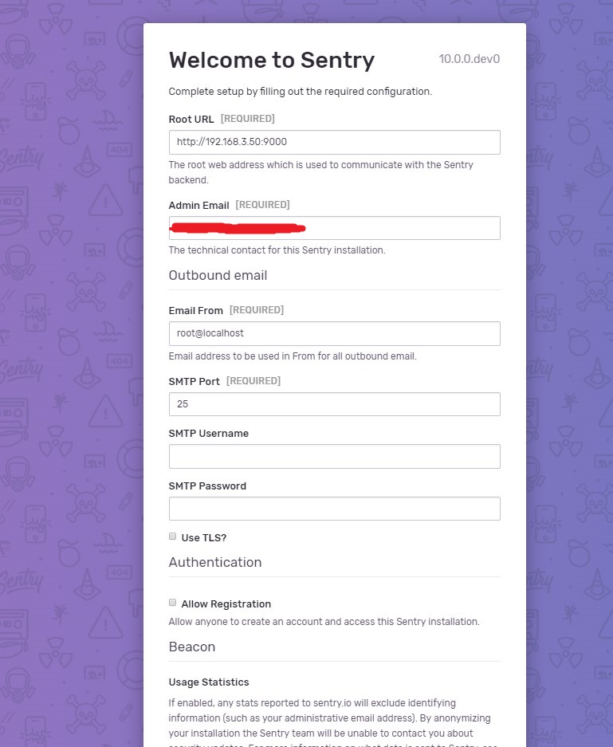
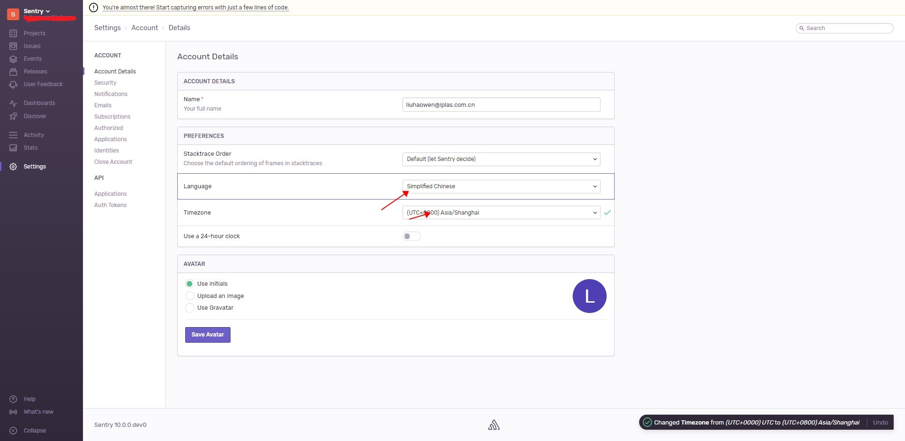
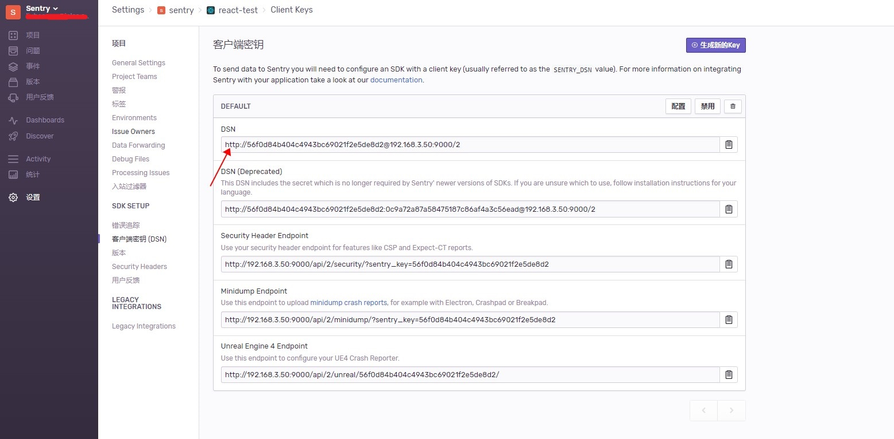
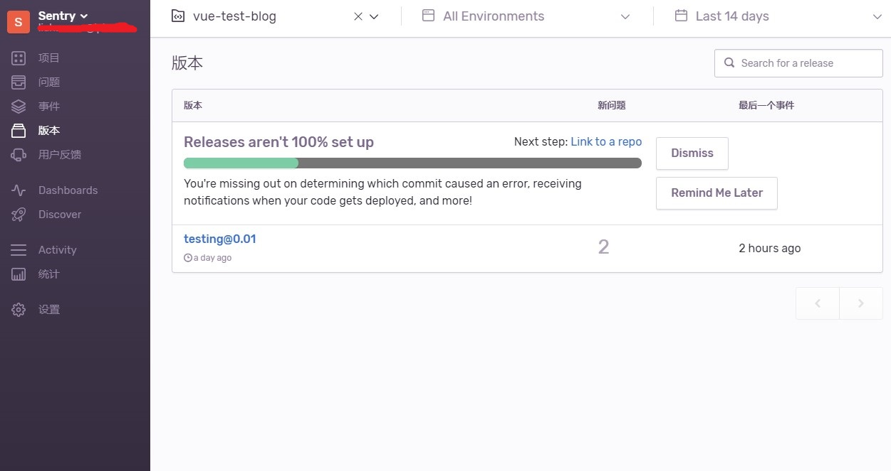
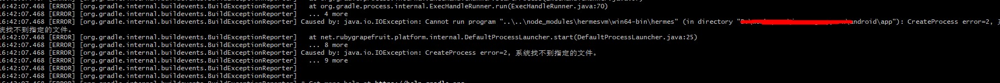
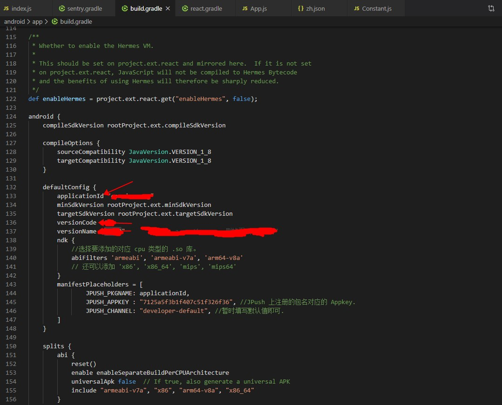
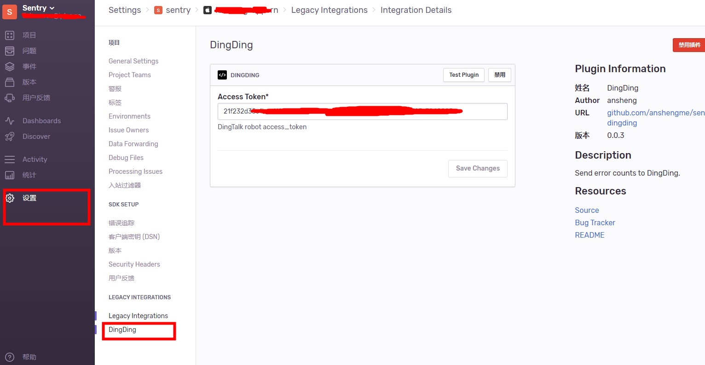

# Sentry学习之旅

> 参考资料：
>
> - [Sentry 部署踩坑记](https://juejin.im/post/5c9f4639e51d452724598c07)
> - [Sentry项目监控工具结合vue的安装与使用（前端）](https://www.520mwx.com/view/28706)
> - [access denied for sentry-onpremise-local](https://github.com/getsentry/onpremise/issues/278)
> - [sentry本地docker化部署](https://github.com/getsentry/onpremise)
> - [前端日志监控平台sentry使用 @sentry/browser @sentry/webpack-plugin](https://juejin.im/post/5bfe0d5be51d4562587b40b9)
> - [Sentry前端部署拓展篇（sourcemap关联、issue关联、release控制）](https://segmentfault.com/a/1190000014683598)
> - [@sentry/webpack-plugin/npm](https://www.npmjs.com/package/@sentry/webpack-plugin)
> - [sentry配置邮件](https://www.baoguoxiao.com/2018/10/30/sentry-configuring-mail/)
> - [React Native之iOS打包发布 | Poetry's Blog](http://blog.poetries.top/2019/10/03/rn-ios-distribute/)
> - [React Native打包iOS的ipa包](https://juejin.im/post/5b4d44286fb9a04fc34c037e)
> - [前端异常监控之Sentry集成钉钉机器人提醒](https://juejin.im/post/5bbaf934e51d450e71256dfd)
> - [Sentry快速开始并集成钉钉群机器人](https://www.cnblogs.com/cjsblog/p/10585213.html)
> - [sentry9.1.2部署](https://www.yp14.cn/2019/11/05/sentry9-1-2%E9%83%A8%E7%BD%B2/)

[TOC]

## 一、是什么

> Sentry 是一个开源的实时错误报告工具，支持 web 前后端、移动应用以及游戏，支持 Python、OC、Java、Go、Node、Django、RoR 等主流编程语言和框架 ，还提供了 GitHub、Slack、Trello 等常见开发工具的集成。可以多团队、多开发一起管理。

简单来说，Sentry 就是一个用于记录前端代码错误的平台工具，借助该平台，可以将项目在生产环境上发生的错误记录下来，并且根据 Sourcemap 定位到具体出错代码行，方便 debug。

具体表现形式如下图：


而对于大部分的项目代码来说，只需要调用 Sentry 的 SDK 就可以方便的将错误日志集成到 Sentry 上，Sentry 自身也集成了对许多类型项目的支持，如下图：


可以看到，JavaScript、React、Vue、Angular 等前端语言和框架工具都是支持的。

Sentry 的使用方式类似于 Gitlab，你可以使用官方组织提供的线上版本，也可以下载源码在服务器上部署自己的私有化服务。

Sentry 基于 Django —— 一个 python web 框架，官方提供了基于 docker 容器的部署方式，通过[这个仓库](https://github.com/getsentry/onpremise)便可以通过 docker 镜像部署私有服务。

## 二、部署

### 环境条件：

- 部署机器安装了 docker 环境
- 部署机器安装了 python 环境（推荐 python3 ，python2 会在不久以后失去官方安装脚本的支持）
- 部署机器至少还有 3G 的可用内存（推荐 4G）
- 部署机器需要能够运行 shell 脚本（win10 推荐安装 git-bash）

### 部署步骤：

1. 确认部署机器 docker 可用内存大于 3G，新建目标文件夹，将官方推荐部署仓库使用以下命令 clone 下来

   ```shell
   git clone https://github.com/getsentry/onpremise ./.
   ```

2. 随后在当前文件夹下执行 install.sh 文件

   ```shell
   ./install.sh
   ```

   安装脚本开始执行，开始拉取镜像并创建容器。

   

   创建初始化用户

   

3. 待脚本执行完成后，使用 docker-compose 启动容器

   ```shell
   docker-compose up -d
   ```

   

4. 安装完成后，使用`docker ps`命令即可看到所有启动的容器，在浏览器中输入`127.0.0.1:9000`即可访问到 Sentry 的控制台页面。

   

   

5. 首次登陆时可以设置 SMTP 服务器，用以项目代码发生报错时，Sentry 自动发送邮件至对应邮箱。若本地服务器开启了 SMTP 服务可以进行设置。

   

6. Sentry 在国际化上提供了简体中文的语言支持，通过以下界面可以通过调整语言和所在时区，十分方便。

   

   设置完成后刷新页面，即可应用设置。虽然仍有部分选项没有汉化完成，但也已经足够友好。

## 三、使用

### Email 服务

Sentry 可以通过配置 smtp 服务，在错误出现的时候通过邮件通知。进行邮件推送需要提供邮件服务器，在 Sentry 10 之前这个邮件服务器通过 docker-compose.yml 配置，可以[戳这里](https://www.baoguoxiao.com/2018/10/30/sentry-configuring-mail/)查看。

Sentry 10 beta 版本之后，通过`${sentry 安装目录}/sentry/config.yml`来配置。

这里使用腾讯企业邮箱，要注意的是，腾讯企业邮箱的 smtp 接口不是官方提供的 465 接口，而是 587 接口。

```yaml
# sentry/config.yml

###############
# Mail Server #
###############
mail.backend: 'smtp'  # Use dummy if you want to disable email entirely
mail.host: 'smtp.exmail.qq.com'
mail.port: 587
mail.username: 'xxxxx@xxxx.com.cn'
mail.password: 'xxxxx'
mail.use-tls: true
# The email address to send on behalf of
mail.from: 'xxxxx@xxxx.com.cn'
```

上面的配置要注意`mail.from`和`mail.username`应该要一致。

配置完毕后再 Sentry 根目录下执行`./install.sh`重新安装，随后使用`docker-compose up -d`重新启动服务。

随后通过 admin -> Mail 界面可以看到自己的设置，通过 Test Settings 下的 Test Button 就可以测试 Sentry 的 Email 服务了。


### 项目集成

如何在项目中集成 Sentry，其实在官网的文档中已经有了很详细的介绍。

> [文档戳我](https://docs.sentry.io/error-reporting/quickstart/?platform=browsernpm)

无论是什么部署方式，到最后原理其实都是通过调用 Sentry 准备好的 SDK，监控捕捉项目运行时出现的异常，收集信息并发送请求到 Sentry 服务器的对应端口。

SDK 引入的方式有很多种，对于以 JavaScript 为主的前端项目来说，有以下两种方式：

- 通过简单的 cdn 链接直接在页面中植入
- 通过 npm 生态库在开发时集成

以下主要结合实例介绍不同的前端框架在 npm 生态下如何集成 Sentry。

#### 集成 React

- 在 Sentry 控制台中新建一个 React 监控项目

  

- 随后在 Setting 中可以找到其对应的 DSN 地址

  

  

  通过该 DSN，我们的前端项目就能与 Sentry 进行通信了。

- 新建一个 React 项目，通过 npm 或 yarn 安装 Sentry 工具。

  ```shell
  npm install @sentry/browser
  ```

  在 index.js 中加入如下代码，使用在项目中出现的 DSN ：

  ```javascript
  import * as Sentry from '@sentry/browser'
  Sentry.init({dsn: "http://56f0d84b404c4943bc69021f2e5de8d2@192.168.3.50:9000/2"})
  ```

  这样当错误发生时，项目不仅会在控制台报错，还会自动发送一份错误报告到 Sentry 服务器。

  在问题面板上可以看到对应项目发生的错误：

  

#### 集成 Vue

集成 Vue 的方式和集成 React 差不多，通过 npm 安装`@sentry/browser`插件并通过与上面一样的方式就可以将 Vue 项目报出的错误自动上传至 Sentry，此外 Sentry 还为 Vue 提供了名为`@sentry/integrations`的库，用于发生错误时返回组件的信息。

具体使用如下：

1. 安装

   ```shell
   npm install @sentry/browser
   npm install @sentry/integrations
   ```

2. ```javascript
   // main.js
   import Vue from 'vue'
   import * as Sentry from '@sentry/browser';
   import * as Integrations from '@sentry/integrations';
   
   Sentry.init({
     dsn: 'http://42d505391c1742dcbdcf4119761c5485@192.168.3.50:9000/4',
     integrations: [new Integrations.Vue({Vue, attachProps: true})],
   });
   ```

需要注意的是这个插件只能在 Vue2.0 中使用，原因在 Vue 官网和 Sentry 文档中都作出了说明：因为 Sentry 的 SDK 其实是调用了 Vue 的 `Vue.config.errorHandler`钩子，每个错误发生时 Vue 都会触发该钩子函数，而 Sentry 正是通过该钩子函数返回的数据得以定位错误发生的位置以及对应的组件信息。

#### SourceMap上传

对于前端项目来说，生产环境中的代码大多是通过 webpack 进行了混淆打包的，对于这些代码的出错 Sentry 并不能进行精准定位，如下图：


如果我们希望能够在 Sentry 上看到混淆代码的源码定位，就需要将产生的 Issue 集中至 Release （版本）系统，并上传 对应 SourceMap。

**准备**

1. 安装 sentry 命令行管理工具，用于生成 token 和创建版本（安装过程需要翻墙，淘宝镜像也没用，注意设置代理）

   ```shell
   npm install -g @sentry/cli
   ```

2. 登录本地 Sentry，生成 token（注意使用 git-bash）

   ```shell
   sentry-cli --url http://127.0.0.1:9000/ login
   ```

   

   顺利的话，随后会弹出`http://127.0.0.1:9000/settings/account/api/auth-tokens`，点击**创建新的令牌**创建新的 token，注意要勾上**project:write**这一权限。

   

   

   随后 Sentry 就会在当前用户目录下生成`.sentryclirc`文件，用于和 Sentry 连接。

**版本（Release）控制**

1. 创建一个新版本

   ```shell
   sentry-cli releases -o 组织 -p 项目 new staging@1.0.1
   ```

   上面的代码用于创建一个名为 staging@1.0.1 的新版本。

   Sentry 默认的组织为 sentry，比如此时我有一个名为 vue-test-blog 的项目，想创建一个名为 testing@0.01 的版本，则命令应该是这样的

   ```shell
   
   -p 项目 new testing@0.01
   ```

   当然也可以修改当前用户目录下的`.sentryclirc`文件，添加默认的组织项目信息（还可以在当前项目根目录下添加该文件）。

   

2. 随后登录 Sentry 控制台，在 Release（版本）界面中可以看到 testing@0.01 版本已经被创建出来了

   

   也可以通过 senctry-cli 工具查看

   ```shell
   sentry-cli releases list
   ```

   此后，版本对应的 SourceMap 文件会被上传到该版本 -> 工件（Artifacts）模块下。

3. 前端项目设置，Issue 与版本关联

   以 Vue 项目为例，在 main.js 文件中添加相应版本号，此后项目抛出的问题都会被关联到对应的版本之下。

   ```javascript
   // main.js
   import * as Sentry from '@sentry/browser'
   import * as Integrations from '@sentry/integrations'
   
   Sentry.init({
     dsn: 'http://8ce91b4c211946a5b39d205b5d3e69cf@192.168.3.50:9000/3',
     release: 'testing@0.01',
     integrations: [new Integrations.Vue({Vue, attachProps: true})],
   })
   ```

   

**上传**

对于前端项目来说，上传 SourceMap 至对应版本有两种方法，一种通过 sentry-cli 手动上传，一种通过 webpack 插件在每次编译后自动上传。

**手动上传**：

1. 在每次上传前最好先清空一遍已有的 SourceMap

   ```shell
   sentry-cli releases files testing@0.01 delete --all
   ```

   也可以选择在 版本>工件 里点击一个个辣鸡桶进行删除

2. 使用 files 命令进行上传

   ```shell
   sentry-cli releases -o 组织 -p 项目 files staging@1.0.1 upload-sourcemaps js文件所在目录 --url-prefix 线上资源URI
   ```

   注意，这里的 --url-prefix 指的是线上 js 资源的完整路径，如下所示：

   

   如上面的例子所示，我们的 js 文件相对应的 --url-perfix 就是`http://blog.liubasara.local.com/static/js/`，Sentry 中规定可以用 ~ 来指代域名，所以 --url-prefix 也可以是`~/static/js`。

   所以完整命令应为：

   ```shell
   sentry-cli releases -o sentry -p vue-test-blog files testing@0.01 upload-sourcemaps ./js --url-prefix '~/static/js' --rewrite --log-level=info
   ```

   待上传完成后，就可以在版本 -> 工件（Artifacts）模块下找到对应文件。

   **PS： 这条命令在 win10 底下非常的坑，执行以后经常导致 docker 由于不明原因直接卡死，重启之后发现SourceMap 文件只传了部分。目测这是由于 docker volume 在 win10 底下坑爹的挂载机制所导致（只能挂载当前用户目录）。所以 win10 底下还是建议使用 webpack 自动上传的方式比较好**。

**自动上传**：

1. 自动上传需要安装 @sentry/webpack-plugin 插件

   ```shell
   npm install @sentry/webpack-plugin --save-dev
   ```

2. 随后在 vue.config.js 中添加配置

   ```javascript
   // vue.config.js
   const SentryCliPlugin = require('@sentry/webpack-plugin')
   {
       productionSourceMap: true,
       plugins: [
         new SentryCliPlugin({
           release: 'testing@0.01',
           include: './docs/static/js',
           urlPrefix: '~/static/js',
           ignore: ['node_modules', 'babel.config.js', 'vue.config.js']
         })
       ]
   }
   ```

   这样在每次执行`npm run build`后，都会自动上传 SourceMap 至 Sentry。**需要注意的是，该操作不会在上传前清空已有的 SourceMap**。

上传效果如下图：


这时候再看版本中的问题，就会发现具体出错的代码已经能被定位了：


PS: 如果上传过程中出现错误，可以在 Sentry 的 internal 项目中查看错误，如果出现如下 OSError 权限问题：


那就说明是 Sentry 内部的容器出了权限问题，解决方法是进入 Web 9000 端口映射出来的容器，执行下面的 shell 命令

```shell
[xxxxx@xxxxxx ~]$ docker exec -it xxxxxx bash

root@30946a3ce9a3:/usr/src/sentry# chmod -R 777 /data/files/
```

之后重新上传，便能成功。

#### 集成 ReactNative

**首先确保自己有一个能够跑起来并且能够打包的 ReactNative 项目**，由于 RN 升级迭代非常的快，本次集成所用到的`@sentry/react-native`更新也非常频繁（频繁到甚至就连稳定版 sentry 的安装向导中都没有提到这个为新版 RN 准备的插件...坑爹），所以本篇向导仅供参考，以下是用到的 RN 及插件的版本：

- OS：win10
- "react-native": "0.60.3"
- "@sentry/react-native": "^1.2.0"

详细集成步骤如下（**安卓**）：

1. 项目目录下使用 npm 或 yarn 集成 sentry 插件

   ```shell
   # yarn
   yarn add @sentry/react-native
   # npm
   npm install @sentry/react-native --save
   ```

2. 使用 sentry-wizard 工具为 android 和 ios 项目自动生成 sentry.properties 文件

   ```shell
   yarn sentry-wizard -i reactNative -p ios android --skip-connect
   ```

   要注意的是`--skip-connect`参数，由于笔者在这里使用的是自建的 sentry 服务，所以必须加上，否则 sentry 会自动连接`https://sentry.io`为项目生成初始化连接代码。

   更多详情可以[戳这里](https://github.com/getsentry/sentry-wizard/issues/31)了解

3. 随后修改 android 和 ios 文件夹下的 sentry.properties 文件，将其修改为自己的服务信息，内容与上面介绍的 .sentryclirc 文件大同小异。

   ```properties
   defaults.url=http://192.168.3.253:9000/
   defaults.org=sentry
   defaults.project=react-native
   auth.token=xxxxxxxxxxxxxxxxxxxxxxxxxxxxxxxxxxxxxxxxx
   cli.executable=node_modules\\@sentry\\cli\\bin\\sentry-cli
   ```

4. 在执行完步骤二后，应该就能发现自己的项目代码中多出了几行用于连接 sentry 服务的代码。

   ```javascript
   // App.js
   // ...
   import * as Sentry from '@sentry/react-native';
   
   Sentry.init({ 
     dsn: 'null'
   });
   // ...
   ```

   在这里填上自己的 dsn 地址，再对 release 和 dist 进行设置，最后代码看起来是这样的

   ```javascript
   // App.js
   // ...
   
   import * as Sentry from '@sentry/react-native';
   
   Sentry.init({ 
     dsn: 'http://xxxxxxxxxxxxxxxxxxxxxxx@192.168.3.253:9000/3'
   });
   
   Sentry.setRelease('testing@0.01');
   Sentry.setDist('123456');
   
   // ..
   ```

   要注意的是与 Vue 和 React 项目不同，这里的 dist 必不可少，主要用于 SourceMap 定位代码，至于为什么只有 RN 项目一定需要 dist 参数，这一点尚不清楚。

5. 完成代码编写后，生成对应的 bundle 和 sourcemap，在项目根目录下执行：

   ```shell
   react-native bundle --platform android --dev false --entry-file index.js --bundle-output android/app/src/main/assets/index.android.bundle --assets-dest android/app/src/main/res
   ```

   > **坑**：执行完该条命令后，记住要手动删除 android\app\src\main\res 目录下的所有 drawable 开头的文件夹，和 android\app\src\main\res\raw 目录下的所有文件，否则会在下一步打包时报 duplicate 的错
   >
   > 具体详情 issue 可以[戳这里](https://github.com/facebook/react-native/issues/22234)

**sourcemap上传并打包**

如果在默认情况下打包，`@sentry/react-native`会在生成 apk 的同时上传 sourcemap，但是由于种种坑爹的原因，`@sentry/react-native`识别到的默认 bundle 路径和 sourcemap 路径与 RN 生成的并不一致，打包会在 Task :app:bundleReleaseJsAndAssets_SentryUpload 这一步报错。


> 相关讨论看这里：
>
> - [#641](https://github.com/getsentry/sentry-react-native/issues/641#issuecomment-524620974)
> - [#25693](https://github.com/facebook/react-native/issues/25693)

这也导致了如果不修改其源码，自动上传功能就无法使用。所以在这里先介绍**手动上传 sourcemap **的方式：

1. 修改 android/build.gradle 文件，将`@sentry/react-native`引入的代码注释掉：

   

2. 随后进入 android 目录，执行打包命令，生成 apk

   ```shell
   ./gradlew assembleRelease
   ```

   生成后的文件在 android\app\build\outputs\apk\release 中

   **PS**：若此步报错，尝试将 android/app/build 目录删除后重试

3. 进入 android/app/src/main/assets/ 目录下，执行上传命令

   ```shell
   sentry-cli releases files testing@0.01 upload-sourcemaps index.android.bundle.map --strip-prefix '~/' --rewrite --dist 123456
   # or
   sentry-cli releases files testing@0.01 upload-sourcemaps index.android.bundle.map --url-prefix 'app:///' --rewrite --dist 123456
   ```

   > 关于 --strip-prefix 和 --url-prefix 的区别，可以[戳这里](https://github.com/getsentry/sentry-docs/blob/master/src/collections/_documentation/cli/releases.md)了解

   要注意的是，dist 需要和上面项目中所设置的一致。

4. 上传完成后，便能发现引发错误的代码已经能够定位，手动上传集成完毕。

   

**自动上传 sourcemap 踩坑**

根据[#25693](https://github.com/facebook/react-native/issues/25693)中的讨论可以得知，`@sentry/react-native`在打包时选择的路径是在 Hermes（react-native 新出的一种 react 渲染模式）下生成的 sourcemap 路径，但是默认情况下 Hermes 模式是关闭的，即`project.ext.react.enableHermes`为 `false`，这就导致了自动上传必定出错的问题。


但坑爹的是，在 0.60 版本下，React-native 的 Hermes 模式也是有问题的，详情戳这里[#25599](https://github.com/facebook/react-native/issues/25599#issuecomment-524537342)。虽然切换为`true`之后 SourceMap 能够上传上去，但是由于 React-native 的问题，本身 apk 的打包却会报错。



所以想要成功打包且成功上传，要么不使用 Hermes 模式，按照[#25693](https://github.com/facebook/react-native/issues/25693)的方式修改源码，要么使用 Hermes 模式，按照[#25599](https://github.com/facebook/react-native/issues/25599#issuecomment-524537342)的方式修改源码。

当然，你也可以两者都改。

这里采用**不使用 Hermes 模式的方案**，将 [修改后的react.gradle](https://github.com/HazAT/react-native/blob/2d2780da7129699a726603eb205a2473c8511cb7/react.gradle) 文件覆盖到 node_modules/react-native/react.gradle 中，再执行命令，即可成功上传 sourcemap 并打包 apk。

上传 sourcemap 的版本为 android/app/build.gradle 中的版本相关设定，比如下面的 build.gradle 的设置：



自动生成下，其上传生成的版本 release 为`applicationId-versionName`，dist 选项为`versionCode`

即相当于下面的命令：

```shell
sentry-cli releases files ${applicationId}-${versionName} upload-sourcemaps index.android.bundle.map index.android.bundle --strip-prefix '~/' --rewrite --dist ${versionCode}
```

在 sentry 控制台项目版本的 title 中，可以看到其上传的版本全称。


### 集成钉钉

利用 Sentry 的 Plugin 插件机制，加上钉钉机器人，就可以实现在报错发邮件的同时将提醒发送到钉钉中，方便提醒。

其原理是通过钉钉开放的机器人 webHook 接口，发送对应规则的消息至该接口，就可以让机器人在群聊中自动发送消息。

github 上已经有了集成钉钉通知的开源插件，可以直接使用。[地址点我](https://github.com/anshengme/sentry-dingding)

下面是部署步骤，本次使用的插件为 v0.03 版本：

1. **修改 requirements.txt**

   进入 Sentry 安装目录下，修改`./sentry/requirements.txt`，加入以下代码：

   ```
   redis-py-cluster==1.3.4
   ```

2. **修改 Dockerfile**

   修改`./sentry/Dockerfile`，加入以下代码：

   ```dockerfile
   RUN pip install sentry-dingding
   ```

3. **重新执行安装脚本**

   在安装目录下执行`./install.sh`，系统重新安装，随后执行`docker-compose up -d`启动容器

4. **进入 Sentry 控制台，开启钉钉插件**

   

5. **新增钉钉机器人，打开插件，输入 AccessToken**

   输入 Access Token （注意这串 Token 要不带 http 的前缀，插件会根据 token 自动生成 url）后，可以点击 Test Plugin 进行报错消息测试。

   

**踩坑总结**：

- [点Test-Plugin的时候提示'Event' object has no attribute 'id'](https://github.com/anshengme/sentry-dingding/issues/22)

  由于钉钉机器人的更新，0.03 版本的该插件字段不适用，需要自己对已安装的插件源码进行修改，或者自己 fork 一个版本自行安装。由于该教程的 Sentry 服务是基于 docker 的，且 bug 修改所需的代码量较小，这里只要通过以下步骤对`plugin.py`文件进行相应的修改

  ```shell
  # 进入 Sentry 9000 端口的 web 容器
  docker exec -it ***sentry_web_1 bash
  # 进入 pip 安装的 Sentry-dingding 库目录
  /usr/local/lib/python2.7/site-packages/sentry_dingding
  # 修改安装的 plugin 源码
  vi plugin.py
  # 旧版本  61行 url=u"{}events/{}/".format(group.get_absolute_url(), event.id)
  # 修改后新版本  61行 url=u"{}events/{}/".format(group.get_absolute_url(), event.event_id)
  ```

  然后退出容器，使用`docker-compose restart`重启即可生效。

- [点Test-Plugin的时候提示"No errors returned"](https://github.com/anshengme/sentry-dingding/issues/18)

  在钉钉机器人中设置自定义关键词为 from，即可接受到来自 Sentry 的消息

### 结语

至此，Sentry 在前端项目中的基础使用介绍完毕。

## 四、Sentry历史数据清理

> 1. 保留60天数据。cleanup的使用delete命令删除postgresql数据，但postgrdsql对于delete, update等操作，只是将对应行标志为DEAD，并没有真正释放磁盘空间
>
>    ```shell
>    docker exec -it sentry_worker_1 bash
>    sentry cleanup  --days 60
>    ```
>
> 2. postgres数据清理 （清理完后会释放磁盘空间）
>
>    ```shell
>    docker exec -it sentry_postgres_1 bash
>    vacuumdb -U postgres -d postgres -v -f --analyze
>    ```
>
> 3. 定时清理脚本
>
>    ```shell
>    #!/usr/bin/env bash
>    docker exec -i sentry_worker_1 sentry cleanup --days 60 && docker exec -i -u postgres sentry_postgres_1 vacuumdb -U postgres -d postgres -v -f --analyze
>    ```

