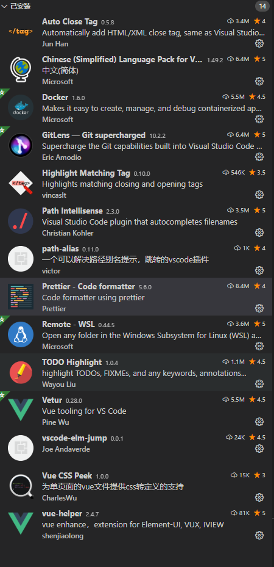

# vscode常用设置

## 常用插件一览



## 常用 setting

```json
{
    /**
    常规设置
    **/
    "window.zoomLevel": 2,
    "typescript.locale": "zh-CN",
    "terminal.integrated.shell.windows": "C:\\Program Files\\Git\\bin\\bash.exe",
    "editor.fontSize": 16,
    "editor.tabSize": 2,
    
    /**
    路径解析设置文件
    **/
    "pathAlias.aliasMap": {
        "@": "${cwd}/src",
        "assets": "${cwd}/src/assets",
        "components": "${cwd}/src/components",
        "pages": "${cwd}/src/pages",
        "styles": "${cwd}/src/styles",
        "store": "${cwd}/src/store",
        "utils": "${cwd}/src/utils",
        "assert": "${cwd}/src/assert",
        "mixins": "${cwd}/src/mixins",
        "plugins": "${cwd}/src/plugins",
        "config": "${cwd}/src/config"
    },
    "path-intellisense.mappings": {
        "@": "${workspaceRoot}/src"
    },

    /**
    TODO 插件设置文件
    **/
    "todohighlight.isEnable": true,
    "todohighlight.include": [
        "**/*.vue",
        "**/*.js",
        "**/*.jsx",
        "**/*.ts",
        "**/*.tsx",
        "**/*.html",
        "**/*.php",
        "**/*.css",
        "**/*.scss"
    ],
    "todohighlight.exclude": [
        "**/node_modules/**",
        "**/bower_components/**",
        "**/dist/**",
        "**/build/**",
        "**/.vscode/**",
        "**/.github/**",
        "**/_output/**",
        "**/*.min.*",
        "**/*.map",
        "**/.next/**"
    ],
    "todohighlight.keywords": [
        "DEBUG:",
        "REVIEW:",
        {
            "text": "NOTE:",
            "color": "#ff0000",
            "backgroundColor": "yellow",
            "overviewRulerColor": "grey"
        },
        {
            "text": "HACK:",
            "color": "#000",
            "isWholeLine": false,
        },
        {
            "text": "TODO:",
            "color": "red",
            // "border": "1px solid red",
            "borderRadius": "2px", //NOTE: using borderRadius along with `border` or you will see nothing change
            "backgroundColor": "lightblue",
            //other styling properties goes here ... 
        }
    ],

    /**
    代码 Formatter 设置
    **/
    "prettier.printWidth": 120,
    "prettier.semi": false,
    "prettier.singleQuote": true,
    "prettier.trailingComma": "none",
    "[javascript]": {
        "editor.defaultFormatter": "esbenp.prettier-vscode"
    },
    "[vue]": {
        "editor.defaultFormatter": "octref.vetur"
    },
    "vetur.format.defaultFormatterOptions": {
        "prettier": {
            "printWidth": 120,
            "semi": false,
            "singleQuote": true,
            "insertSpaceBeforeFunctionParenthesis": true,
            "trailingComma": "none"
        }
    },
    "[jsonc]": {
        "editor.defaultFormatter": "esbenp.prettier-vscode"
    },
    // "vetur.format.defaultFormatter.js": "vscode-typescript",
    // "javascript.format.insertSpaceBeforeFunctionParenthesis": true
}
```

