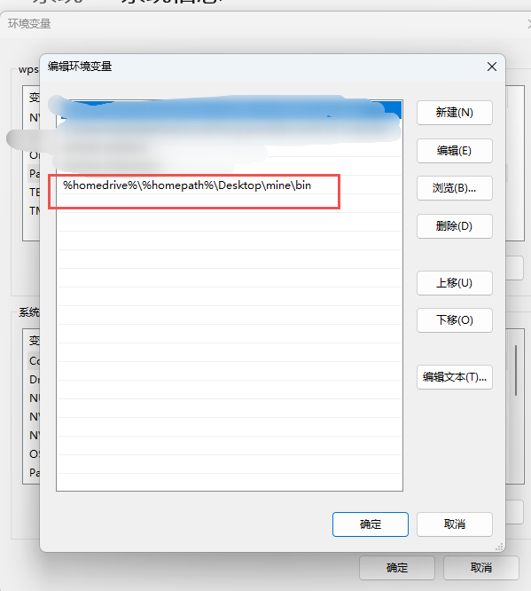
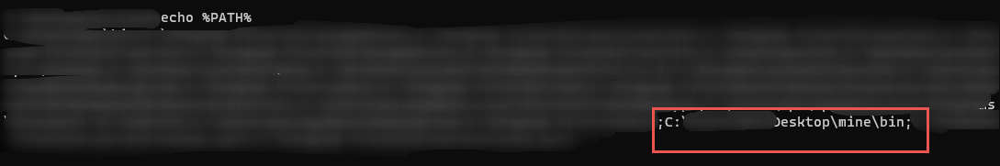

# Windows 上添加自定义命令

1. 首先新建一个文件夹，然后在系统环境变量中添加该文件夹，注意盘符不能缺少，建议尽量放在 C 盘下，这样盘符可以直接用 %HOMEDRIVE% 变量指代。建议直接在下方的系统变量上进行指定，不要设置成用户级系统变量

   

2. **重启电脑使设置生效**，打开 cmd 命令，输入 echo %PATH%，查看是否能输出相应的路径。

   


3. 在对应文件夹中新建 xxx.cmd 文件，在该文件中可以使用 bat 批处理语法执行代码。以 nodejs 中生成的代码为例，一个普通的命令如下所示：

   ```basic
   @IF EXIST "%~dp0\node.exe" (
     "%~dp0\node.exe"  "%~dp0\..\glob-all\bin\glob-all" %*
   ) ELSE (
     @SETLOCAL
     @SET PATHEXT=%PATHEXT:;.JS;=;%
     node  "%~dp0\..\glob-all\bin\glob-all" %*
   )
   ```

   > ChatGPT：
   >
   > 这段代码是一个Windows批处理脚本，主要用于执行指定的命令。下面是对每个指令的解释和注释：
   >
   > \1. `@IF EXIST "%~dp0\node.exe"`：检查当前目录下是否存在名为"node.exe"的文件。`%~dp0`是批处理脚本文件所在目录的路径。
   > \2. `(`：如果上一步的条件成立，则执行以下命令。
   > \3. `"%~dp0\node.exe"  "%~dp0\..\glob-all\bin\glob-all" %*`：执行`"%~dp0\..\glob-all\bin\glob-all"`命令，并传递脚本中的所有参数。
   > \- `"%~dp0\node.exe"`：指定要执行的命令是`node.exe`，该文件位于与批处理脚本相同的目录下。
   > \- `"%~dp0\..\glob-all\bin\glob-all"`：指定要执行的命令是`glob-all`，该文件位于与批处理脚本相同的目录的上一级目录下的`glob-all\bin`目录中。
   > \- `%*`：表示将脚本中的所有参数传递给命令。
   > \4. `)`：结束条件成立的代码块。
   >
   > 如果条件不成立，则执行以下命令：
   >
   > \1. `@SETLOCAL`：创建一个局部环境变量，以便在脚本执行期间更改环境变量的值。
   > \2. `@SET PATHEXT=%PATHEXT:;.JS;=;%`：在环境变量`PATHEXT`中移除`.JS`，这样在执行命令时就不会自动添加`.JS`后缀。
   > \3. `node  "%~dp0\..\glob-all\bin\glob-all" %*`：执行`node`命令并传递脚本中的所有参数，执行的命令是`"%~dp0\..\glob-all\bin\glob-all"`。
   > \- `node`：指定要执行的命令是`node`。
   > \- `"%~dp0\..\glob-all\bin\glob-all"`：指定要执行的命令是`glob-all`，该文件位于与批处理脚本相同的目录的上一级目录下的`glob-all\bin`目录中。
   > \- `%*`：表示将脚本中的所有参数传递给命令。
   >
   > 这段代码的作用是根据条件判断是否存在`node.exe`文件，如果存在，则使用`node.exe`来执行`glob-all`命令，否则使用系统中的`node`命令执行`glob-all`命令。这个脚本的目的可能是为了确保在不同的环境中都能正确执行`glob-all`命令。


4. 同目录下对应启动脚本如下所示

   ```javascript
   #!/bin/sh
   basedir=$(dirname "$(echo "$0" | sed -e 's,\\,/,g')")
   
   case `uname` in
       *CYGWIN*) basedir=`cygpath -w "$basedir"`;;
   esac
   
   if [ -x "$basedir/node" ]; then
     "$basedir/node"  "$basedir/../glob-all/bin/glob-all" "$@"
     ret=$?
   else 
     node  "$basedir/../glob-all/bin/glob-all" "$@"
     ret=$?
   fi
   exit $ret
   ```

5. 除此以外，还可以添加硬链接，将自定义命令链接到任意目录

   > ChatGPT:
   > GitHub Copilot: 在 PowerShell 中，您可以使用 `New-Item` 命令来创建硬链接。以下是创建硬链接的步骤：
   >
   > 1. 确定源文件夹的路径，这里是 "D:\笔记note\bin"
   > 2. 确定目标文件夹的路径，这里是 "C:\Users\llhhww\Desktop\mine\bin"
   > 3. 使用 `New-Item` 命令创建硬链接
   >
   > 以下是对应的 PowerShell 命令：
   >
   > ```powershell
   > New-Item -ItemType Junction -Path "C:\Users\wps\Desktop\mine\bin" -Target "D:\笔记note\bin"
   > ```
   >
   > 这个命令会创建一个名为 "bin" 的硬链接，它链接到 "D:\笔记note\bin"。

   
