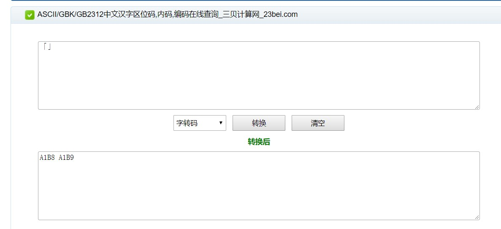
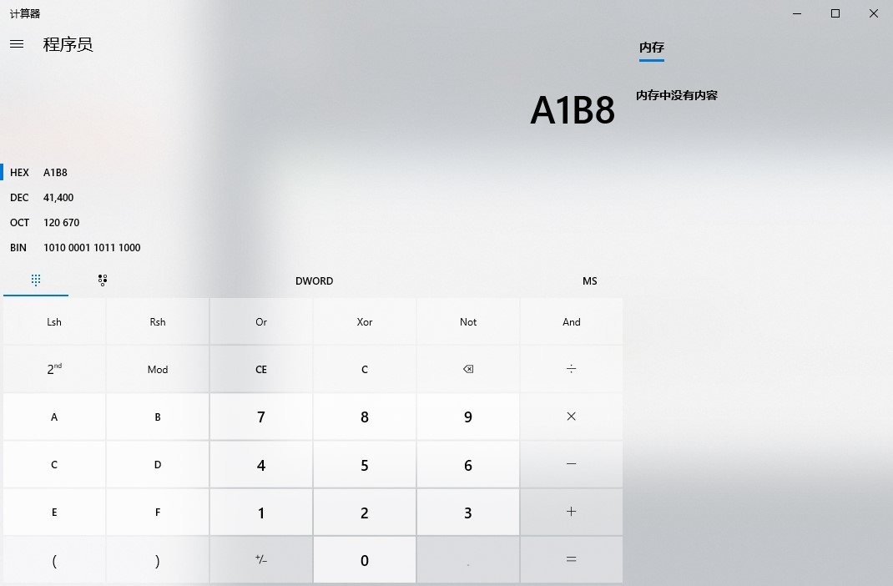

# windows如何用键盘打出任意特殊字符

> 参考资料：
>
> - [▓▓▓.....▓怎么打出来](https://zhidao.baidu.com/question/327116550427818605.html#wgt-replyer-all-1770247980)
> - [三贝计算器](https://www.23bei.com/tool-54.html)

## 原理

windows 默认使用的是 GBK 编码，而 GBK 编码是一串 16 进制的字符串，只要将任意单个字符转换为 GBK 编码，再将这串编码转换为 10 进制，就能通过按住键盘上的 alt 键 + 若干个十进制数字输入任何字符，下面是操作实例。

## 操作步骤：

**目标字符**：键盘和正常中文输入法中都不存在的直角引号“「」”

1. 通过[三贝计算器](https://www.23bei.com/tool-54.html)将字符串转换为 GBK 编码形式，得到其 GBK 编码分别为 A1B8，A1B9

   

2. 通过计算器分别将 A1B8、A1B9 转化为十进制数字

   

   得出“「 ” 的数字编号为 41400，“ 」” 的编号为 41401 。

3. 按住 alt + 41400 即可输入“「 ”，  alt + 41401 即可输入“ 」”

## PS

引用资料中，[▓▓▓.....▓怎么打出来](https://zhidao.baidu.com/question/327116550427818605.html#wgt-replyer-all-1770247980)这一答案是诞生本博客的灵感来源，但由于浏览器的改版以及 encodeURIComponent 这一函数的改进，目前浏览器对于 URL 的编译已经不再使用 windows 的 GBK 编码而改为了统一的 UTF-8 编码，所以使用该答案中的“使用百度搜索中的url”这一方法并不能得出正确的 16 进制编码。