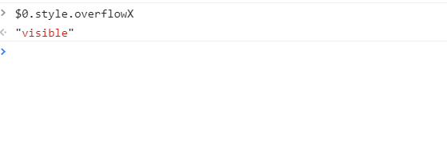
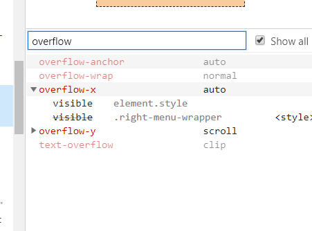
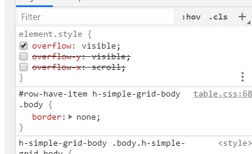
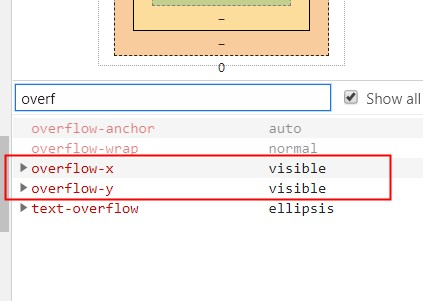

#  记一次overflow的debug之旅

> 参考资料：
>
> - [对同一元素设置overflow-x:hidden,overflow-y:visible;属性值不生效](https://blog.csdn.net/wuyou1336/article/details/78965920)

对于 overflow，W3C 有这样的一段定义：

> **The computed values of ‘overflow-x’ and ‘overflow-y’ are the same as their specified values, except that some combinations with ‘visible’ are not possible: if one is specified as ‘visible’ and the other is ‘scroll’ or ‘auto’, then ‘visible’ is set to ‘auto’**. The computed value of ‘overflow’ is equal to the computed value of ‘overflow-x’ if ‘overflow-y’ is the same; otherwise it is the pair of computed values of ‘overflow-x’ and ‘overflow-y’.

这一段表明了，一个 div 中，overflow-x 属性中的 visible 属性和 overflow-y 属性中的 scroll 属性是互斥的，也就是说，你不可能在一个 div 中实现水平方向 visible 溢出，垂直方向滚动的场景（反之亦然）。

如果你这样设置了，其中那个不为 scroll 的属性会被浏览器自动重置为 auto。

那么这么隐晦的属性规范到底有啥用呢。

相信聪明绝顶的小朋友们已经想到了。

试想实现这样一个场景：

**想要在某个 div 内弹窗， 然后弹窗会跟着 div 走而且要可以显示在 div 外面**。

然后这个规范就可以把那些企图用 position: absolute 和 position: relative 来写弹窗组件的年轻小前端们坑到死为止。

你会发现无论怎么调，overflow-x 都无法实现 visible 的效果。但如果单独设置 overflow: visible 却可以得到一个无法滚动的完整效果。

惊不惊喜，开不开心，意不意外，恶不恶心？

重写 dialog 组件吧。

下附赠方法（来自群内大佬）：

> 因为 div 设置 overflow 的话 position 就占位了， div 内出现滚动条而不是弹窗出现在 div 外面。
>
> 现在实现这种弹窗都是在 body 下创建的 div，position 定位在 0 0，用 translate 去定位置，然后获取绑定弹窗元素的定位值，来确定 translate 的值，要用到 js。

完。

