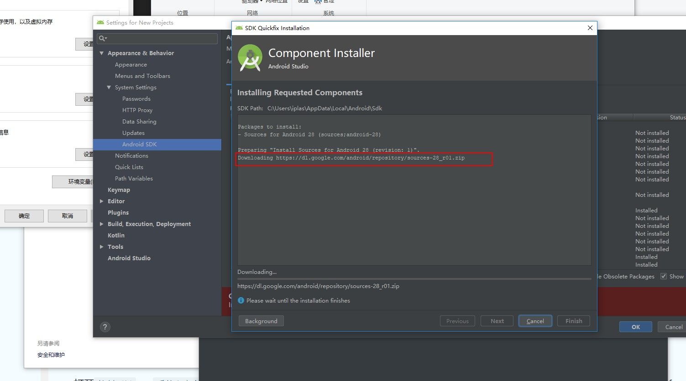
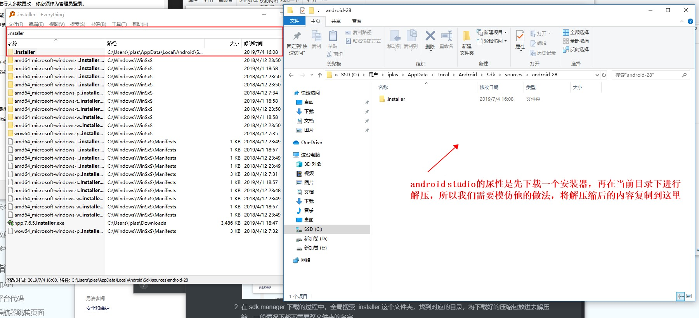

# 记react-native环境搭建的种种坑（一）

>  引导搭建中文指南：https://reactnative.cn/docs/getting-started/

## React-native 基本运行环境搭建篇

**坑**：

- [**配置 ANDROID_HOME 环境变量**](https://reactnative.cn/docs/getting-started/#3-%E9%85%8D%E7%BD%AE-android-home-%E7%8E%AF%E5%A2%83%E5%8F%98%E9%87%8F)

  **此处不仅需要配置 ANDROID_HOME，还需要配置一个名为 ANDROID_SDK_ROOT 的环境变量**，值与前者相同

- Android Studio 第一次开启时默认安装的是 Android SDK Platform 29 以及 Android SDK Build-Tools 29.0.0，而 react native  需要的版本是 Android SDK Platform 28 和 Android SDK Build-Tools 28.0.3，所以需要我们手动进行下载。

  **PS：注意在查看时一定要勾选下面的一个 Show Package Details 选项，才能看到所有版本**。

- android studio 下载奇慢无比的解决方法

  1. 首先先通过 sdk manager 获取下载地址，随便通过什么下载器给他下载下来（国内对于 SDK 包的下载是没有墙的，但是很奇葩的是 Android Studio 这个软件的使用本身需要翻墙，而且哪怕使用代理，在软件内安装也慢的一比...日）

     

  2. 在 sdk manager 下载的过程中，全局搜索 .installer 这个文件夹，找到对应的目录，将下载好的压缩包放进去解压缩，一般情况下都不需要改文件夹的名字。

     

  3. 覆盖完成后，重新打开 SDK Mamager 即可看到安装包已安装

