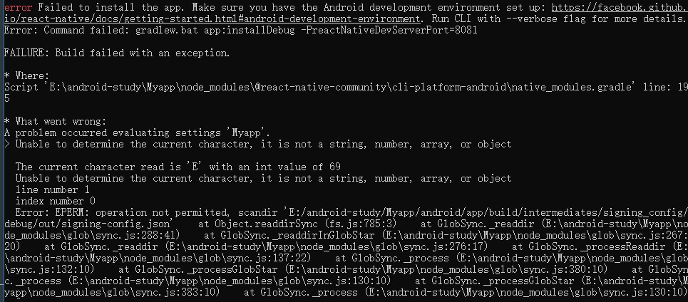

# 记react-native环境搭建的种种坑（二）

> 引用资料：
>
> - [React-navigation官网英文文档](https://reactnavigation.org/docs/en/getting-started.html)
> - [React-Navigation在混合开发中报错undefined is not an obj... - 简书](https://www.jianshu.com/p/066f95cde865)
> - [[error\] package android.support.v4.util doesn't exist · Issue #678 · kmagiera/react-native-gesture-handler](https://github.com/kmagiera/react-native-gesture-handler/issues/678)

## React-navigation 组件环境搭建篇

查看搭建完成的demo项目地址点[这里](https://github.com/Liubasara/react-native-study/tree/46b2cb9ca2e49780944d69733cdb167fffe6f554)

**坑：**

- **只要你用的是 Version3 的 React-navigation，那就绝对！绝对！绝对！不要上React-navigation的中文官网！那里的文档已经八百年没更新了**。

- 不确定是不是系统的问题，反正在 win10 下，官网推荐使用的 `react-native link`命令是没有用的，所以需要我们手动在 gradle 文件中引入各类设置（涉及到的文件有：settings.gradle、app/build.gradle、MainApplication.java、MainActivity.java），具体配置的流程可见[这里](https://www.jianshu.com/p/066f95cde865)

- 成功引入了 React-navigation 后，可能会遇到 android.support.v4.util 库不存在的情况。

  这个时候需要在项目根目录下，执行：

  ```shell
  npm install --save-dev jetifier
  npx jetify
  ```

  npm 会自动把库安装好。

- React-navigation 创建路由的方式与其他版本的是不一样的，`StackNavigator`在版本 3 切换成了 `createStackNavigator`和`createAppContainer`，具体示例如下：

  ```javascript
  // App.js
  import React, { Component } from "react";
  import { StyleSheet, Text } from "react-native";
  import { createStackNavigator, createAppContainer } from "react-navigation";
  
  class HomeScreen extends Component {
    static navigationOptions = {
      title: "Welcome"
    };
    render() {
      return <Text>Hello, Navigation!</Text>;
    }
  }
  
  const SimpleApp = createStackNavigator({
    Home: { screen: HomeScreen }
  });
  
  const AppNavigator = createAppContainer(SimpleApp);
  
  export default class App extends Component {
    render() {
      return <AppNavigator />;
    }
  }
  
  const styles = StyleSheet.create({
    container: {
      flex: 1,
      backgroundColor: "#fff",
      alignItems: "center",
      justifyContent: "center"
    }
  });
  ```

- 在按照上述步骤引入完 react-navigation 以后，使用`npm start`命令就可以正常载入 App 了，但是这里还有一个隐性的坑，在引入完成以后，当你试图在新的设备或者虚拟机上使用`react-native run-android`来安装 App 的时候，大概率会报没有权限(operation not permitted)：

  

  **解决方案**是进入`${项目根目录}/android/app`下，将 build 文件夹删掉，重新运行命令，即可成功安装。